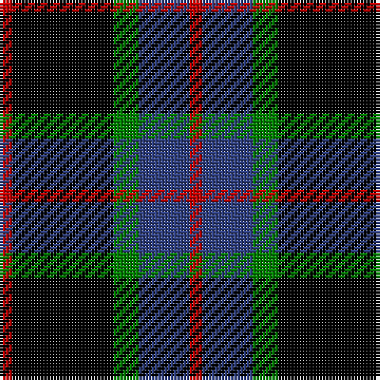

In pattern [RBGKR](/stripes/rbgkr/).

This was sourced from weddslist.  It is a [5 stripe tartan](/stripes/stripes5/).

Original link http://www.weddslist.com/cgi-bin/tartans/pg.pl?source=sts

## Attestations

This cloth appears in 2 source records; the oldest owns this page.

- undated — Nairn (weddslist, [record](http://www.weddslist.com/cgi-bin/tartans/pg.pl?source=sts))
- undated — Nairn Family Tartan Tartan Number: 1331. Earliest known date: c.1930 The exact date of this design is uncertain. We know that it appeared around 1930 in the collection of Messrs. Anderson of Edinburgh. (Later Kinloch Anderson). A note on the weavers scale in the STS collection states '..worn by the Spencer-Nairn family. (done)'. The design is similar to the Hunting Brodie sett without the yellow. Nairns were first recorded in Fife and later in Moray. There is also a family called Nairne of Dunsinnan in Perthshire of MacBeth fame. See products available Copyright © Blair Urquhart, Comrie, 2015 (house-of-tartan, [record](http://www.house-of-tartan.scotland.net/house/TartanViewjs.asp?colr=Def&tnam=1331))

## Thread count
R/4 K32 G8 B16 R/4

## Palette
Each colour and the base-6 reference it is a variant of.

| Colour | Shade | Base |
|---|---|---|
| B | <code style="background-color:#304080;">#304080</code> `oklch(39.4% 0.109 270.2)` <small>#304080</small> | B <code style="background-color:#2A418A;">#2A418A</code> |
| G | <code style="background-color:#008000;">#008000</code> `oklch(52.0% 0.177 142.5)` <small>#008000</small> | G <code style="background-color:#006100;">#006100</code> |
| K | <code style="background-color:#000000;">#000000</code> `oklch(0.0% 0.000 0.0)` <small>#000000</small> | K <code style="background-color:#000000;">#000000</code> |
| R | <code style="background-color:#C00000;">#C00000</code> `oklch(50.7% 0.208 29.2)` <small>#C00000</small> | R <code style="background-color:#CC0000;">#CC0000</code> |

# Sample pattern

## Nearest tartans

The nearest existing variants by ΔTartan distance.

1. [Melville](/setts/s6/k5lb2dg18k17dp16k3/) — ΔT 1.09
1. [Wcwm 1106-2](/setts/s5/k4dg3dp18k18lb2~x2/) — ΔT 1.13
1. [College of Radiographers](/setts/s5/k15y2k10db18w3~x2/) — ΔT 1.22
1. [Graham W](/setts/s6/dg21lb2dg4k17dp14k3/) — ΔT 1.23
1. [Melville](/setts/s6/k5lr2dg18k17n16k3~x2/) — ΔT 1.23
1. [Melville](/setts/s6/k5lr2dg18k17n16k3/) — ΔT 1.23
1. [LP Cover (Dance)](/setts/s7/ly3k9ly1k1k6k2ly3~x4/) — ΔT 1.26
1. [Scott, Sir Walter](/setts/s6/k3g9t2k11p9k3~x2/) — ΔT 1.28
1. [Guthrie](/setts/s9/k1g8k9r1k1r1k9db8r1~x6/) — ΔT 1.31
1. [Forbes Ancient](/setts/s7/db1k6db6k6g6k1w1~x2/) — ΔT 1.37

## Neighbour map

Every grey dot is one of 14299 variants placed by the first two principal components of the ΔTartan feature space (44% of its variance). Red is this tartan; blue dots are its nearest — click one to open its page.

<svg viewBox="0 0 640 380" role="img" style="max-width:100%;height:auto;border:1px solid #e0e0e0;border-radius:4px;display:block" xmlns="http://www.w3.org/2000/svg"><image href="/nn/cloud.v1.png" width="640" height="380"/><a href="/setts/s6/k5lb2dg18k17dp16k3/"><circle cx="187.5" cy="231.6" r="4" fill="#3465a4"><title>Melville</title></circle></a><a href="/setts/s5/k4dg3dp18k18lb2~x2/"><circle cx="271.8" cy="231.2" r="4" fill="#3465a4"><title>Wcwm 1106-2</title></circle></a><a href="/setts/s5/k15y2k10db18w3~x2/"><circle cx="250.7" cy="240.1" r="4" fill="#3465a4"><title>College of Radiographers</title></circle></a><a href="/setts/s6/dg21lb2dg4k17dp14k3/"><circle cx="200.8" cy="222.2" r="4" fill="#3465a4"><title>Graham W</title></circle></a><a href="/setts/s6/k5lr2dg18k17n16k3~x2/"><circle cx="195.4" cy="234.6" r="4" fill="#3465a4"><title>Melville</title></circle></a><a href="/setts/s6/k5lr2dg18k17n16k3/"><circle cx="195.4" cy="234.6" r="4" fill="#3465a4"><title>Melville</title></circle></a><a href="/setts/s7/ly3k9ly1k1k6k2ly3~x4/"><circle cx="210.5" cy="209.9" r="4" fill="#3465a4"><title>LP Cover (Dance)</title></circle></a><a href="/setts/s6/k3g9t2k11p9k3~x2/"><circle cx="168.4" cy="251.1" r="4" fill="#3465a4"><title>Scott, Sir Walter</title></circle></a><a href="/setts/s9/k1g8k9r1k1r1k9db8r1~x6/"><circle cx="233.2" cy="197.0" r="4" fill="#3465a4"><title>Guthrie</title></circle></a><a href="/setts/s7/db1k6db6k6g6k1w1~x2/"><circle cx="184.4" cy="240.8" r="4" fill="#3465a4"><title>Forbes Ancient</title></circle></a><circle cx="233.8" cy="227.0" r="5" fill="#c00000"/></svg>

ID: /setts/s5/r1k8g2db4r1~x4/
