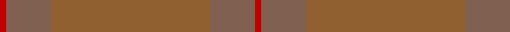

This page is one **sett** — a single exact thread-count. It belongs to the [tartan](/tartans/r1o7o25o7r1/)
(the same proportion at any scale), whose colour order is pattern [RRRRR](/stripes/rrrrr/).

Sourced from weddslist.  It is a [5 stripe tartan](/stripes/stripes5/).

Original link http://www.weddslist.com/cgi-bin/tartans/pg.pl?source=sts

## Thread count
R/2 LTa14 LT50 LTa14 R/2

## Palette

Palette: <strong>custom</strong>
<table><thead><tr><th>Colour</th><th>Threads</th><th>Shade</th><th>Base</th><th>OKLCh</th></tr></thead><tbody><tr><td>R/</td><td style="text-align:right;font-variant-numeric:tabular-nums">2</td><td><code style="background-color:#C00000;">#C00000</code> <small style="color:#888">#C00000</small></td><td>R <code style="background-color:#CC0000;">#CC0000</code></td><td><small style="color:#888">oklch(50.7% 0.208 29.2)</small></td></tr><tr><td>LTa</td><td style="text-align:right;font-variant-numeric:tabular-nums">14</td><td><code style="background-color:#806050;">#806050</code> <small style="color:#888">#806050</small></td><td>R <code style="background-color:#CC0000;">#CC0000</code></td><td><small style="color:#888">oklch(51.7% 0.049 47.8)</small></td></tr><tr><td>LT</td><td style="text-align:right;font-variant-numeric:tabular-nums">50</td><td><code style="background-color:#906030;">#906030</code> <small style="color:#888">#906030</small></td><td>R <code style="background-color:#CC0000;">#CC0000</code></td><td><small style="color:#888">oklch(53.1% 0.089 63.7)</small></td></tr><tr><td>LTa</td><td style="text-align:right;font-variant-numeric:tabular-nums">14</td><td><code style="background-color:#806050;">#806050</code> <small style="color:#888">#806050</small></td><td>R <code style="background-color:#CC0000;">#CC0000</code></td><td><small style="color:#888">oklch(51.7% 0.049 47.8)</small></td></tr><tr><td>R/</td><td style="text-align:right;font-variant-numeric:tabular-nums">2</td><td><code style="background-color:#C00000;">#C00000</code> <small style="color:#888">#C00000</small></td><td>R <code style="background-color:#CC0000;">#CC0000</code></td><td><small style="color:#888">oklch(50.7% 0.208 29.2)</small></td></tr></tbody></table>

# Sample pattern

## Nearest tartans

The nearest existing variants by ΔTartan distance, with this tartan at the top so the swatches line up against it.

ΔTartan

Tartan

Sett

—

<a href="/ttd/edit/#slug=r1o7o25o7r1~x2">Unnamed Brown (Teddy Bear)</a> <a class="nn-out" href="/setts/s5/r1o7o25o7r1~x2/" title="open its dictionary page">↗</a>

3.06

<a href="/ttd/edit/#slug=r3o8r3o20o20o3o8o3~x2">Miyuki, House Check Tan, 1004A</a> <a class="nn-out" href="/setts/s8/r3o8r3o20o20o3o8o3~x2/" title="open its dictionary page">↗</a>

3.29

<a href="/ttd/edit/#slug=dt3dr1dt14dg14dr1dg1dr1dg1dr2~x4">Breckon Hunting</a> <a class="nn-out" href="/setts/s9/dt3dr1dt14dg14dr1dg1dr1dg1dr2~x4/" title="open its dictionary page">↗</a>

3.68

<a href="/ttd/edit/#slug=o6y2o29y29o2y6~x2">Harmony, 12</a> <a class="nn-out" href="/setts/s6/o6y2o29y29o2y6~x2/" title="open its dictionary page">↗</a>

4.10

<a href="/ttd/edit/#slug=lo56db2lo19db1lo2db1lo2~x2">Lewis (Welsh Name)</a> <a class="nn-out" href="/setts/s7/lo56db2lo19db1lo2db1lo2~x2/" title="open its dictionary page">↗</a>

4.44

<a href="/ttd/edit/#slug=dy6dg2dy29dg29dy2dg6~x2">Harmony 11 #2</a> <a class="nn-out" href="/setts/s6/dy6dg2dy29dg29dy2dg6~x2/" title="open its dictionary page">↗</a>

4.54

<a href="/ttd/edit/#slug=o12o6o2ly1~x4">Loch Garth</a> <a class="nn-out" href="/setts/s4/o12o6o2ly1~x4/" title="open its dictionary page">↗</a>

4.56

<a href="/ttd/edit/#slug=dt4k2dt4k45dt2k3dt2~x2">STLTH</a> <a class="nn-out" href="/setts/s7/dt4k2dt4k45dt2k3dt2~x2/" title="open its dictionary page">↗</a>

4.65

<a href="/ttd/edit/#slug=dy2n4y12n3dy6t2n24dy2n2y2~x2">Wicklow Irish County Tartan Tartan Number: 2265. Earliest known date: 1995 One of a series of Irish District tartans designed by Polly Wittering of the House of Edgar, with colours reminiscent of the Country with soft warm colours dominating. See products available Copyright © Blair Urquhart, Comrie, 2015</a> <a class="nn-out" href="/setts/s10/dy2n4y12n3dy6t2n24dy2n2y2~x2/" title="open its dictionary page">↗</a>

4.76

<a href="/ttd/edit/#slug=o1o1o1o1o4o3lo1~x12">Burns' Birthplace (Commem)</a> <a class="nn-out" href="/setts/s7/o1o1o1o1o4o3lo1~x12/" title="open its dictionary page">↗</a>

4.76

<a href="/ttd/edit/#slug=r86dg3r3dg6r85~x2">MacNab #4</a> <a class="nn-out" href="/setts/s5/r86dg3r3dg6r85~x2/" title="open its dictionary page">↗</a>

## Neighbour map

Every grey dot is one of 14299 variants placed by the first two principal components of the ΔTartan feature space (44% of its variance). Red is this tartan; blue dots are its nearest — click one to open its page.

<svg viewBox="0 0 640 380" role="img" style="max-width:100%;height:auto;border:1px solid #e0e0e0;border-radius:4px;display:block" xmlns="http://www.w3.org/2000/svg"><image href="/nn/cloud.v1.png" width="640" height="380"/><a href="/setts/s8/r3o8r3o20o20o3o8o3~x2/"><circle cx="552.6" cy="366.0" r="4" fill="#3465a4"><title>Miyuki, House Check Tan, 1004A</title></circle></a><a href="/setts/s9/dt3dr1dt14dg14dr1dg1dr1dg1dr2~x4/"><circle cx="626.0" cy="366.0" r="4" fill="#3465a4"><title>Breckon Hunting</title></circle></a><a href="/setts/s6/o6y2o29y29o2y6~x2/"><circle cx="626.0" cy="360.1" r="4" fill="#3465a4"><title>Harmony, 12</title></circle></a><a href="/setts/s7/lo56db2lo19db1lo2db1lo2~x2/"><circle cx="626.0" cy="246.3" r="4" fill="#3465a4"><title>Lewis (Welsh Name)</title></circle></a><a href="/setts/s6/dy6dg2dy29dg29dy2dg6~x2/"><circle cx="621.8" cy="366.0" r="4" fill="#3465a4"><title>Harmony 11 #2</title></circle></a><a href="/setts/s4/o12o6o2ly1~x4/"><circle cx="619.8" cy="354.9" r="4" fill="#3465a4"><title>Loch Garth</title></circle></a><a href="/setts/s7/dt4k2dt4k45dt2k3dt2~x2/"><circle cx="626.0" cy="328.5" r="4" fill="#3465a4"><title>STLTH</title></circle></a><a href="/setts/s10/dy2n4y12n3dy6t2n24dy2n2y2~x2/"><circle cx="551.6" cy="299.3" r="4" fill="#3465a4"><title>Wicklow Irish County Tartan Tartan Number: 2265. Earliest known date: 1995 One of a series of Irish District tartans designed by Polly Wittering of the House of Edgar, with colours reminiscent of the Country with soft warm colours dominating. See products available Copyright © Blair Urquhart, Comrie, 2015</title></circle></a><a href="/setts/s7/o1o1o1o1o4o3lo1~x12/"><circle cx="513.1" cy="366.0" r="4" fill="#3465a4"><title>Burns' Birthplace (Commem)</title></circle></a><a href="/setts/s5/r86dg3r3dg6r85~x2/"><circle cx="609.3" cy="281.5" r="4" fill="#3465a4"><title>MacNab #4</title></circle></a><circle cx="626.0" cy="360.9" r="5" fill="#c00000"/></svg>

ID: /setts/s5/r1o7o25o7r1~x2/
