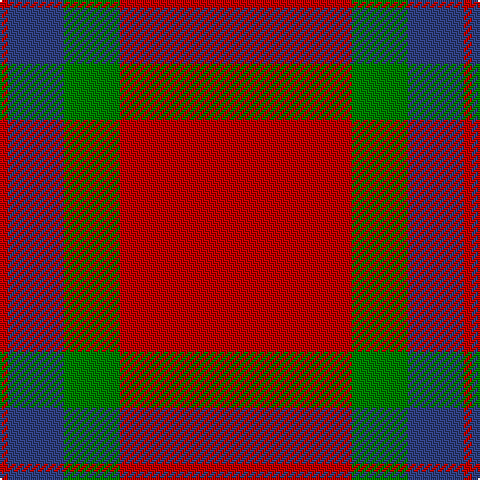

In pattern [RBGRR](/stripes/rbgrr/).

This was sourced from weddslist.  It is a [5 stripe tartan](/stripes/stripes5/).

Original link http://www.weddslist.com/cgi-bin/tartans/pg.pl?source=sts

## Thread count
R/4 R56 G28 B28 R/4

## Palette
Each colour and the base-6 reference it is a variant of.

| Colour | Shade | Base |
|---|---|---|
| B | <code style="background-color:#304080;">#304080</code> `oklch(39.4% 0.109 270.2)` <small>#304080</small> | B <code style="background-color:#2A418A;">#2A418A</code> |
| G | <code style="background-color:#008000;">#008000</code> `oklch(52.0% 0.177 142.5)` <small>#008000</small> | G <code style="background-color:#006100;">#006100</code> |
| R | <code style="background-color:#C00000;">#C00000</code> `oklch(50.7% 0.208 29.2)` <small>#C00000</small> | R <code style="background-color:#CC0000;">#CC0000</code> |

# Sample pattern

## Nearest tartans

The nearest existing variants by ΔTartan distance.

1. [Fraser of Boblainy, Hugh (Personal)](/setts/s5/db1r14g7db7r1~x4/) — ΔT 0.60
1. [Edinchat](/setts/s6/db2o28g13o2db13o2~x4/) — ΔT 0.80
1. [Grant of Lurg](/setts/s6/db2r25g10r2db10r2~x2/) — ΔT 0.80
1. [Dunbar](/setts/s6/r6g21k8r28k2r4~x2/) — ΔT 0.92
1. [Wotherspoon](/setts/s5/r12g8r54db45g6/) — ΔT 1.00
1. [MacKintosh, Plaid](/setts/s6/r16db6r2g6r2db1~x2/) — ΔT 1.06
1. [Glasgow, City of](/setts/s7/g28r4dp25r22g27r4dp2~x2/) — ΔT 1.18
1. [MacKintosh](/setts/s6/r70db20r10g40r10db3/) — ΔT 1.18
1. [MacGregor of Balquhidder](/setts/s5/dg8r2dg9r16w1~x2/) — ΔT 1.18
1. [MacDonald Lord of the Isles #2](/setts/s5/dg16r5dg2r18k2~x2/) — ΔT 1.22

## Neighbour map

Every grey dot is one of 14299 variants placed by the first two principal components of the ΔTartan feature space (44% of its variance). Red is this tartan; blue dots are its nearest — click one to open its page.

<svg viewBox="0 0 640 380" role="img" style="max-width:100%;height:auto;border:1px solid #e0e0e0;border-radius:4px;display:block" xmlns="http://www.w3.org/2000/svg"><image href="/nn/cloud.v1.png" width="640" height="380"/><a href="/setts/s5/db1r14g7db7r1~x4/"><circle cx="319.2" cy="220.3" r="4" fill="#3465a4"><title>Fraser of Boblainy, Hugh (Personal)</title></circle></a><a href="/setts/s6/db2o28g13o2db13o2~x4/"><circle cx="348.3" cy="208.3" r="4" fill="#3465a4"><title>Edinchat</title></circle></a><a href="/setts/s6/db2r25g10r2db10r2~x2/"><circle cx="370.3" cy="206.8" r="4" fill="#3465a4"><title>Grant of Lurg</title></circle></a><a href="/setts/s6/r6g21k8r28k2r4~x2/"><circle cx="345.5" cy="207.7" r="4" fill="#3465a4"><title>Dunbar</title></circle></a><a href="/setts/s5/r12g8r54db45g6/"><circle cx="341.4" cy="240.6" r="4" fill="#3465a4"><title>Wotherspoon</title></circle></a><a href="/setts/s6/r16db6r2g6r2db1~x2/"><circle cx="402.7" cy="201.7" r="4" fill="#3465a4"><title>MacKintosh, Plaid</title></circle></a><a href="/setts/s7/g28r4dp25r22g27r4dp2~x2/"><circle cx="298.8" cy="223.8" r="4" fill="#3465a4"><title>Glasgow, City of</title></circle></a><a href="/setts/s6/r70db20r10g40r10db3/"><circle cx="401.2" cy="187.7" r="4" fill="#3465a4"><title>MacKintosh</title></circle></a><a href="/setts/s5/dg8r2dg9r16w1~x2/"><circle cx="346.6" cy="217.1" r="4" fill="#3465a4"><title>MacGregor of Balquhidder</title></circle></a><a href="/setts/s5/dg16r5dg2r18k2~x2/"><circle cx="343.2" cy="232.8" r="4" fill="#3465a4"><title>MacDonald Lord of the Isles #2</title></circle></a><circle cx="341.5" cy="222.8" r="5" fill="#c00000"/></svg>

ID: /setts/s5/r1r14g7db7r1~x4/
