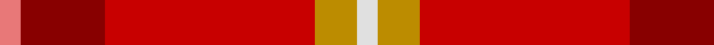
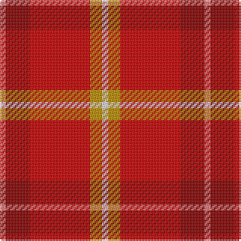

In pattern [RRRYW](/stripes/rrryw/).

This was sourced from tartans-authority.  It is a [5 stripe tartan](/stripes/stripes5/).

Original link http://www.tartansauthority.com/tartan-ferret/display/10521/

## Thread count
LR/4 DR16 R40 DY8 LN/4

## Palette
Each colour and its ΔE from the base-6 reference it is a variant of.

| Colour | Shade | Base | ΔE (OKLab) |
|---|---|---|---|
| DR | <code style="background-color:#880000;">#880000</code> `#880000` | R <code style="background-color:#CC0000;">#CC0000</code> | 0.15 |
| DY | <code style="background-color:#BC8C00;">#BC8C00</code> `#BC8C00` | Y <code style="background-color:#F2BF00;">#F2BF00</code> | 0.16 |
| LN | <code style="background-color:#E0E0E0;">#E0E0E0</code> `#E0E0E0` | W <code style="background-color:#F7F7F7;">#F7F7F7</code> | 0.07 |
| LR | <code style="background-color:#E87878;">#E87878</code> `#E87878` | R <code style="background-color:#CC0000;">#CC0000</code> | 0.19 |
| R | <code style="background-color:#C80000;">#C80000</code> `#C80000` | R <code style="background-color:#CC0000;">#CC0000</code> | 0.01 |

# Sample pattern

## Nearest tartans

The nearest existing variants by ΔTartan distance.

1. [Love](/setts/s5/m1dp4r10o2w1~x4/) — ΔT 1.49
1. [Barbour - Cardinal Red](/setts/s7/r3ly2r18db8w1r18r2~x2/) — ΔT 1.67
1. [Haughey (2015)](/setts/s5/do5r21lo21w2db1~x2/) — ΔT 1.86
1. [Cairn O'Mount (Personal)](/setts/s6/r58n12r5y28r7lo5~x2/) — ΔT 1.87
1. [Mason (Personal)](/setts/s6/k7w2dg2o31r35lo2~x2/) — ΔT 1.99
1. [Flowers of the Forest, The](/setts/s9/r2do2r20y13lg3db5r2r4o2~x2/) — ΔT 2.07
1. [Staves (Personal)](/setts/s5/r10dg4r1w1t1~x6/) — ΔT 2.10
1. [Staves (Personal)](/setts/s5/r10dg4r1w1t1~x2/) — ΔT 2.12
1. [Roseate Sunrise](/setts/s6/r26r5m12ly1g1r3~x2/) — ΔT 2.13
1. [Tipperary, County](/setts/s7/r33k8dy12g12r8dy2r8~x2/) — ΔT 2.14

## Neighbour map

Every grey dot is one of 14299 variants placed by the first two principal components of the ΔTartan feature space (44% of its variance). Red is this tartan; blue dots are its nearest — click one to open its page.

<svg viewBox="0 0 640 380" role="img" style="max-width:100%;height:auto;border:1px solid #e0e0e0;border-radius:4px;display:block" xmlns="http://www.w3.org/2000/svg"><image href="/nn/cloud.v1.png" width="640" height="380"/><a href="/setts/s5/m1dp4r10o2w1~x4/"><circle cx="325.7" cy="195.5" r="4" fill="#3465a4"><title>Love</title></circle></a><a href="/setts/s7/r3ly2r18db8w1r18r2~x2/"><circle cx="304.9" cy="162.2" r="4" fill="#3465a4"><title>Barbour - Cardinal Red</title></circle></a><a href="/setts/s5/do5r21lo21w2db1~x2/"><circle cx="302.1" cy="161.9" r="4" fill="#3465a4"><title>Haughey (2015)</title></circle></a><a href="/setts/s6/r58n12r5y28r7lo5~x2/"><circle cx="427.7" cy="215.5" r="4" fill="#3465a4"><title>Cairn O'Mount (Personal)</title></circle></a><a href="/setts/s6/k7w2dg2o31r35lo2~x2/"><circle cx="304.9" cy="150.1" r="4" fill="#3465a4"><title>Mason (Personal)</title></circle></a><a href="/setts/s9/r2do2r20y13lg3db5r2r4o2~x2/"><circle cx="291.1" cy="153.8" r="4" fill="#3465a4"><title>Flowers of the Forest, The</title></circle></a><a href="/setts/s5/r10dg4r1w1t1~x6/"><circle cx="328.3" cy="174.6" r="4" fill="#3465a4"><title>Staves (Personal)</title></circle></a><a href="/setts/s5/r10dg4r1w1t1~x2/"><circle cx="327.5" cy="174.2" r="4" fill="#3465a4"><title>Staves (Personal)</title></circle></a><a href="/setts/s6/r26r5m12ly1g1r3~x2/"><circle cx="350.9" cy="122.5" r="4" fill="#3465a4"><title>Roseate Sunrise</title></circle></a><a href="/setts/s7/r33k8dy12g12r8dy2r8~x2/"><circle cx="362.4" cy="193.4" r="4" fill="#3465a4"><title>Tipperary, County</title></circle></a><circle cx="348.8" cy="196.6" r="5" fill="#c00000"/></svg>

ID: /setts/s5/r1r4r10lo2w1~x4/
