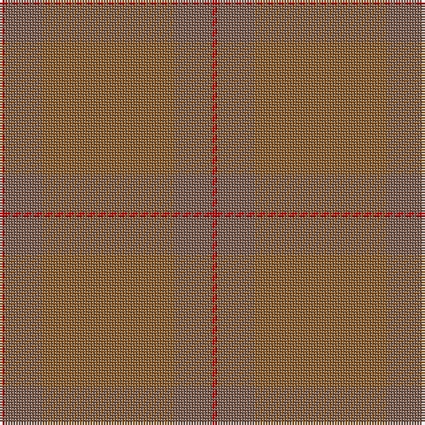

In pattern [RRRRR](/patterns/rrrrr/).

This was sourced from weddslist.  It is a [5 stripes tartan](/stripes/stripes5/).

Original link http://www.weddslist.com/cgi-bin/tartans/pg.pl?source=sts

## Thread count
R/2 LTa14 LT50 LTa14 R/2

## Palette
Each colour and its ΔE from the base-6 reference it is a variant of.

| Colour | Shade | Base | ΔE (OKLab) |
|---|---|---|---|
| LT | <code style="background-color:#906030;">#906030</code> `#906030` | R <code style="background-color:#CC0000;">#CC0000</code> | 0.15 |
| LTa | <code style="background-color:#806050;">#806050</code> `#806050` | R <code style="background-color:#CC0000;">#CC0000</code> | 0.17 |
| R | <code style="background-color:#C00000;">#C00000</code> `#C00000` | R <code style="background-color:#CC0000;">#CC0000</code> | 0.03 |

# Sample pattern

## Nearest tartans

The nearest existing variants by ΔTartan distance.

1. [Miyuki, House Check Tan, 1004A](/setts/s8/r3r8ra3r20ra20rb3ra8rb3~r806050-ra906030-rbc00000~x2/) — ΔT 3.07
1. [Breckon Hunting](/setts/s9/b3ba1b14g14ba1g1ba1g1ba2~b233634-ba51200f-g27371d~x4/) — ΔT 3.29
1. [Harmony, 12](/setts/s6/g6r2g29r29g2r6~g808080-r806050~x2/) — ΔT 3.70
1. [Harmony, No 13](/setts/s6/b10g1b1g10b18g5~b5480b0-g808080~x2/) — ΔT 4.09
1. [Lewis (Welsh Name)](/setts/s7/y56b2y19b1y2b1y2~b202060-ya08858~x2/) — ΔT 4.11
1. [Harmony 11 #2](/setts/s6/g6ga2g29ga29g2ga6~g005020-ga503c14~x2/) — ΔT 4.45
1. [STLTH](/setts/s7/b4k2b4k45ba2k3ba2~b1e2025-ba3f4441-k1c1714~x2/) — ΔT 4.56
1. [Loch Garth](/setts/s4/r12ra6r2y1~r806050-ra906030-yf0c000~x4/) — ΔT 4.56
1. [Wicklow Irish County Tartan Tartan Number: 2265. Earliest known date: 1995 One of a series of Irish District tartans designed by Polly Wittering of the House of Edgar, with colours reminiscent of the Country with soft warm colours dominating. See products available Copyright © Blair Urquhart, Comrie, 2015](/setts/s10/g2b2ga2b24ba2ga6b3g12b4ga2~b646c84-ba0070a4-g3c6060-ga644c40~x2/) — ΔT 4.66
1. [Dark Island Black Weavers Tartan Tartan Number: 5832. Earliest known date: May 2003 A Solid Sett* tartan and an innovative departure from conventional tartan design. An ecru (white) yarn has been woven on a Jacquard loom with the sett being formed by stitches other than 2/2 twill and then the finished fabric has been piece-dyed black. The sett is highlighted because of the differing light reflecting qualities of the stitches. Here they are shown in grey so as to be discernible. *This new category of tartan has been given the description of Solid Sett - a solid colour but with a sett still showing. See products available Copyright © Blair Urquhart, Comrie, 2015](/setts/s16/k4b2k43b20k4b2k2b4k2b2k4b20k43b2k4b2~b1c1c1c-k101010~x2/) — ΔT 4.69

## Neighbour map

Every grey dot is one of 15726 variants placed by the first two principal components of the ΔTartan feature space (44% of its variance). Red is this tartan; blue dots are its nearest — click one to open its page.

<svg viewBox="0 0 640 380" role="img" style="max-width:100%;height:auto;border:1px solid #e0e0e0;border-radius:4px;display:block" xmlns="http://www.w3.org/2000/svg"><image href="/nn/cloud.v1.png" width="640" height="380"/><a href="/setts/s8/r3r8ra3r20ra20rb3ra8rb3~r806050-ra906030-rbc00000~x2/"><circle cx="556.0" cy="348.6" r="4" fill="#3465a4"><title>Miyuki, House Check Tan, 1004A</title></circle></a><a href="/setts/s9/b3ba1b14g14ba1g1ba1g1ba2~b233634-ba51200f-g27371d~x4/"><circle cx="626.0" cy="327.5" r="4" fill="#3465a4"><title>Breckon Hunting</title></circle></a><a href="/setts/s6/g6r2g29r29g2r6~g808080-r806050~x2/"><circle cx="626.0" cy="330.9" r="4" fill="#3465a4"><title>Harmony, 12</title></circle></a><a href="/setts/s6/b10g1b1g10b18g5~b5480b0-g808080~x2/"><circle cx="626.0" cy="350.7" r="4" fill="#3465a4"><title>Harmony, No 13</title></circle></a><a href="/setts/s7/y56b2y19b1y2b1y2~b202060-ya08858~x2/"><circle cx="626.0" cy="220.0" r="4" fill="#3465a4"><title>Lewis (Welsh Name)</title></circle></a><a href="/setts/s6/g6ga2g29ga29g2ga6~g005020-ga503c14~x2/"><circle cx="623.0" cy="342.6" r="4" fill="#3465a4"><title>Harmony 11 #2</title></circle></a><a href="/setts/s7/b4k2b4k45ba2k3ba2~b1e2025-ba3f4441-k1c1714~x2/"><circle cx="626.0" cy="296.6" r="4" fill="#3465a4"><title>STLTH</title></circle></a><a href="/setts/s4/r12ra6r2y1~r806050-ra906030-yf0c000~x4/"><circle cx="622.6" cy="332.6" r="4" fill="#3465a4"><title>Loch Garth</title></circle></a><a href="/setts/s10/g2b2ga2b24ba2ga6b3g12b4ga2~b646c84-ba0070a4-g3c6060-ga644c40~x2/"><circle cx="552.7" cy="268.1" r="4" fill="#3465a4"><title>Wicklow Irish County Tartan Tartan Number: 2265. Earliest known date: 1995 One of a series of Irish District tartans designed by Polly Wittering of the House of Edgar, with colours reminiscent of the Country with soft warm colours dominating. See products available Copyright © Blair Urquhart, Comrie, 2015</title></circle></a><a href="/setts/s16/k4b2k43b20k4b2k2b4k2b2k4b20k43b2k4b2~b1c1c1c-k101010~x2/"><circle cx="626.0" cy="330.0" r="4" fill="#3465a4"><title>Dark Island Black Weavers Tartan Tartan Number: 5832. Earliest known date: May 2003 A Solid Sett* tartan and an innovative departure from conventional tartan design. An ecru (white) yarn has been woven on a Jacquard loom with the sett being formed by stitches other than 2/2 twill and then the finished fabric has been piece-dyed black. The sett is highlighted because of the differing light reflecting qualities of the stitches. Here they are shown in grey so as to be discernible. *This new category of tartan has been given the description of Solid Sett - a solid colour but with a sett still showing. See products available Copyright © Blair Urquhart, Comrie, 2015</title></circle></a><circle cx="626.0" cy="323.6" r="5" fill="#c00000"/></svg>

ID: /setts/s5/r1ra7rb25ra7r1~rc00000-ra806050-rb906030~x2/
