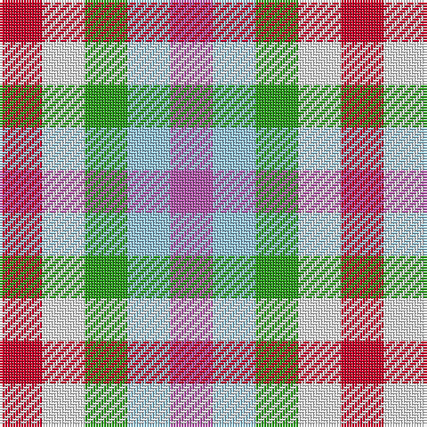

In pattern [RWGWR](/stripes/rwgwr/).

This was sourced from register-of-tartans.  It is a [5 stripe tartan](/stripes/stripes5/).

Original link https://www.tartanregister.gov.uk/tartanDetails.aspx?ref=11537

## Register references

External register numbers recorded for this tartan.

- Scottish Register of Tartans: [11537](https://www.tartanregister.gov.uk/tartanDetails.aspx?ref=11537)

## Thread count
R/16 W16 G16 LB16 P/16

## Palette
Each colour and the base-6 reference it is a variant of.

| Colour | Shade | Base |
|---|---|---|
| G | <code style="background-color:#289C18;">#289C18</code> `oklch(60.6% 0.191 141.6)` <small>#289C18</small> | G <code style="background-color:#006100;">#006100</code> |
| LB | <code style="background-color:#98C8E8;">#98C8E8</code> `oklch(81.0% 0.068 237.9)` <small>#98C8E8</small> | W <code style="background-color:#F7F7F7;">#F7F7F7</code> |
| P | <code style="background-color:#B458AC;">#B458AC</code> `oklch(60.2% 0.158 330.7)` <small>#B458AC</small> | R <code style="background-color:#CC0000;">#CC0000</code> |
| R | <code style="background-color:#C80028;">#C80028</code> `oklch(52.5% 0.212 23.0)` <small>#C80028</small> | R <code style="background-color:#CC0000;">#CC0000</code> |
| W | <code style="background-color:#F8F8F8;">#F8F8F8</code> `oklch(97.9% 0.000 89.9)` <small>#F8F8F8</small> | W <code style="background-color:#F7F7F7;">#F7F7F7</code> |

# Sample pattern

## Nearest tartans

The nearest existing variants by ΔTartan distance, with this tartan at the top so the swatches line up against it.

ΔTartan

Tartan

Sett

—

<a href="/ttd/edit/#slug=r1w1g1lb1m1~x16">Daughter of Mull</a> <a class="nn-out" href="/setts/s5/r1w1g1lb1m1~x16/" title="open its dictionary page">↗</a>

1.83

<a href="/ttd/edit/#slug=dg1r1w1db1~x20">Algarve</a> <a class="nn-out" href="/setts/s4/dg1r1w1db1~x20/" title="open its dictionary page">↗</a>

2.13

<a href="/ttd/edit/#slug=b15g15o11r17m15~x2">Highland Princess, The</a> <a class="nn-out" href="/setts/s5/b15g15o11r17m15~x2/" title="open its dictionary page">↗</a>

2.51

<a href="/ttd/edit/#slug=b15g15lo11r17m15~x2">Highland Princess, The</a> <a class="nn-out" href="/setts/s5/b15g15lo11r17m15~x2/" title="open its dictionary page">↗</a>

2.83

<a href="/ttd/edit/#slug=k1lt1r1db1g1db1~x25">Antonelli (Oklahoma), John (Personal)</a> <a class="nn-out" href="/setts/s6/k1lt1r1db1g1db1~x25/" title="open its dictionary page">↗</a>

2.94

<a href="/ttd/edit/#slug=dt1lb1w1~x8">Glen Moriston Estate Check</a> <a class="nn-out" href="/setts/s3/dt1lb1w1~x8/" title="open its dictionary page">↗</a>

2.99

<a href="/ttd/edit/#slug=db1w1r1~x22">Aquascutum</a> <a class="nn-out" href="/setts/s3/db1w1r1~x22/" title="open its dictionary page">↗</a>

3.00

<a href="/ttd/edit/#slug=r1db1ly1~x40">Mothers Pride</a> <a class="nn-out" href="/setts/s3/r1db1ly1~x40/" title="open its dictionary page">↗</a>

3.01

<a href="/ttd/edit/#slug=r4ly3g4ly4b4ly4g4~x2">Lochwood Estate Check</a> <a class="nn-out" href="/setts/s7/r4ly3g4ly4b4ly4g4~x2/" title="open its dictionary page">↗</a>

3.02

<a href="/ttd/edit/#slug=n1m1n1g1n1w1m1g1w1m1g1m1m1n1n1m1g1w1~x10">Welly (Personal)</a> <a class="nn-out" href="/setts/s18/n1m1n1g1n1w1m1g1w1m1g1m1m1n1n1m1g1w1~x10/" title="open its dictionary page">↗</a>

3.06

<a href="/ttd/edit/#slug=r1ly1g1ly1r1ly1g1~x8">Lochwood (Estate Check)</a> <a class="nn-out" href="/setts/s7/r1ly1g1ly1r1ly1g1~x8/" title="open its dictionary page">↗</a>

## Neighbour map

Every grey dot is one of 14299 variants placed by the first two principal components of the ΔTartan feature space (44% of its variance). Red is this tartan; blue dots are its nearest — click one to open its page.

<svg viewBox="0 0 640 380" role="img" style="max-width:100%;height:auto;border:1px solid #e0e0e0;border-radius:4px;display:block" xmlns="http://www.w3.org/2000/svg"><image href="/nn/cloud.v1.png" width="640" height="380"/><a href="/setts/s4/dg1r1w1db1~x20/"><circle cx="14.0" cy="366.0" r="4" fill="#3465a4"><title>Algarve</title></circle></a><a href="/setts/s5/b15g15o11r17m15~x2/"><circle cx="14.0" cy="343.3" r="4" fill="#3465a4"><title>Highland Princess, The</title></circle></a><a href="/setts/s5/b15g15lo11r17m15~x2/"><circle cx="14.0" cy="358.0" r="4" fill="#3465a4"><title>Highland Princess, The</title></circle></a><a href="/setts/s6/k1lt1r1db1g1db1~x25/"><circle cx="14.0" cy="366.0" r="4" fill="#3465a4"><title>Antonelli (Oklahoma), John (Personal)</title></circle></a><a href="/setts/s3/dt1lb1w1~x8/"><circle cx="14.0" cy="366.0" r="4" fill="#3465a4"><title>Glen Moriston Estate Check</title></circle></a><a href="/setts/s3/db1w1r1~x22/"><circle cx="14.0" cy="366.0" r="4" fill="#3465a4"><title>Aquascutum</title></circle></a><a href="/setts/s3/r1db1ly1~x40/"><circle cx="14.0" cy="366.0" r="4" fill="#3465a4"><title>Mothers Pride</title></circle></a><a href="/setts/s7/r4ly3g4ly4b4ly4g4~x2/"><circle cx="23.8" cy="366.0" r="4" fill="#3465a4"><title>Lochwood Estate Check</title></circle></a><a href="/setts/s18/n1m1n1g1n1w1m1g1w1m1g1m1m1n1n1m1g1w1~x10/"><circle cx="14.0" cy="322.8" r="4" fill="#3465a4"><title>Welly (Personal)</title></circle></a><a href="/setts/s7/r1ly1g1ly1r1ly1g1~x8/"><circle cx="14.0" cy="366.0" r="4" fill="#3465a4"><title>Lochwood (Estate Check)</title></circle></a><circle cx="14.0" cy="366.0" r="5" fill="#c00000"/></svg>

ID: /setts/s5/r1w1g1lb1m1~x16/
