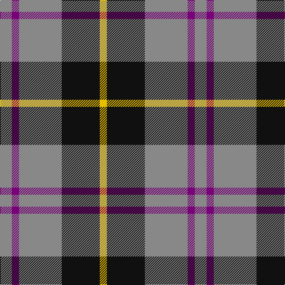

In pattern [RBRKY](/patterns/rbrky/).

This was sourced from register-of-tartans.  It is a [5 stripes tartan](/stripes/stripes5/).

Original link https://www.tartanregister.gov.uk/tartanDetails.aspx?ref=3122

## Attestations

This cloth appears in 2 source records; the oldest owns this page.

- 01/01/1993 — New York State Police Pipe Band (register-of-tartans, [record](https://www.tartanregister.gov.uk/tartanDetails.aspx?ref=3122))
- 1993 — New York State Police (Corporate) (tartans-authority, [record](http://www.tartansauthority.com/tartan-ferret/display/5619/))

## Thread count
N/20 P12 N72 K64 Y/12

## Palette
Each colour and its ΔE from the base-6 reference it is a variant of.

| Colour | Shade | Base | ΔE (OKLab) |
|---|---|---|---|
| K | <code style="background-color:#101010;">#101010</code> `#101010` | K <code style="background-color:#000000;">#000000</code> | 0.17 |
| N | <code style="background-color:#888888;">#888888</code> `#888888` | R <code style="background-color:#CC0000;">#CC0000</code> | 0.24 |
| P | <code style="background-color:#780078;">#780078</code> `#780078` | B <code style="background-color:#2A418A;">#2A418A</code> | 0.17 |
| Y | <code style="background-color:#E8C000;">#E8C000</code> `#E8C000` | Y <code style="background-color:#F2BF00;">#F2BF00</code> | 0.02 |

# Sample pattern

## Nearest tartans

The nearest existing variants by ΔTartan distance.

1. [Oban Grey (Fashion)](/setts/s5/k16w16k16r60ra8-k101010-r888888-ra880000-wc0c0c0/) — ΔT 0.66
1. [Loganair Uniform Skirt Corporate Tartan Tartan Number: 1629. Earliest known date: c.1985 Half actual count for display. Used until 1988 See products available Copyright © Blair Urquhart, Comrie, 2015](/setts/s4/r5ra32k31w5-k101010-rc80000-ra888888-we0e0e0/) — ΔT 0.78
1. [Loganair](/setts/s4/r10ra64k62w10-k101010-r880000-ra888888-we0e0e0/) — ΔT 0.79
1. [Thompson, Dress (Clan)](/setts/s4/r12ra64k64w12-k101010-r880000-ra888888-wc0c0c0/) — ΔT 0.96
1. [Burberry Hunting](/setts/s5/k18w18k18g60r6-g406054-k101010-rc80000-wfcfcfc/) — ΔT 1.00
1. [Bronte House Check (Fashion)](/setts/s6/r10g60b13w24b24g8-b003c64-g604000-re87878-we8ccb8/) — ΔT 1.07
1. [MacCrimmon from Skye](/setts/s7/r10k6b44k34b44k6y10-b5c8ca8-k101010-rc80000-ye8c000/) — ΔT 1.12
1. [Greystone (Burberry Grey)](/setts/s5/k18w18k18b60r6-b646464-k000000-r8c0000-wc8c8c8/) — ΔT 1.12
1. [Oban Grey](/setts/s5/k16w12k16g36r4-g808080-k101010-rdc0000-we0e0e0/) — ΔT 1.12
1. [Oban Grey District Tartan Tartan Number: 1237. Earliest known date: pre 2003 Not an official district but a name chosen by the weavers. See products available Copyright © Blair Urquhart, Comrie, 2015](/setts/s5/k16w12k16r36ra4-k101010-r888888-rac80000-we0e0e0/) — ΔT 1.14

## Neighbour map

Every grey dot is one of 15726 variants placed by the first two principal components of the ΔTartan feature space (44% of its variance). Red is this tartan; blue dots are its nearest — click one to open its page.

<svg viewBox="0 0 640 380" role="img" style="max-width:100%;height:auto;border:1px solid #e0e0e0;border-radius:4px;display:block" xmlns="http://www.w3.org/2000/svg"><image href="/nn/cloud.v1.png" width="640" height="380"/><a href="/setts/s5/k16w16k16r60ra8-k101010-r888888-ra880000-wc0c0c0/"><circle cx="241.6" cy="218.6" r="4" fill="#3465a4"><title>Oban Grey (Fashion)</title></circle></a><a href="/setts/s4/r5ra32k31w5-k101010-rc80000-ra888888-we0e0e0/"><circle cx="208.5" cy="240.8" r="4" fill="#3465a4"><title>Loganair Uniform Skirt Corporate Tartan Tartan Number: 1629. Earliest known date: c.1985 Half actual count for display. Used until 1988 See products available Copyright © Blair Urquhart, Comrie, 2015</title></circle></a><a href="/setts/s4/r10ra64k62w10-k101010-r880000-ra888888-we0e0e0/"><circle cx="209.3" cy="242.1" r="4" fill="#3465a4"><title>Loganair</title></circle></a><a href="/setts/s4/r12ra64k64w12-k101010-r880000-ra888888-wc0c0c0/"><circle cx="191.9" cy="253.9" r="4" fill="#3465a4"><title>Thompson, Dress (Clan)</title></circle></a><a href="/setts/s5/k18w18k18g60r6-g406054-k101010-rc80000-wfcfcfc/"><circle cx="230.5" cy="211.4" r="4" fill="#3465a4"><title>Burberry Hunting</title></circle></a><a href="/setts/s6/r10g60b13w24b24g8-b003c64-g604000-re87878-we8ccb8/"><circle cx="231.1" cy="220.0" r="4" fill="#3465a4"><title>Bronte House Check (Fashion)</title></circle></a><a href="/setts/s7/r10k6b44k34b44k6y10-b5c8ca8-k101010-rc80000-ye8c000/"><circle cx="263.4" cy="214.9" r="4" fill="#3465a4"><title>MacCrimmon from Skye</title></circle></a><a href="/setts/s5/k18w18k18b60r6-b646464-k000000-r8c0000-wc8c8c8/"><circle cx="229.4" cy="210.4" r="4" fill="#3465a4"><title>Greystone (Burberry Grey)</title></circle></a><a href="/setts/s5/k16w12k16g36r4-g808080-k101010-rdc0000-we0e0e0/"><circle cx="186.4" cy="225.1" r="4" fill="#3465a4"><title>Oban Grey</title></circle></a><a href="/setts/s5/k16w12k16r36ra4-k101010-r888888-rac80000-we0e0e0/"><circle cx="184.7" cy="224.1" r="4" fill="#3465a4"><title>Oban Grey District Tartan Tartan Number: 1237. Earliest known date: pre 2003 Not an official district but a name chosen by the weavers. See products available Copyright © Blair Urquhart, Comrie, 2015</title></circle></a><circle cx="234.8" cy="235.0" r="5" fill="#c00000"/></svg>

ID: /setts/s5/r20b12r72k64y12-b780078-k101010-r888888-ye8c000/
