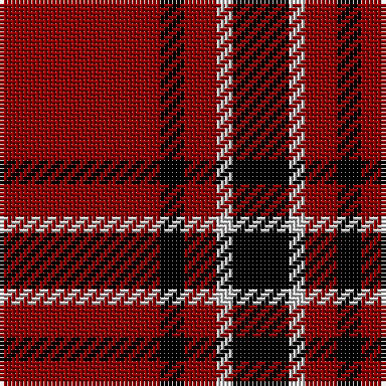

In pattern [KWRKR](/stripes/kwrkr/).

This was sourced from register-of-tartans.  It is a [5 stripe tartan](/stripes/stripes5/).

Original link https://www.tartanregister.gov.uk/tartanDetails.aspx?ref=5296

## Register references

External register numbers recorded for this tartan.

- Scottish Register of Tartans: [5296](https://www.tartanregister.gov.uk/tartanDetails.aspx?ref=5296)
- Scottish Tartans Authority (ITI): 3634

## Thread count
DR/40 K6 DR8 N4 K/14

## Palette
Each colour and its ΔE from the base-6 reference it is a variant of.

| Colour | Shade | Base | ΔE (OKLab) |
|---|---|---|---|
| DR | <code style="background-color:#8C0000;">#8C0000</code> `#8C0000` | R <code style="background-color:#CC0000;">#CC0000</code> | 0.14 |
| K | <code style="background-color:#000000;">#000000</code> `#000000` | K <code style="background-color:#000000;">#000000</code> | 0.00 |
| N | <code style="background-color:#C8C8C8;">#C8C8C8</code> `#C8C8C8` | W <code style="background-color:#F7F7F7;">#F7F7F7</code> | 0.14 |

# Sample pattern

## Nearest tartans

The nearest existing variants by ΔTartan distance.

1. [Loevenstein Castle 1 (Artefact)](/setts/s5/r20k3r4w2k7~x2/) — ΔT 0.23
1. [MacKeane](/setts/s5/r4k8r12k1ly1~x2/) — ΔT 1.21
1. [MacGregor, Black (Personal)](/setts/s5/r41k19r7k9w3~x2/) — ΔT 1.22
1. [Auld Reekie](/setts/s6/db4r3db3r22dg8r2~x2/) — ΔT 1.25
1. [MacQuarrie 5](/setts/s7/r4g5r2k6r18k2r4~x2/) — ΔT 1.26
1. [MacQueen](/setts/s6/k2r6k2r6k12ly1~x4/) — ΔT 1.30
1. [Swanstrom (Personal)](/setts/s6/k8r1k8r11ly1r1~x4/) — ΔT 1.33
1. [Campbell of Armaddie](/setts/s5/r4k1r12k12r2~x2/) — ΔT 1.34
1. [MacIver](/setts/s5/k16r2k2r12w1~x2/) — ΔT 1.34
1. [Hopkins (Name)](/setts/s5/r36k18r4k7w2~x2/) — ΔT 1.38

## Neighbour map

Every grey dot is one of 14299 variants placed by the first two principal components of the ΔTartan feature space (44% of its variance). Red is this tartan; blue dots are its nearest — click one to open its page.

<svg viewBox="0 0 640 380" role="img" style="max-width:100%;height:auto;border:1px solid #e0e0e0;border-radius:4px;display:block" xmlns="http://www.w3.org/2000/svg"><image href="/nn/cloud.v1.png" width="640" height="380"/><a href="/setts/s5/r20k3r4w2k7~x2/"><circle cx="397.8" cy="214.6" r="4" fill="#3465a4"><title>Loevenstein Castle 1 (Artefact)</title></circle></a><a href="/setts/s5/r4k8r12k1ly1~x2/"><circle cx="384.8" cy="212.9" r="4" fill="#3465a4"><title>MacKeane</title></circle></a><a href="/setts/s5/r41k19r7k9w3~x2/"><circle cx="382.7" cy="201.8" r="4" fill="#3465a4"><title>MacGregor, Black (Personal)</title></circle></a><a href="/setts/s6/db4r3db3r22dg8r2~x2/"><circle cx="400.1" cy="201.9" r="4" fill="#3465a4"><title>Auld Reekie</title></circle></a><a href="/setts/s7/r4g5r2k6r18k2r4~x2/"><circle cx="390.1" cy="200.8" r="4" fill="#3465a4"><title>MacQuarrie 5</title></circle></a><a href="/setts/s6/k2r6k2r6k12ly1~x4/"><circle cx="342.4" cy="216.7" r="4" fill="#3465a4"><title>MacQueen</title></circle></a><a href="/setts/s6/k8r1k8r11ly1r1~x4/"><circle cx="336.5" cy="214.7" r="4" fill="#3465a4"><title>Swanstrom (Personal)</title></circle></a><a href="/setts/s5/r4k1r12k12r2~x2/"><circle cx="373.8" cy="229.8" r="4" fill="#3465a4"><title>Campbell of Armaddie</title></circle></a><a href="/setts/s5/k16r2k2r12w1~x2/"><circle cx="360.3" cy="195.2" r="4" fill="#3465a4"><title>MacIver</title></circle></a><a href="/setts/s5/r36k18r4k7w2~x2/"><circle cx="399.6" cy="189.5" r="4" fill="#3465a4"><title>Hopkins (Name)</title></circle></a><circle cx="404.5" cy="217.4" r="5" fill="#c00000"/></svg>

ID: /setts/s5/r20k3r4lb2k7~x2/
