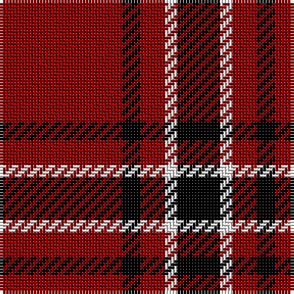

In pattern [KWRKR](/stripes/kwrkr/).

This was sourced from tartans-authority.  It is a [5 stripe tartan](/stripes/stripes5/).

Original link http://www.tartansauthority.com/tartan-ferret/display/3634/

## Thread count
DR/40 K6 DR8 W4 K/14

## Palette
Each colour and the base-6 reference it is a variant of.

| Colour | Shade | Base |
|---|---|---|
| DR | <code style="background-color:#880000;">#880000</code> `oklch(39.4% 0.162 29.2)` <small>#880000</small> | R <code style="background-color:#CC0000;">#CC0000</code> |
| K | <code style="background-color:#000000;">#000000</code> `oklch(0.0% 0.000 0.0)` <small>#000000</small> | K <code style="background-color:#000000;">#000000</code> |
| W | <code style="background-color:#FCFCFC;">#FCFCFC</code> `oklch(99.1% 0.000 89.9)` <small>#FCFCFC</small> | W <code style="background-color:#F7F7F7;">#F7F7F7</code> |

# Sample pattern

## Nearest tartans

The nearest existing variants by ΔTartan distance, with this tartan at the top so the swatches line up against it.

ΔTartan

Tartan

Sett

—

<a href="/ttd/edit/#slug=r20k3r4w2k7~x2">Loevenstein Castle 1 (Artefact)</a> <a class="nn-out" href="/setts/s5/r20k3r4w2k7~x2/" title="open its dictionary page">↗</a>

0.23

<a href="/ttd/edit/#slug=r20k3r4lb2k7~x2">Loevenstein Castle</a> <a class="nn-out" href="/setts/s5/r20k3r4lb2k7~x2/" title="open its dictionary page">↗</a>

1.25

<a href="/ttd/edit/#slug=r41k19r7k9w3~x2">MacGregor, Black (Personal)</a> <a class="nn-out" href="/setts/s5/r41k19r7k9w3~x2/" title="open its dictionary page">↗</a>

1.27

<a href="/ttd/edit/#slug=r4g5r2k6r18k2r4~x2">MacQuarrie 5</a> <a class="nn-out" href="/setts/s7/r4g5r2k6r18k2r4~x2/" title="open its dictionary page">↗</a>

1.29

<a href="/ttd/edit/#slug=r4k8r12k1ly1~x2">MacKeane</a> <a class="nn-out" href="/setts/s5/r4k8r12k1ly1~x2/" title="open its dictionary page">↗</a>

1.29

<a href="/ttd/edit/#slug=r4k1r12k12r2~x2">Campbell of Armaddie</a> <a class="nn-out" href="/setts/s5/r4k1r12k12r2~x2/" title="open its dictionary page">↗</a>

1.32

<a href="/ttd/edit/#slug=k2r6k2r6k12ly1~x4">MacQueen</a> <a class="nn-out" href="/setts/s6/k2r6k2r6k12ly1~x4/" title="open its dictionary page">↗</a>

1.33

<a href="/ttd/edit/#slug=k16r2k2r12w1~x2">MacIver</a> <a class="nn-out" href="/setts/s5/k16r2k2r12w1~x2/" title="open its dictionary page">↗</a>

1.36

<a href="/ttd/edit/#slug=k8r1k8r11ly1r1~x4">Swanstrom (Personal)</a> <a class="nn-out" href="/setts/s6/k8r1k8r11ly1r1~x4/" title="open its dictionary page">↗</a>

1.36

<a href="/ttd/edit/#slug=db4r3db3r22dg8r2~x2">Auld Reekie</a> <a class="nn-out" href="/setts/s6/db4r3db3r22dg8r2~x2/" title="open its dictionary page">↗</a>

1.43

<a href="/ttd/edit/#slug=r36k18r4k7w2~x2">Hopkins (Name)</a> <a class="nn-out" href="/setts/s5/r36k18r4k7w2~x2/" title="open its dictionary page">↗</a>

## Neighbour map

Every grey dot is one of 14299 variants placed by the first two principal components of the ΔTartan feature space (44% of its variance). Red is this tartan; blue dots are its nearest — click one to open its page.

<svg viewBox="0 0 640 380" role="img" style="max-width:100%;height:auto;border:1px solid #e0e0e0;border-radius:4px;display:block" xmlns="http://www.w3.org/2000/svg"><image href="/nn/cloud.v1.png" width="640" height="380"/><a href="/setts/s5/r20k3r4lb2k7~x2/"><circle cx="404.5" cy="217.4" r="4" fill="#3465a4"><title>Loevenstein Castle</title></circle></a><a href="/setts/s5/r41k19r7k9w3~x2/"><circle cx="382.7" cy="201.8" r="4" fill="#3465a4"><title>MacGregor, Black (Personal)</title></circle></a><a href="/setts/s7/r4g5r2k6r18k2r4~x2/"><circle cx="390.1" cy="200.8" r="4" fill="#3465a4"><title>MacQuarrie 5</title></circle></a><a href="/setts/s5/r4k8r12k1ly1~x2/"><circle cx="384.8" cy="212.9" r="4" fill="#3465a4"><title>MacKeane</title></circle></a><a href="/setts/s5/r4k1r12k12r2~x2/"><circle cx="373.8" cy="229.8" r="4" fill="#3465a4"><title>Campbell of Armaddie</title></circle></a><a href="/setts/s6/k2r6k2r6k12ly1~x4/"><circle cx="342.4" cy="216.7" r="4" fill="#3465a4"><title>MacQueen</title></circle></a><a href="/setts/s5/k16r2k2r12w1~x2/"><circle cx="360.3" cy="195.2" r="4" fill="#3465a4"><title>MacIver</title></circle></a><a href="/setts/s6/k8r1k8r11ly1r1~x4/"><circle cx="336.5" cy="214.7" r="4" fill="#3465a4"><title>Swanstrom (Personal)</title></circle></a><a href="/setts/s6/db4r3db3r22dg8r2~x2/"><circle cx="400.1" cy="201.9" r="4" fill="#3465a4"><title>Auld Reekie</title></circle></a><a href="/setts/s5/r36k18r4k7w2~x2/"><circle cx="399.6" cy="189.5" r="4" fill="#3465a4"><title>Hopkins (Name)</title></circle></a><circle cx="397.8" cy="214.6" r="5" fill="#c00000"/></svg>

ID: /setts/s5/r20k3r4w2k7~x2/
