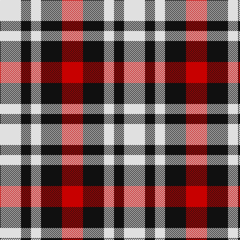

In pattern [RKWKW](/patterns/rkwkw/).

This was sourced from tartans-authority.  It is a [5 stripes tartan](/stripes/stripes5/).

Original link http://www.tartansauthority.com/tartan-ferret/display/10625/

## Thread count
LN/42 K20 LN20 K42 R/42

## Palette
Each colour and its ΔE from the base-6 reference it is a variant of.

| Colour | Shade | Base | ΔE (OKLab) |
|---|---|---|---|
| K | <code style="background-color:#101010;">#101010</code> `#101010` | K <code style="background-color:#000000;">#000000</code> | 0.17 |
| LN | <code style="background-color:#E0E0E0;">#E0E0E0</code> `#E0E0E0` | W <code style="background-color:#F7F7F7;">#F7F7F7</code> | 0.07 |
| R | <code style="background-color:#C80000;">#C80000</code> `#C80000` | R <code style="background-color:#CC0000;">#CC0000</code> | 0.01 |

# Sample pattern

## Nearest tartans

The nearest existing variants by ΔTartan distance.

1. [Havel](/setts/s5/r21k21w10k10w21x2~k101010-rff0000-wffffff/) — ΔT 0.59
1. [Oakland Centre](/setts/s5/w3r2w1b2r2x4~b1c1c1c-rc8002c-wfcfcfc/) — ΔT 1.34
1. [Quaboos Pipers Plaid](/setts/s4/w9g23r23w9x2~g006818-rc80000-we0e0e0/) — ΔT 1.62
1. [Harazeen (Personal)](/setts/s8/r2g1w1k1r2g1w1k1x20~g00801c-k101010-rc80000-we0e0e0/) — ΔT 1.66
1. [Thomas Newcomen's Combustion Engine](/setts/s4/k7r5w3b2x4~b0000cd-k101010-rff0000-wffffff/) — ΔT 1.69
1. [Boxer Beauty](/setts/s7/k13g28y13g28k18w18k13x2~g603800-k101010-wfcfcfc-ydc943c/) — ΔT 1.69
1. [Hage-West (Personal)](/setts/s6/g8k8g8y6k3y6x2~g23321b-k1c1714-yf8e38c/) — ΔT 1.69
1. [Boxer Beauty](/setts/s7/k13g28y13g28k18w18k13x2~g603800-k101010-wffffff-ycc7f32/) — ΔT 1.71
1. [Austin / Wilson's No 173](/setts/s5/b3k3b3g6y2x2~b800080-g008000-k000000-yf0c000/) — ΔT 1.74
1. [SAL Glindrande Stiernan](/setts/s4/r3g1k3w1x20~g008b00-k101010-rff0000-wffffff/) — ΔT 1.76

## Neighbour map

Every grey dot is one of 15726 variants placed by the first two principal components of the ΔTartan feature space (44% of its variance). Red is this tartan; blue dots are its nearest — click one to open its page.

<svg viewBox="0 0 640 380" role="img" style="max-width:100%;height:auto;border:1px solid #e0e0e0;border-radius:4px;display:block" xmlns="http://www.w3.org/2000/svg"><image href="/nn/cloud.v1.png" width="640" height="380"/><a href="/setts/s5/r21k21w10k10w21x2~k101010-rff0000-wffffff/"><circle cx="74.2" cy="313.7" r="4" fill="#3465a4"><title>Havel</title></circle></a><a href="/setts/s5/w3r2w1b2r2x4~b1c1c1c-rc8002c-wfcfcfc/"><circle cx="109.1" cy="300.7" r="4" fill="#3465a4"><title>Oakland Centre</title></circle></a><a href="/setts/s4/w9g23r23w9x2~g006818-rc80000-we0e0e0/"><circle cx="119.8" cy="311.7" r="4" fill="#3465a4"><title>Quaboos Pipers Plaid</title></circle></a><a href="/setts/s8/r2g1w1k1r2g1w1k1x20~g00801c-k101010-rc80000-we0e0e0/"><circle cx="53.8" cy="283.9" r="4" fill="#3465a4"><title>Harazeen (Personal)</title></circle></a><a href="/setts/s4/k7r5w3b2x4~b0000cd-k101010-rff0000-wffffff/"><circle cx="103.0" cy="277.5" r="4" fill="#3465a4"><title>Thomas Newcomen's Combustion Engine</title></circle></a><a href="/setts/s7/k13g28y13g28k18w18k13x2~g603800-k101010-wfcfcfc-ydc943c/"><circle cx="80.3" cy="300.3" r="4" fill="#3465a4"><title>Boxer Beauty</title></circle></a><a href="/setts/s6/g8k8g8y6k3y6x2~g23321b-k1c1714-yf8e38c/"><circle cx="88.2" cy="324.2" r="4" fill="#3465a4"><title>Hage-West (Personal)</title></circle></a><a href="/setts/s7/k13g28y13g28k18w18k13x2~g603800-k101010-wffffff-ycc7f32/"><circle cx="81.7" cy="300.9" r="4" fill="#3465a4"><title>Boxer Beauty</title></circle></a><a href="/setts/s5/b3k3b3g6y2x2~b800080-g008000-k000000-yf0c000/"><circle cx="68.7" cy="291.7" r="4" fill="#3465a4"><title>Austin / Wilson's No 173</title></circle></a><a href="/setts/s4/r3g1k3w1x20~g008b00-k101010-rff0000-wffffff/"><circle cx="101.9" cy="275.8" r="4" fill="#3465a4"><title>SAL Glindrande Stiernan</title></circle></a><circle cx="79.9" cy="320.2" r="5" fill="#c00000"/></svg>

ID: /setts/s5/r21k21w10k10w21x2~k101010-rc80000-we0e0e0/
