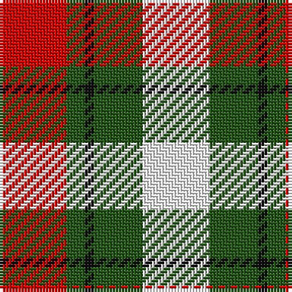

In pattern [RGKGW](/stripes/rgkgw/).

This was sourced from register-of-tartans.  It is a [5 stripe tartan](/stripes/stripes5/).

Original link https://www.tartanregister.gov.uk/tartanDetails.aspx?ref=10067

## Register references

External register numbers recorded for this tartan.

- Scottish Register of Tartans: [10067](https://www.tartanregister.gov.uk/tartanDetails.aspx?ref=10067)

## Thread count
R/22 G6 K3 G16 W/22

## Palette
Each colour and the base-6 reference it is a variant of.

| Colour | Shade | Base |
|---|---|---|
| G | <code style="background-color:#25571A;">#25571A</code> `oklch(40.8% 0.106 140.3)` <small>#25571A</small> | G <code style="background-color:#006100;">#006100</code> |
| K | <code style="background-color:#101010;">#101010</code> `oklch(17.3% 0.000 89.9)` <small>#101010</small> | K <code style="background-color:#000000;">#000000</code> |
| R | <code style="background-color:#DA0501;">#DA0501</code> `oklch(55.9% 0.228 29.4)` <small>#DA0501</small> | R <code style="background-color:#CC0000;">#CC0000</code> |
| W | <code style="background-color:#FFFFFF;">#FFFFFF</code> `oklch(100.0% 0.000 89.9)` <small>#FFFFFF</small> | W <code style="background-color:#F7F7F7;">#F7F7F7</code> |

# Sample pattern

## Nearest tartans

The nearest existing variants by ΔTartan distance.

1. [Inverness Basque (District)](/setts/s5/r33g9k5g24w33~x2/) — ΔT 0.56
1. [Fraser Dress](/setts/s6/r6k14r6dg14w27k4/) — ΔT 1.26
1. [MacKinnon Dress Hunting (Fashion)](/setts/s4/dg7dr7w7r1~x6/) — ΔT 1.35
1. [Wallace Dress, Red (Dance)](/setts/s5/k3r28k10w28t3~x2/) — ΔT 1.42
1. [Abbink, Ingmar (Personal)](/setts/s5/r39t22k11ly22g5~x2/) — ΔT 1.46
1. [Glasgow Dress (Dance)](/setts/s7/o16r3lb15r18w15o3lb3~x2/) — ΔT 1.46
1. [Fraser, dress](/setts/s6/r6k14r6g14w27k4/) — ΔT 1.48
1. [Scottish American Athletic Assoc](/setts/s5/ly32k21r16lr6dt4~x2/) — ΔT 1.50
1. [Thompson Camel Clan Tartan Tartan Number: 2421. Earliest known date: 1967 Designed by Scotty Thompson. It it a simple colour variation on the usual blue Thompson, but is often confused with the Burberry Check. See products available Copyright © Blair Urquhart, Comrie, 2015](/setts/s6/r2lo20k5w10k10w2~x2/) — ΔT 1.57
1. [Brodie Dress](/setts/s5/k6r33k18w20db6~x2/) — ΔT 1.58

## Neighbour map

Every grey dot is one of 14299 variants placed by the first two principal components of the ΔTartan feature space (44% of its variance). Red is this tartan; blue dots are its nearest — click one to open its page.

<svg viewBox="0 0 640 380" role="img" style="max-width:100%;height:auto;border:1px solid #e0e0e0;border-radius:4px;display:block" xmlns="http://www.w3.org/2000/svg"><image href="/nn/cloud.v1.png" width="640" height="380"/><a href="/setts/s5/r33g9k5g24w33~x2/"><circle cx="117.9" cy="229.6" r="4" fill="#3465a4"><title>Inverness Basque (District)</title></circle></a><a href="/setts/s6/r6k14r6dg14w27k4/"><circle cx="120.4" cy="207.7" r="4" fill="#3465a4"><title>Fraser Dress</title></circle></a><a href="/setts/s4/dg7dr7w7r1~x6/"><circle cx="107.6" cy="252.5" r="4" fill="#3465a4"><title>MacKinnon Dress Hunting (Fashion)</title></circle></a><a href="/setts/s5/k3r28k10w28t3~x2/"><circle cx="183.6" cy="185.9" r="4" fill="#3465a4"><title>Wallace Dress, Red (Dance)</title></circle></a><a href="/setts/s5/r39t22k11ly22g5~x2/"><circle cx="130.8" cy="203.4" r="4" fill="#3465a4"><title>Abbink, Ingmar (Personal)</title></circle></a><a href="/setts/s7/o16r3lb15r18w15o3lb3~x2/"><circle cx="94.1" cy="211.3" r="4" fill="#3465a4"><title>Glasgow Dress (Dance)</title></circle></a><a href="/setts/s6/r6k14r6g14w27k4/"><circle cx="113.2" cy="207.4" r="4" fill="#3465a4"><title>Fraser, dress</title></circle></a><a href="/setts/s5/ly32k21r16lr6dt4~x2/"><circle cx="130.7" cy="196.8" r="4" fill="#3465a4"><title>Scottish American Athletic Assoc</title></circle></a><a href="/setts/s6/r2lo20k5w10k10w2~x2/"><circle cx="176.4" cy="189.9" r="4" fill="#3465a4"><title>Thompson Camel Clan Tartan Tartan Number: 2421. Earliest known date: 1967 Designed by Scotty Thompson. It it a simple colour variation on the usual blue Thompson, but is often confused with the Burberry Check. See products available Copyright © Blair Urquhart, Comrie, 2015</title></circle></a><a href="/setts/s5/k6r33k18w20db6~x2/"><circle cx="136.0" cy="223.9" r="4" fill="#3465a4"><title>Brodie Dress</title></circle></a><circle cx="114.9" cy="216.4" r="5" fill="#c00000"/></svg>

ID: /setts/s5/r22dg6k3dg16w22/
