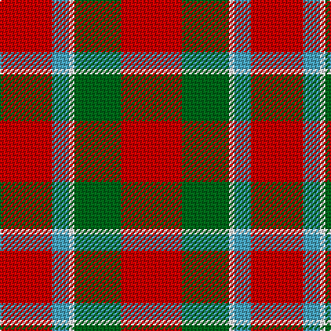

This page is one **sett** — a single exact thread-count. It belongs to the [tartan](/tartans/r22g17w2lg6r19/)
(the same proportion at any scale), whose colour order is pattern [RGWYR](/stripes/rgwyr/).

Sourced from register-of-tartans.  It is a [5 stripe tartan](/stripes/stripes5/).

Original link https://www.tartanregister.gov.uk/tartanDetails.aspx?ref=2921

## Also known as

This cloth is also recorded under:

- Menzies #2

2 attestations — the source records this cloth was collapsed from (oldest owns this page)

<ul>
<li>01/01/1819 — Menzies #2 (register-of-tartans, <a href="https://www.tartanregister.gov.uk/tartanDetails.aspx?ref=2921">record</a>)</li>
<li>1819 — Menzies 1819 - Wilsons (tartans-authority, <a href="http://www.tartansauthority.com/tartan-ferret/display/1440/">record</a>)</li>
</ul>

## Register references

External register numbers recorded for this tartan.

- Scottish Register of Tartans: [2921](https://www.tartanregister.gov.uk/tartanDetails.aspx?ref=2921)
- Scottish Tartans Authority (ITI): 1440
- Scottish Tartans World Register: 1440

## Thread count
R/44 G34 W4 B12 R/38

## Palette

Palette: <strong>Tartan Register</strong>
<table><thead><tr><th>Colour</th><th>Threads</th><th>Shade</th><th>Base</th><th>OKLCh</th></tr></thead><tbody><tr><td>R/</td><td style="text-align:right;font-variant-numeric:tabular-nums">44</td><td><code style="background-color:#C80000;">#C80000</code> <small style="color:#888">#C80000</small></td><td>R <code style="background-color:#CC0000;">#CC0000</code></td><td><small style="color:#888">oklch(52.3% 0.215 29.2)</small></td></tr><tr><td>G</td><td style="text-align:right;font-variant-numeric:tabular-nums">34</td><td><code style="background-color:#006818;">#006818</code> <small style="color:#888">#006818</small></td><td>G <code style="background-color:#006100;">#006100</code></td><td><small style="color:#888">oklch(45.0% 0.142 145.0)</small></td></tr><tr><td>W</td><td style="text-align:right;font-variant-numeric:tabular-nums">4</td><td><code style="background-color:#FCFCFC;">#FCFCFC</code> <small style="color:#888">#FCFCFC</small></td><td>W <code style="background-color:#F7F7F7;">#F7F7F7</code></td><td><small style="color:#888">oklch(99.1% 0.000 89.9)</small></td></tr><tr><td>B</td><td style="text-align:right;font-variant-numeric:tabular-nums">12</td><td><code style="background-color:#48A4C0;">#48A4C0</code> <small style="color:#888">#48A4C0</small></td><td>Y <code style="background-color:#F2BF00;">#F2BF00</code></td><td><small style="color:#888">oklch(67.5% 0.096 221.0)</small></td></tr><tr><td>R/</td><td style="text-align:right;font-variant-numeric:tabular-nums">38</td><td><code style="background-color:#C80000;">#C80000</code> <small style="color:#888">#C80000</small></td><td>R <code style="background-color:#CC0000;">#CC0000</code></td><td><small style="color:#888">oklch(52.3% 0.215 29.2)</small></td></tr></tbody></table>

# Sample pattern

## Nearest tartans

The nearest existing variants by ΔTartan distance, with this tartan at the top so the swatches line up against it.

ΔTartan

Tartan

Sett

—

<a href="/ttd/edit/#slug=r22g17w2lg6r19~x2">Menzies #2</a> <a class="nn-out" href="/setts/s5/r22g17w2lg6r19~x2/" title="open its dictionary page">↗</a>

0.58

<a href="/ttd/edit/#slug=r22g17w2t6r13~x2">Menzies</a> <a class="nn-out" href="/setts/s5/r22g17w2t6r13~x2/" title="open its dictionary page">↗</a>

1.22

<a href="/ttd/edit/#slug=r10g24k10r28lb3r6~x2">Nisbet</a> <a class="nn-out" href="/setts/s6/r10g24k10r28lb3r6~x2/" title="open its dictionary page">↗</a>

1.27

<a href="/ttd/edit/#slug=r28dg16k4lb7r28">Sinclair Dress</a> <a class="nn-out" href="/setts/s5/r28dg16k4lb7r28/" title="open its dictionary page">↗</a>

1.31

<a href="/ttd/edit/#slug=r21g3r21g16lo3w2lo3~x2">Claus of the North Pole (Restricted)</a> <a class="nn-out" href="/setts/s7/r21g3r21g16lo3w2lo3~x2/" title="open its dictionary page">↗</a>

1.36

<a href="/ttd/edit/#slug=r34w4t7ly10t7r18~x2">Ploysongsang, Edward Thiravej (Pers</a> <a class="nn-out" href="/setts/s6/r34w4t7ly10t7r18~x2/" title="open its dictionary page">↗</a>

1.37

<a href="/ttd/edit/#slug=r22t8k9dg14r10t2r10~x2">MacDuff #2</a> <a class="nn-out" href="/setts/s7/r22t8k9dg14r10t2r10~x2/" title="open its dictionary page">↗</a>

1.39

<a href="/ttd/edit/#slug=k1r18dg12r2dg12r18w1~x2">MacKinnon #4</a> <a class="nn-out" href="/setts/s7/k1r18dg12r2dg12r18w1~x2/" title="open its dictionary page">↗</a>

1.40

<a href="/ttd/edit/#slug=r36lt9k12g17r10k3r10~x2">MacDuff #6</a> <a class="nn-out" href="/setts/s7/r36lt9k12g17r10k3r10~x2/" title="open its dictionary page">↗</a>

1.43

<a href="/ttd/edit/#slug=r52k32dg22r16ly3r16">Sturrock</a> <a class="nn-out" href="/setts/s6/r52k32dg22r16ly3r16/" title="open its dictionary page">↗</a>

1.43

<a href="/ttd/edit/#slug=r36db9k12g17r10k3r10~x2">MacDuff - 1819 (Clan)</a> <a class="nn-out" href="/setts/s7/r36db9k12g17r10k3r10~x2/" title="open its dictionary page">↗</a>

## Neighbour map

Every grey dot is one of 14299 variants placed by the first two principal components of the ΔTartan feature space (44% of its variance). Red is this tartan; blue dots are its nearest — click one to open its page.

<svg viewBox="0 0 640 380" role="img" style="max-width:100%;height:auto;border:1px solid #e0e0e0;border-radius:4px;display:block" xmlns="http://www.w3.org/2000/svg"><image href="/nn/cloud.v1.png" width="640" height="380"/><a href="/setts/s5/r22g17w2t6r13~x2/"><circle cx="322.5" cy="231.0" r="4" fill="#3465a4"><title>Menzies</title></circle></a><a href="/setts/s6/r10g24k10r28lb3r6~x2/"><circle cx="286.6" cy="216.8" r="4" fill="#3465a4"><title>Nisbet</title></circle></a><a href="/setts/s5/r28dg16k4lb7r28/"><circle cx="347.4" cy="233.8" r="4" fill="#3465a4"><title>Sinclair Dress</title></circle></a><a href="/setts/s7/r21g3r21g16lo3w2lo3~x2/"><circle cx="356.4" cy="192.1" r="4" fill="#3465a4"><title>Claus of the North Pole (Restricted)</title></circle></a><a href="/setts/s6/r34w4t7ly10t7r18~x2/"><circle cx="353.4" cy="200.3" r="4" fill="#3465a4"><title>Ploysongsang, Edward Thiravej (Pers</title></circle></a><a href="/setts/s7/r22t8k9dg14r10t2r10~x2/"><circle cx="268.5" cy="215.7" r="4" fill="#3465a4"><title>MacDuff #2</title></circle></a><a href="/setts/s7/k1r18dg12r2dg12r18w1~x2/"><circle cx="374.0" cy="179.4" r="4" fill="#3465a4"><title>MacKinnon #4</title></circle></a><a href="/setts/s7/r36lt9k12g17r10k3r10~x2/"><circle cx="292.6" cy="190.1" r="4" fill="#3465a4"><title>MacDuff #6</title></circle></a><a href="/setts/s6/r52k32dg22r16ly3r16/"><circle cx="328.7" cy="189.6" r="4" fill="#3465a4"><title>Sturrock</title></circle></a><a href="/setts/s7/r36db9k12g17r10k3r10~x2/"><circle cx="309.8" cy="199.6" r="4" fill="#3465a4"><title>MacDuff - 1819 (Clan)</title></circle></a><circle cx="341.3" cy="228.8" r="5" fill="#c00000"/></svg>

ID: /setts/s5/r22g17w2lg6r19~x2/
