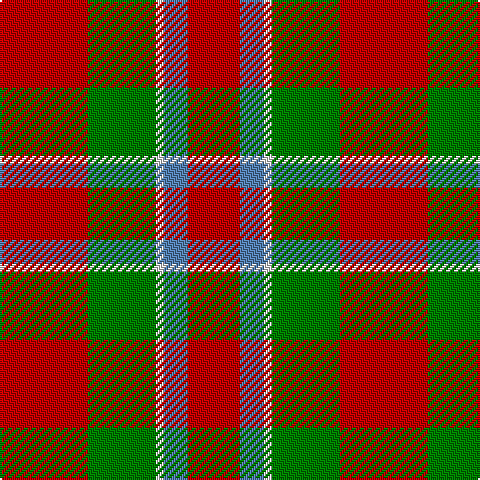

In pattern [RBWGR](/stripes/rbwgr/).

This was sourced from weddslist.  It is a [5 stripe tartan](/stripes/stripes5/).

Original link http://www.weddslist.com/cgi-bin/tartans/pg.pl?source=sts

## Thread count
R/44 G34 LN4 B12 R/26

## Palette
Each colour and the base-6 reference it is a variant of.

| Colour | Shade | Base |
|---|---|---|
| B | <code style="background-color:#5480B0;">#5480B0</code> `oklch(58.8% 0.089 251.5)` <small>#5480B0</small> | B <code style="background-color:#2A418A;">#2A418A</code> |
| G | <code style="background-color:#008000;">#008000</code> `oklch(52.0% 0.177 142.5)` <small>#008000</small> | G <code style="background-color:#006100;">#006100</code> |
| LN | <code style="background-color:#E0E0E0;">#E0E0E0</code> `oklch(90.7% 0.000 89.9)` <small>#E0E0E0</small> | W <code style="background-color:#F7F7F7;">#F7F7F7</code> |
| R | <code style="background-color:#C00000;">#C00000</code> `oklch(50.7% 0.208 29.2)` <small>#C00000</small> | R <code style="background-color:#CC0000;">#CC0000</code> |

# Sample pattern

## Nearest tartans

The nearest existing variants by ΔTartan distance.

1. [Menzies #2](/setts/s5/r22g17w2lg6r19~x2/) — ΔT 0.58
1. [Nisbet](/setts/s6/r10g24k10r28lb3r6~x2/) — ΔT 0.99
1. [Espy (Fashion?)](/setts/s5/r10g3k1g3b1~x16/) — ΔT 1.30
1. [MacAulay](/setts/s6/k2r16g6r3g8lb1~x2/) — ΔT 1.33
1. [MacAulay (Clan)](/setts/s6/k2r16g6r3g8w1~x4/) — ΔT 1.34
1. [MacDuff #2](/setts/s7/r22t8k9dg14r10t2r10~x2/) — ΔT 1.35
1. [Claus of the North Pole (Restricted)](/setts/s7/r21g3r21g16lo3w2lo3~x2/) — ΔT 1.36
1. [MacDuff #6](/setts/s7/r36lt9k12g17r10k3r10~x2/) — ΔT 1.41
1. [MacDuff - 1819 (Clan)](/setts/s7/r36db9k12g17r10k3r10~x2/) — ΔT 1.42
1. [Caspari (Corporate)](/setts/s7/r8ly2r15g10r4g10r4~x2/) — ΔT 1.42

## Neighbour map

Every grey dot is one of 14299 variants placed by the first two principal components of the ΔTartan feature space (44% of its variance). Red is this tartan; blue dots are its nearest — click one to open its page.

<svg viewBox="0 0 640 380" role="img" style="max-width:100%;height:auto;border:1px solid #e0e0e0;border-radius:4px;display:block" xmlns="http://www.w3.org/2000/svg"><image href="/nn/cloud.v1.png" width="640" height="380"/><a href="/setts/s5/r22g17w2lg6r19~x2/"><circle cx="341.3" cy="228.8" r="4" fill="#3465a4"><title>Menzies #2</title></circle></a><a href="/setts/s6/r10g24k10r28lb3r6~x2/"><circle cx="286.6" cy="216.8" r="4" fill="#3465a4"><title>Nisbet</title></circle></a><a href="/setts/s5/r10g3k1g3b1~x16/"><circle cx="338.3" cy="208.3" r="4" fill="#3465a4"><title>Espy (Fashion?)</title></circle></a><a href="/setts/s6/k2r16g6r3g8lb1~x2/"><circle cx="335.7" cy="189.8" r="4" fill="#3465a4"><title>MacAulay</title></circle></a><a href="/setts/s6/k2r16g6r3g8w1~x4/"><circle cx="331.6" cy="187.7" r="4" fill="#3465a4"><title>MacAulay (Clan)</title></circle></a><a href="/setts/s7/r22t8k9dg14r10t2r10~x2/"><circle cx="268.5" cy="215.7" r="4" fill="#3465a4"><title>MacDuff #2</title></circle></a><a href="/setts/s7/r21g3r21g16lo3w2lo3~x2/"><circle cx="356.4" cy="192.1" r="4" fill="#3465a4"><title>Claus of the North Pole (Restricted)</title></circle></a><a href="/setts/s7/r36lt9k12g17r10k3r10~x2/"><circle cx="292.6" cy="190.1" r="4" fill="#3465a4"><title>MacDuff #6</title></circle></a><a href="/setts/s7/r36db9k12g17r10k3r10~x2/"><circle cx="309.8" cy="199.6" r="4" fill="#3465a4"><title>MacDuff - 1819 (Clan)</title></circle></a><a href="/setts/s7/r8ly2r15g10r4g10r4~x2/"><circle cx="341.4" cy="256.1" r="4" fill="#3465a4"><title>Caspari (Corporate)</title></circle></a><circle cx="322.5" cy="231.0" r="5" fill="#c00000"/></svg>

ID: /setts/s5/r22g17w2t6r13~x2/
