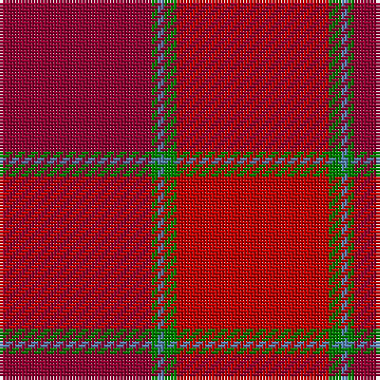

This page is one **sett** — a single exact thread-count. It belongs to the [tartan](/tartans/dr24g1b1g2r24/)
(the same proportion at any scale), whose colour order is pattern [RGBGR](/stripes/rgbgr/).

Sourced from weddslist.  It is a [5 stripe tartan](/stripes/stripes5/).

Original link http://www.weddslist.com/cgi-bin/tartans/pg.pl?source=sts

## Thread count
DR/48 G2 B2 G4 R/48

## Palette
Each colour and the base-6 reference it is a variant of.

| Colour | Shade | Base |
|---|---|---|
| B | <code style="background-color:#5480B0;">#5480B0</code> `oklch(58.8% 0.089 251.5)` <small>#5480B0</small> | B <code style="background-color:#2A418A;">#2A418A</code> |
| DR | <code style="background-color:#900030;">#900030</code> `oklch(41.6% 0.166 13.6)` <small>#900030</small> | R <code style="background-color:#CC0000;">#CC0000</code> |
| G | <code style="background-color:#008000;">#008000</code> `oklch(52.0% 0.177 142.5)` <small>#008000</small> | G <code style="background-color:#006100;">#006100</code> |
| R | <code style="background-color:#C00000;">#C00000</code> `oklch(50.7% 0.208 29.2)` <small>#C00000</small> | R <code style="background-color:#CC0000;">#CC0000</code> |

# Sample pattern

## Nearest tartans

The nearest existing variants by ΔTartan distance, with this tartan at the top so the swatches line up against it.

ΔTartan

Tartan

Sett

—

<a href="/ttd/edit/#slug=r24g2t1g1r24~x2">MacNab 4</a> <a class="nn-out" href="/setts/s5/r24g2t1g1r24~x2/" title="open its dictionary page">↗</a>

0.40

<a href="/ttd/edit/#slug=r24g2t1g1m24~x4">MacNab (Smith)</a> <a class="nn-out" href="/setts/s5/r24g2t1g1m24~x4/" title="open its dictionary page">↗</a>

1.53

<a href="/ttd/edit/#slug=r2k1r12r12t1m2~x4">Grelloch (Fashion)</a> <a class="nn-out" href="/setts/s6/r2k1r12r12t1m2~x4/" title="open its dictionary page">↗</a>

1.60

<a href="/ttd/edit/#slug=dr24dg1b1dg2r24~x2">MacNab WI 1</a> <a class="nn-out" href="/setts/s5/dr24dg1b1dg2r24~x2/" title="open its dictionary page">↗</a>

1.64

<a href="/ttd/edit/#slug=r96g3lb3g6r95">MacNab - 1800 (Portrait)</a> <a class="nn-out" href="/setts/s5/r96g3lb3g6r95/" title="open its dictionary page">↗</a>

2.01

<a href="/setts/s10/r2k1r12r12t1m2~x4/">Grelloch</a>

2.29

<a href="/ttd/edit/#slug=g1dr10r10g1~x6">Stirling of Keir (Clan)</a> <a class="nn-out" href="/setts/s4/g1dr10r10g1~x6/" title="open its dictionary page">↗</a>

2.55

<a href="/ttd/edit/#slug=y4r18dy2r2dy5k2dy15r1y4~x2">Redwoods</a> <a class="nn-out" href="/setts/s9/y4r18dy2r2dy5k2dy15r1y4~x2/" title="open its dictionary page">↗</a>

2.56

<a href="/ttd/edit/#slug=o50k1r14lb1dg14r14lb1r2~x4">McBrayer Htg (Personal)</a> <a class="nn-out" href="/setts/s8/o50k1r14lb1dg14r14lb1r2~x4/" title="open its dictionary page">↗</a>

2.65

<a href="/ttd/edit/#slug=r3r18r6r15r4r3r4r7w2~x2">Tune Hotels</a> <a class="nn-out" href="/setts/s9/r3r18r6r15r4r3r4r7w2~x2/" title="open its dictionary page">↗</a>

2.66

<a href="/ttd/edit/#slug=r3dy2r26dy4do6dy29do2lo3~x2">Hyland Day (Personal)</a> <a class="nn-out" href="/setts/s8/r3dy2r26dy4do6dy29do2lo3~x2/" title="open its dictionary page">↗</a>

## Neighbour map

Every grey dot is one of 14299 variants placed by the first two principal components of the ΔTartan feature space (44% of its variance). Red is this tartan; blue dots are its nearest — click one to open its page.

<svg viewBox="0 0 640 380" role="img" style="max-width:100%;height:auto;border:1px solid #e0e0e0;border-radius:4px;display:block" xmlns="http://www.w3.org/2000/svg"><image href="/nn/cloud.v1.png" width="640" height="380"/><a href="/setts/s5/r24g2t1g1m24~x4/"><circle cx="474.6" cy="218.4" r="4" fill="#3465a4"><title>MacNab (Smith)</title></circle></a><a href="/setts/s6/r2k1r12r12t1m2~x4/"><circle cx="409.7" cy="226.8" r="4" fill="#3465a4"><title>Grelloch (Fashion)</title></circle></a><a href="/setts/s5/dr24dg1b1dg2r24~x2/"><circle cx="448.1" cy="214.6" r="4" fill="#3465a4"><title>MacNab WI 1</title></circle></a><a href="/setts/s5/r96g3lb3g6r95/"><circle cx="466.3" cy="183.6" r="4" fill="#3465a4"><title>MacNab - 1800 (Portrait)</title></circle></a><a href="/setts/s10/r2k1r12r12t1m2~x4/"><circle cx="394.5" cy="206.5" r="4" fill="#3465a4"><title>Grelloch</title></circle></a><a href="/setts/s4/g1dr10r10g1~x6/"><circle cx="453.1" cy="314.3" r="4" fill="#3465a4"><title>Stirling of Keir (Clan)</title></circle></a><a href="/setts/s9/y4r18dy2r2dy5k2dy15r1y4~x2/"><circle cx="412.1" cy="233.4" r="4" fill="#3465a4"><title>Redwoods</title></circle></a><a href="/setts/s8/o50k1r14lb1dg14r14lb1r2~x4/"><circle cx="460.3" cy="146.3" r="4" fill="#3465a4"><title>McBrayer Htg (Personal)</title></circle></a><a href="/setts/s9/r3r18r6r15r4r3r4r7w2~x2/"><circle cx="348.7" cy="222.2" r="4" fill="#3465a4"><title>Tune Hotels</title></circle></a><a href="/setts/s8/r3dy2r26dy4do6dy29do2lo3~x2/"><circle cx="341.9" cy="198.8" r="4" fill="#3465a4"><title>Hyland Day (Personal)</title></circle></a><circle cx="472.6" cy="220.0" r="5" fill="#c00000"/></svg>

ID: /setts/s5/r24g2t1g1r24~x2/
