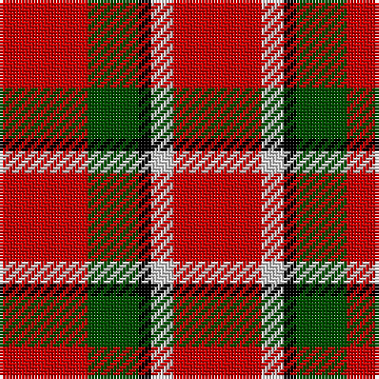

This page is one **sett** — a single exact thread-count. It belongs to the [tartan](/tartans/r28dg16k4lb7r28/)
(the same proportion at any scale), whose colour order is pattern [RGKWR](/stripes/rgkwr/).

Sourced from weddslist.  It is a [5 stripe tartan](/stripes/stripes5/).

Original link http://www.weddslist.com/cgi-bin/tartans/pg.pl?source=rb

## Thread count
R/28 G16 K4 N7 R/28

## Palette

Palette: <strong>Tartan Register</strong> <small style="color:#888">(3 of 4 colours)</small>
<table><thead><tr><th>Colour</th><th>Threads</th><th>Shade</th><th>Base</th><th>OKLCh</th></tr></thead><tbody><tr><td>R/</td><td style="text-align:right;font-variant-numeric:tabular-nums">28</td><td><code style="background-color:#C80000;">#C80000</code> <small style="color:#888">#C80000</small></td><td>R <code style="background-color:#CC0000;">#CC0000</code></td><td><small style="color:#888">oklch(52.3% 0.215 29.2)</small></td></tr><tr><td>G</td><td style="text-align:right;font-variant-numeric:tabular-nums">16</td><td><code style="background-color:#004C00;">#004C00</code> <small style="color:#888">#004C00</small></td><td>G <code style="background-color:#006100;">#006100</code></td><td><small style="color:#888">oklch(36.1% 0.123 142.5)</small></td></tr><tr><td>K</td><td style="text-align:right;font-variant-numeric:tabular-nums">4</td><td><code style="background-color:#000000;">#000000</code> <small style="color:#888">#000000</small></td><td>K <code style="background-color:#000000;">#000000</code></td><td><small style="color:#888">oklch(0.0% 0.000 0.0)</small></td></tr><tr><td>N</td><td style="text-align:right;font-variant-numeric:tabular-nums">7</td><td><code style="background-color:#D0D0D0;">#D0D0D0</code> <small style="color:#888">#D0D0D0</small></td><td>W <code style="background-color:#F7F7F7;">#F7F7F7</code></td><td><small style="color:#888">oklch(85.8% 0.000 89.9)</small></td></tr><tr><td>R/</td><td style="text-align:right;font-variant-numeric:tabular-nums">28</td><td><code style="background-color:#C80000;">#C80000</code> <small style="color:#888">#C80000</small></td><td>R <code style="background-color:#CC0000;">#CC0000</code></td><td><small style="color:#888">oklch(52.3% 0.215 29.2)</small></td></tr></tbody></table>

# Sample pattern

## Nearest tartans

The nearest existing variants by ΔTartan distance, with this tartan at the top so the swatches line up against it.

ΔTartan

Tartan

Sett

—

<a href="/ttd/edit/#slug=r28dg16k4lb7r28">Sinclair Dress</a> <a class="nn-out" href="/setts/s5/r28dg16k4lb7r28/" title="open its dictionary page">↗</a>

0.51

<a href="/ttd/edit/#slug=r30dg12k5lb8r30">Sinclair</a> <a class="nn-out" href="/setts/s5/r30dg12k5lb8r30/" title="open its dictionary page">↗</a>

1.27

<a href="/ttd/edit/#slug=r22g17w2lg6r19~x2">Menzies #2</a> <a class="nn-out" href="/setts/s5/r22g17w2lg6r19~x2/" title="open its dictionary page">↗</a>

1.29

<a href="/setts/s6/r10k1r4g6~x2/">Macan, of Lurgyvallan (Hose)</a>

1.34

<a href="/ttd/edit/#slug=r34w4t7ly10t7r18~x2">Ploysongsang, Edward Thiravej (Pers</a> <a class="nn-out" href="/setts/s6/r34w4t7ly10t7r18~x2/" title="open its dictionary page">↗</a>

1.50

<a href="/ttd/edit/#slug=r125k26lb20lo16">McPeek (Fashion)</a> <a class="nn-out" href="/setts/s4/r125k26lb20lo16/" title="open its dictionary page">↗</a>

1.58

<a href="/ttd/edit/#slug=r34w4t7lo10t7r18~x2">Ploysongsang, Edward Thiravej (Personal)</a> <a class="nn-out" href="/setts/s6/r34w4t7lo10t7r18~x2/" title="open its dictionary page">↗</a>

1.63

<a href="/ttd/edit/#slug=r4dg5r2k6r18k2r4~x2">MacQuarrie #7</a> <a class="nn-out" href="/setts/s7/r4dg5r2k6r18k2r4~x2/" title="open its dictionary page">↗</a>

1.64

<a href="/ttd/edit/#slug=r26k18r7k4ly4~x2">Haig &amp; Haig Whisky (Corporate)</a> <a class="nn-out" href="/setts/s5/r26k18r7k4ly4~x2/" title="open its dictionary page">↗</a>

1.67

<a href="/ttd/edit/#slug=ly3k2r10k1~x4">Masai Shuka 26 (Artefact)</a> <a class="nn-out" href="/setts/s4/ly3k2r10k1~x4/" title="open its dictionary page">↗</a>

1.69

<a href="/ttd/edit/#slug=r4k8r12k1ly1~x2">MacKeane</a> <a class="nn-out" href="/setts/s5/r4k8r12k1ly1~x2/" title="open its dictionary page">↗</a>

## Neighbour map

Every grey dot is one of 14359 variants placed by the first two principal components of the ΔTartan feature space (44% of its variance). Red is this tartan; blue dots are its nearest — click one to open its page.

<svg viewBox="0 0 640 380" role="img" style="max-width:100%;height:auto;border:1px solid #e0e0e0;border-radius:4px;display:block" xmlns="http://www.w3.org/2000/svg"><image href="/nn/cloud.v1.png" width="640" height="380"/><a href="/setts/s5/r30dg12k5lb8r30/"><circle cx="363.2" cy="235.5" r="4" fill="#3465a4"><title>Sinclair</title></circle></a><a href="/setts/s5/r22g17w2lg6r19~x2/"><circle cx="340.1" cy="229.7" r="4" fill="#3465a4"><title>Menzies #2</title></circle></a><a href="/setts/s6/r10k1r4g6~x2/"><circle cx="406.6" cy="225.8" r="4" fill="#3465a4"><title>Macan, of Lurgyvallan (Hose)</title></circle></a><a href="/setts/s6/r34w4t7ly10t7r18~x2/"><circle cx="351.9" cy="201.1" r="4" fill="#3465a4"><title>Ploysongsang, Edward Thiravej (Pers</title></circle></a><a href="/setts/s4/r125k26lb20lo16/"><circle cx="375.1" cy="201.5" r="4" fill="#3465a4"><title>McPeek (Fashion)</title></circle></a><a href="/setts/s6/r34w4t7lo10t7r18~x2/"><circle cx="372.7" cy="211.4" r="4" fill="#3465a4"><title>Ploysongsang, Edward Thiravej (Personal)</title></circle></a><a href="/setts/s7/r4dg5r2k6r18k2r4~x2/"><circle cx="406.7" cy="204.3" r="4" fill="#3465a4"><title>MacQuarrie #7</title></circle></a><a href="/setts/s5/r26k18r7k4ly4~x2/"><circle cx="313.1" cy="239.5" r="4" fill="#3465a4"><title>Haig &amp; Haig Whisky (Corporate)</title></circle></a><a href="/setts/s4/ly3k2r10k1~x4/"><circle cx="365.9" cy="213.0" r="4" fill="#3465a4"><title>Masai Shuka 26 (Artefact)</title></circle></a><a href="/setts/s5/r4k8r12k1ly1~x2/"><circle cx="383.5" cy="213.9" r="4" fill="#3465a4"><title>MacKeane</title></circle></a><circle cx="346.0" cy="234.9" r="5" fill="#c00000"/></svg>

ID: /setts/s5/r28dg16k4lb7r28/
