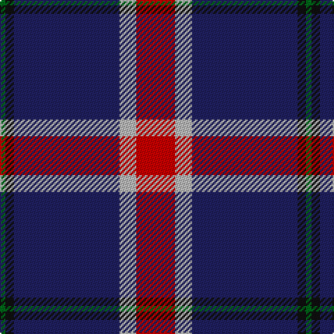

In pattern [GKBYR](/patterns/gkbyr/).

This was sourced from tartans-authority.  It is a [5 stripes tartan](/stripes/stripes5/).

Original link http://www.tartansauthority.com/tartan-ferret/display/10941/

## Thread count
G/4 K6 DB76 N12 R/28

## Palette
Each colour and its ΔE from the base-6 reference it is a variant of.

| Colour | Shade | Base | ΔE (OKLab) |
|---|---|---|---|
| DB | <code style="background-color:#202060;">#202060</code> `#202060` | B <code style="background-color:#2A418A;">#2A418A</code> | 0.11 |
| G | <code style="background-color:#006818;">#006818</code> `#006818` | G <code style="background-color:#006100;">#006100</code> | 0.02 |
| K | <code style="background-color:#101010;">#101010</code> `#101010` | K <code style="background-color:#000000;">#000000</code> | 0.17 |
| N | <code style="background-color:#B8B8B8;">#B8B8B8</code> `#B8B8B8` | Y <code style="background-color:#F2BF00;">#F2BF00</code> | 0.17 |
| R | <code style="background-color:#C80000;">#C80000</code> `#C80000` | R <code style="background-color:#CC0000;">#CC0000</code> | 0.01 |

# Sample pattern

## Nearest tartans

The nearest existing variants by ΔTartan distance.

1. [Widows Sons Scotland Dress](/setts/s6/w12g12k12g24b75y4-b780078-g006818-k101010-wc0c0c0-yfccc00/) — ΔT 0.99
1. [Widows Sons Scotland Dress](/setts/s6/w12g16k12g24b75y4-b5a008c-g003c14-k101010-wc8c8c8-ye0a126/) — ΔT 1.06
1. [Lothian Buses (Corporate?)](/setts/s6/w16b120r24g24r24b8-b2c2c80-g006818-rc80000-we0e0e0/) — ΔT 1.11
1. [Ayllu Thuban (Corporate)](/setts/s5/b46k6g9y9r4-b440044-g006818-k101010-rc80000-ydc943c/) — ΔT 1.15
1. [Widows Sons Scotland (MRA)](/setts/s6/w9k16g10k22b67y4-b5a008c-g003c14-k101010-wc8c8c8-ye0a126/) — ΔT 1.19
1. [Widows Sons Scotland (MRA)](/setts/s6/r9k16g10k22b67y4-b780078-g003820-k101010-r888888-ye8c000/) — ΔT 1.26
1. [Ikelman #4 (Personal)](/setts/s7/r40b60g8b8w4b4w4-b1c0070-g006818-r880000-we0e0e0/) — ΔT 1.30
1. [Heritage of Wales (Fashion)](/setts/s7/r20b8r12b60k20b10w4-b2c2c80-k101010-rc80000-we0e0e0/) — ΔT 1.31
1. [MacGregor, Modern](/setts/s6/b72r36b8r12k4ra4-b1c1c50-k101010-rc80000-ra888888/) — ΔT 1.35
1. [Clan Gregor Tartan Tartan Number: 3089. Earliest known date: See products available Copyright © Blair Urquhart, Comrie, 2015](/setts/s6/b50r16b6r8k2w6-b38356a-k080808-rc80000-we0e0e0/) — ΔT 1.37

## Neighbour map

Every grey dot is one of 15726 variants placed by the first two principal components of the ΔTartan feature space (44% of its variance). Red is this tartan; blue dots are its nearest — click one to open its page.

<svg viewBox="0 0 640 380" role="img" style="max-width:100%;height:auto;border:1px solid #e0e0e0;border-radius:4px;display:block" xmlns="http://www.w3.org/2000/svg"><image href="/nn/cloud.v1.png" width="640" height="380"/><a href="/setts/s6/w12g12k12g24b75y4-b780078-g006818-k101010-wc0c0c0-yfccc00/"><circle cx="296.1" cy="149.3" r="4" fill="#3465a4"><title>Widows Sons Scotland Dress</title></circle></a><a href="/setts/s6/w12g16k12g24b75y4-b5a008c-g003c14-k101010-wc8c8c8-ye0a126/"><circle cx="288.8" cy="159.7" r="4" fill="#3465a4"><title>Widows Sons Scotland Dress</title></circle></a><a href="/setts/s6/w16b120r24g24r24b8-b2c2c80-g006818-rc80000-we0e0e0/"><circle cx="339.9" cy="175.9" r="4" fill="#3465a4"><title>Lothian Buses (Corporate?)</title></circle></a><a href="/setts/s5/b46k6g9y9r4-b440044-g006818-k101010-rc80000-ydc943c/"><circle cx="345.3" cy="181.4" r="4" fill="#3465a4"><title>Ayllu Thuban (Corporate)</title></circle></a><a href="/setts/s6/w9k16g10k22b67y4-b5a008c-g003c14-k101010-wc8c8c8-ye0a126/"><circle cx="289.3" cy="164.2" r="4" fill="#3465a4"><title>Widows Sons Scotland (MRA)</title></circle></a><a href="/setts/s6/r9k16g10k22b67y4-b780078-g003820-k101010-r888888-ye8c000/"><circle cx="306.9" cy="166.5" r="4" fill="#3465a4"><title>Widows Sons Scotland (MRA)</title></circle></a><a href="/setts/s7/r40b60g8b8w4b4w4-b1c0070-g006818-r880000-we0e0e0/"><circle cx="337.5" cy="168.4" r="4" fill="#3465a4"><title>Ikelman #4 (Personal)</title></circle></a><a href="/setts/s7/r20b8r12b60k20b10w4-b2c2c80-k101010-rc80000-we0e0e0/"><circle cx="338.1" cy="185.5" r="4" fill="#3465a4"><title>Heritage of Wales (Fashion)</title></circle></a><a href="/setts/s6/b72r36b8r12k4ra4-b1c1c50-k101010-rc80000-ra888888/"><circle cx="389.2" cy="174.4" r="4" fill="#3465a4"><title>MacGregor, Modern</title></circle></a><a href="/setts/s6/b50r16b6r8k2w6-b38356a-k080808-rc80000-we0e0e0/"><circle cx="415.3" cy="157.1" r="4" fill="#3465a4"><title>Clan Gregor Tartan Tartan Number: 3089. Earliest known date: See products available Copyright © Blair Urquhart, Comrie, 2015</title></circle></a><circle cx="346.0" cy="162.2" r="5" fill="#c00000"/></svg>

ID: /setts/s5/r28y12b76k6g4-b202060-g006818-k101010-rc80000-yb8b8b8/
