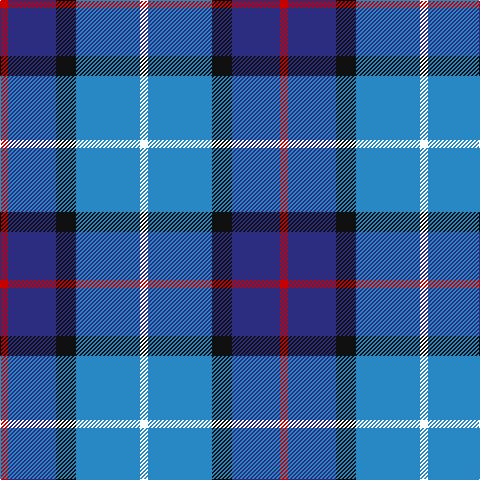

In pattern [RBKBW](/patterns/rbkbw/).

This was sourced from tartans-authority.  It is a [5 stripes tartan](/stripes/stripes5/).

Original link http://www.tartansauthority.com/tartan-ferret/display/8548/

## Thread count
R/8 DB48 K20 B64 W/8

## Palette
Each colour and its ΔE from the base-6 reference it is a variant of.

| Colour | Shade | Base | ΔE (OKLab) |
|---|---|---|---|
| B | <code style="background-color:#2888C4;">#2888C4</code> `#2888C4` | B <code style="background-color:#2A418A;">#2A418A</code> | 0.21 |
| DB | <code style="background-color:#2C2C80;">#2C2C80</code> `#2C2C80` | B <code style="background-color:#2A418A;">#2A418A</code> | 0.06 |
| K | <code style="background-color:#101010;">#101010</code> `#101010` | K <code style="background-color:#000000;">#000000</code> | 0.17 |
| R | <code style="background-color:#C80000;">#C80000</code> `#C80000` | R <code style="background-color:#CC0000;">#CC0000</code> | 0.01 |
| W | <code style="background-color:#FCFCFC;">#FCFCFC</code> `#FCFCFC` | W <code style="background-color:#F7F7F7;">#F7F7F7</code> | 0.01 |

# Sample pattern

## Nearest tartans

The nearest existing variants by ΔTartan distance.

1. [Bryson (1988) (Name)](/setts/s5/y2r1b7ba7w1~b78849c-ba000064-rc80000-wc8d8dc-ya0a0a0~x8/) — ΔT 0.64
1. [SABA](/setts/s5/w3b2ba15bb15r2~b003c64-ba2c2c80-bb2888c4-rc80000-we0e0e0~x4/) — ΔT 0.81
1. [Bryson (1988)](/setts/s5/g16r8b57ba56w8~b2474e8-ba1c0070-g8b6508-re3170d-wa8ace8/) — ΔT 0.95
1. [American Express](/setts/s6/b2ba9r1b5g5w2~b000064-ba3474fc-g007800-r8c0000-wc8c8c8~x4/) — ΔT 1.05
1. [Icelandair](/setts/s7/b3ba24k11b20w2b5y3~b2c4084-ba2888c4-k101010-wffffff-yd87c00~x2/) — ΔT 1.12
1. [Lands of Liberty](/setts/s5/r10w5b30ba20r3~b2c4084-ba0596fa-rc80000-wffffff~x4/) — ΔT 1.20
1. [Jamieson, Robert (Personal)](/setts/s5/w6y6b21ba32r3~b1474b4-ba003c64-rc8002c-wc0c0c0-ybc8c00~x2/) — ΔT 1.25
1. [Loch Ness (Fashion)](/setts/s7/r2b2r2b21y11k17w2~b5c8ca8-k00002c-rc80000-w98c8e8-y48a4c0~x2/) — ΔT 1.28
1. [Isle of Harris (District)](/setts/s6/b3k2g2k1ba10w1~b2888c4-ba2c2c80-g289c18-k101010-wfcfcfc~x8/) — ΔT 1.29
1. [Meh Dundee](/setts/s6/b13y2r4g2ba8w2~b2c2c80-ba2888c4-g006818-rc80000-we0e0e0-ye8c000~x6/) — ΔT 1.32

## Neighbour map

Every grey dot is one of 15726 variants placed by the first two principal components of the ΔTartan feature space (44% of its variance). Red is this tartan; blue dots are its nearest — click one to open its page.

<svg viewBox="0 0 640 380" role="img" style="max-width:100%;height:auto;border:1px solid #e0e0e0;border-radius:4px;display:block" xmlns="http://www.w3.org/2000/svg"><image href="/nn/cloud.v1.png" width="640" height="380"/><a href="/setts/s5/y2r1b7ba7w1~b78849c-ba000064-rc80000-wc8d8dc-ya0a0a0~x8/"><circle cx="157.8" cy="211.8" r="4" fill="#3465a4"><title>Bryson (1988) (Name)</title></circle></a><a href="/setts/s5/w3b2ba15bb15r2~b003c64-ba2c2c80-bb2888c4-rc80000-we0e0e0~x4/"><circle cx="199.8" cy="215.5" r="4" fill="#3465a4"><title>SABA</title></circle></a><a href="/setts/s5/g16r8b57ba56w8~b2474e8-ba1c0070-g8b6508-re3170d-wa8ace8/"><circle cx="173.5" cy="218.2" r="4" fill="#3465a4"><title>Bryson (1988)</title></circle></a><a href="/setts/s6/b2ba9r1b5g5w2~b000064-ba3474fc-g007800-r8c0000-wc8c8c8~x4/"><circle cx="124.9" cy="206.7" r="4" fill="#3465a4"><title>American Express</title></circle></a><a href="/setts/s7/b3ba24k11b20w2b5y3~b2c4084-ba2888c4-k101010-wffffff-yd87c00~x2/"><circle cx="203.3" cy="184.1" r="4" fill="#3465a4"><title>Icelandair</title></circle></a><a href="/setts/s5/r10w5b30ba20r3~b2c4084-ba0596fa-rc80000-wffffff~x4/"><circle cx="207.8" cy="216.5" r="4" fill="#3465a4"><title>Lands of Liberty</title></circle></a><a href="/setts/s5/w6y6b21ba32r3~b1474b4-ba003c64-rc8002c-wc0c0c0-ybc8c00~x2/"><circle cx="238.1" cy="210.2" r="4" fill="#3465a4"><title>Jamieson, Robert (Personal)</title></circle></a><a href="/setts/s7/r2b2r2b21y11k17w2~b5c8ca8-k00002c-rc80000-w98c8e8-y48a4c0~x2/"><circle cx="165.8" cy="169.7" r="4" fill="#3465a4"><title>Loch Ness (Fashion)</title></circle></a><a href="/setts/s6/b3k2g2k1ba10w1~b2888c4-ba2c2c80-g289c18-k101010-wfcfcfc~x8/"><circle cx="239.9" cy="184.0" r="4" fill="#3465a4"><title>Isle of Harris (District)</title></circle></a><a href="/setts/s6/b13y2r4g2ba8w2~b2c2c80-ba2888c4-g006818-rc80000-we0e0e0-ye8c000~x6/"><circle cx="133.8" cy="187.3" r="4" fill="#3465a4"><title>Meh Dundee</title></circle></a><circle cx="178.8" cy="213.4" r="5" fill="#c00000"/></svg>

ID: /setts/s5/r2b12k5ba16w2~b2c2c80-ba2888c4-k101010-rc80000-wfcfcfc~x4/
