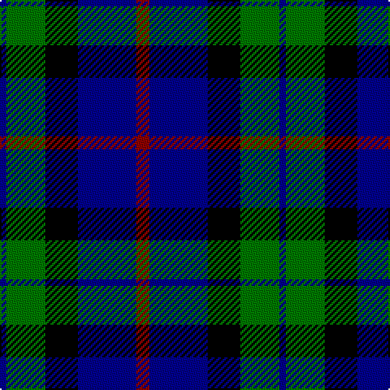

In pattern [BGKBR](/patterns/bgkbr/).

This was sourced from register-of-tartans.  It is a [5 stripes tartan](/stripes/stripes5/).

Original link https://www.tartanregister.gov.uk/tartanDetails.aspx?ref=1283

## Register references

External register numbers recorded for this tartan.

- Scottish Register of Tartans: [1283](https://www.tartanregister.gov.uk/tartanDetails.aspx?ref=1283)
- Scottish Tartans Authority (ITI): 4940

## Thread count
DB/4 G24 K20 DB36 DR/8

## Palette
Each colour and its ΔE from the base-6 reference it is a variant of.

| Colour | Shade | Base | ΔE (OKLab) |
|---|---|---|---|
| DB | <code style="background-color:#00008C;">#00008C</code> `#00008C` | B <code style="background-color:#2A418A;">#2A418A</code> | 0.13 |
| DR | <code style="background-color:#8C0000;">#8C0000</code> `#8C0000` | R <code style="background-color:#CC0000;">#CC0000</code> | 0.14 |
| G | <code style="background-color:#007800;">#007800</code> `#007800` | G <code style="background-color:#006100;">#006100</code> | 0.07 |
| K | <code style="background-color:#000000;">#000000</code> `#000000` | K <code style="background-color:#000000;">#000000</code> | 0.00 |

# Sample pattern

## Nearest tartans

The nearest existing variants by ΔTartan distance.

1. [Wallace Blue Dress Tartan Tartan Number: 6569. Earliest known date: See products available Copyright © Blair Urquhart, Comrie, 2015](/setts/s5/b1ba9b4k9g1~b2888c4-ba2c2c80-g006818-k000000~x6/) — ΔT 0.93
1. [Douglas Green](/setts/s5/k4w2g8b8w1~b000064-g004c00-k000000-wd0d0d0/) — ΔT 1.00
1. [Douglas](/setts/s5/k2w2g8b8w1~b000064-g004c00-k000000-wd0d0d0/) — ΔT 1.01
1. [Allianz Deutschland 2012](/setts/s7/b6ba3b6ba20k20ba8w4~b20608c-ba141c50-k000000-we8e8e8~x2/) — ΔT 1.13
1. [Melville](/setts/s6/k5w2g18k17b16k3~b5a3094-g004c00-k000000-wd0d0d0/) — ΔT 1.14
1. [Marshall of Keith (Personal)](/setts/s5/b10k10b10g26y5~b3f0ffe-g003c14-k101010-ye8c000~x2/) — ΔT 1.19
1. [Bhatti](/setts/s5/k7w3g18b18wa2~b000064-g003c14-k101010-w82f5fa-wae0e0e0~x2/) — ΔT 1.21
1. [Fletcher](/setts/s7/b6k1b6k8r1g8k2~b304080-g008000-k000000-rc00000~x2/) — ΔT 1.23
1. [Wartley Htg (Fashion)](/setts/s6/b4k2b16k10g18k3~b000088-g007800-k000000~x2/) — ΔT 1.26
1. [Fletcher C](/setts/s7/b6k1b6k8r1g8r2~b000064-g004c00-k000000-rc80000/) — ΔT 1.28

## Neighbour map

Every grey dot is one of 15726 variants placed by the first two principal components of the ΔTartan feature space (44% of its variance). Red is this tartan; blue dots are its nearest — click one to open its page.

<svg viewBox="0 0 640 380" role="img" style="max-width:100%;height:auto;border:1px solid #e0e0e0;border-radius:4px;display:block" xmlns="http://www.w3.org/2000/svg"><image href="/nn/cloud.v1.png" width="640" height="380"/><a href="/setts/s5/b1ba9b4k9g1~b2888c4-ba2c2c80-g006818-k000000~x6/"><circle cx="179.7" cy="232.8" r="4" fill="#3465a4"><title>Wallace Blue Dress Tartan Tartan Number: 6569. Earliest known date: See products available Copyright © Blair Urquhart, Comrie, 2015</title></circle></a><a href="/setts/s5/k4w2g8b8w1~b000064-g004c00-k000000-wd0d0d0/"><circle cx="131.6" cy="243.1" r="4" fill="#3465a4"><title>Douglas Green</title></circle></a><a href="/setts/s5/k2w2g8b8w1~b000064-g004c00-k000000-wd0d0d0/"><circle cx="163.9" cy="233.7" r="4" fill="#3465a4"><title>Douglas</title></circle></a><a href="/setts/s7/b6ba3b6ba20k20ba8w4~b20608c-ba141c50-k000000-we8e8e8~x2/"><circle cx="195.9" cy="235.9" r="4" fill="#3465a4"><title>Allianz Deutschland 2012</title></circle></a><a href="/setts/s6/k5w2g18k17b16k3~b5a3094-g004c00-k000000-wd0d0d0/"><circle cx="183.8" cy="231.9" r="4" fill="#3465a4"><title>Melville</title></circle></a><a href="/setts/s5/b10k10b10g26y5~b3f0ffe-g003c14-k101010-ye8c000~x2/"><circle cx="153.8" cy="264.2" r="4" fill="#3465a4"><title>Marshall of Keith (Personal)</title></circle></a><a href="/setts/s5/k7w3g18b18wa2~b000064-g003c14-k101010-w82f5fa-wae0e0e0~x2/"><circle cx="161.1" cy="222.4" r="4" fill="#3465a4"><title>Bhatti</title></circle></a><a href="/setts/s7/b6k1b6k8r1g8k2~b304080-g008000-k000000-rc00000~x2/"><circle cx="154.4" cy="232.0" r="4" fill="#3465a4"><title>Fletcher</title></circle></a><a href="/setts/s6/b4k2b16k10g18k3~b000088-g007800-k000000~x2/"><circle cx="190.5" cy="247.8" r="4" fill="#3465a4"><title>Wartley Htg (Fashion)</title></circle></a><a href="/setts/s7/b6k1b6k8r1g8r2~b000064-g004c00-k000000-rc80000/"><circle cx="164.4" cy="240.4" r="4" fill="#3465a4"><title>Fletcher C</title></circle></a><circle cx="182.3" cy="247.0" r="5" fill="#c00000"/></svg>

ID: /setts/s5/r2b9k5g6b1~b00008c-g007800-k000000-r8c0000~x4/
