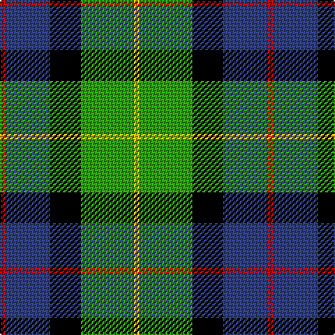

In pattern [RBKGY](/stripes/rbkgy/).

This was sourced from weddslist.  It is a [5 stripe tartan](/stripes/stripes5/).

Original link http://www.weddslist.com/cgi-bin/tartans/pg.pl?source=sts

## Thread count
R/4 B32 K22 G38 Y/4

## Palette
Each colour and the base-6 reference it is a variant of.

| Colour | Shade | Base |
|---|---|---|
| B | <code style="background-color:#304080;">#304080</code> `oklch(39.4% 0.109 270.2)` <small>#304080</small> | B <code style="background-color:#2A418A;">#2A418A</code> |
| G | <code style="background-color:#30A010;">#30A010</code> `oklch(61.9% 0.195 140.5)` <small>#30A010</small> | G <code style="background-color:#006100;">#006100</code> |
| K | <code style="background-color:#000000;">#000000</code> `oklch(0.0% 0.000 0.0)` <small>#000000</small> | K <code style="background-color:#000000;">#000000</code> |
| R | <code style="background-color:#C00000;">#C00000</code> `oklch(50.7% 0.208 29.2)` <small>#C00000</small> | R <code style="background-color:#CC0000;">#CC0000</code> |
| Y | <code style="background-color:#F0C000;">#F0C000</code> `oklch(82.7% 0.169 90.5)` <small>#F0C000</small> | Y <code style="background-color:#F2BF00;">#F2BF00</code> |

# Sample pattern

## Nearest tartans

The nearest existing variants by ΔTartan distance, with this tartan at the top so the swatches line up against it.

ΔTartan

Tartan

Sett

—

<a href="/ttd/edit/#slug=r2db16k11g19ly2~x2">Sanix Modern</a> <a class="nn-out" href="/setts/s5/r2db16k11g19ly2~x2/" title="open its dictionary page">↗</a>

0.73

<a href="/ttd/edit/#slug=k2g11ly1k8b9r2~x4">Forsyth (1795)</a> <a class="nn-out" href="/setts/s6/k2g11ly1k8b9r2~x4/" title="open its dictionary page">↗</a>

0.91

<a href="/ttd/edit/#slug=r1db6k3g6w1~x4">Davidson</a> <a class="nn-out" href="/setts/s5/r1db6k3g6w1~x4/" title="open its dictionary page">↗</a>

0.95

<a href="/ttd/edit/#slug=k2g11ly1k8db9r2~x4">Forsyth</a> <a class="nn-out" href="/setts/s6/k2g11ly1k8db9r2~x4/" title="open its dictionary page">↗</a>

0.98

<a href="/ttd/edit/#slug=r2db10k5g12w2~x2">Davidson of Tulloch</a> <a class="nn-out" href="/setts/s5/r2db10k5g12w2~x2/" title="open its dictionary page">↗</a>

0.98

<a href="/ttd/edit/#slug=w1db8k9g9k1ly1~x4">MacNeil 4</a> <a class="nn-out" href="/setts/s6/w1db8k9g9k1ly1~x4/" title="open its dictionary page">↗</a>

0.98

<a href="/ttd/edit/#slug=k7ly3g28db28w3~x2">Turnbull, hunting</a> <a class="nn-out" href="/setts/s5/k7ly3g28db28w3~x2/" title="open its dictionary page">↗</a>

0.98

<a href="/ttd/edit/#slug=r3k2g15k10db20ly2~x2">MacLeod of Assynt</a> <a class="nn-out" href="/setts/s6/r3k2g15k10db20ly2~x2/" title="open its dictionary page">↗</a>

1.02

<a href="/ttd/edit/#slug=g9t2g1k6db6r1db1~x2">MacTaggert</a> <a class="nn-out" href="/setts/s7/g9t2g1k6db6r1db1~x2/" title="open its dictionary page">↗</a>

1.03

<a href="/ttd/edit/#slug=r5g18ly2k14t5k4~x2">Dahlonega (District)</a> <a class="nn-out" href="/setts/s6/r5g18ly2k14t5k4~x2/" title="open its dictionary page">↗</a>

1.09

<a href="/ttd/edit/#slug=r4g16k16db4g3db12ly2~x2">Junior Chamber International</a> <a class="nn-out" href="/setts/s7/r4g16k16db4g3db12ly2~x2/" title="open its dictionary page">↗</a>

## Neighbour map

Every grey dot is one of 14299 variants placed by the first two principal components of the ΔTartan feature space (44% of its variance). Red is this tartan; blue dots are its nearest — click one to open its page.

<svg viewBox="0 0 640 380" role="img" style="max-width:100%;height:auto;border:1px solid #e0e0e0;border-radius:4px;display:block" xmlns="http://www.w3.org/2000/svg"><image href="/nn/cloud.v1.png" width="640" height="380"/><a href="/setts/s6/k2g11ly1k8b9r2~x4/"><circle cx="121.2" cy="195.1" r="4" fill="#3465a4"><title>Forsyth (1795)</title></circle></a><a href="/setts/s5/r1db6k3g6w1~x4/"><circle cx="111.2" cy="229.6" r="4" fill="#3465a4"><title>Davidson</title></circle></a><a href="/setts/s6/k2g11ly1k8db9r2~x4/"><circle cx="127.4" cy="197.0" r="4" fill="#3465a4"><title>Forsyth</title></circle></a><a href="/setts/s5/r2db10k5g12w2~x2/"><circle cx="119.5" cy="224.9" r="4" fill="#3465a4"><title>Davidson of Tulloch</title></circle></a><a href="/setts/s6/w1db8k9g9k1ly1~x4/"><circle cx="129.1" cy="196.5" r="4" fill="#3465a4"><title>MacNeil 4</title></circle></a><a href="/setts/s5/k7ly3g28db28w3~x2/"><circle cx="185.7" cy="202.4" r="4" fill="#3465a4"><title>Turnbull, hunting</title></circle></a><a href="/setts/s6/r3k2g15k10db20ly2~x2/"><circle cx="154.2" cy="193.1" r="4" fill="#3465a4"><title>MacLeod of Assynt</title></circle></a><a href="/setts/s7/g9t2g1k6db6r1db1~x2/"><circle cx="144.9" cy="192.6" r="4" fill="#3465a4"><title>MacTaggert</title></circle></a><a href="/setts/s6/r5g18ly2k14t5k4~x2/"><circle cx="140.5" cy="200.8" r="4" fill="#3465a4"><title>Dahlonega (District)</title></circle></a><a href="/setts/s7/r4g16k16db4g3db12ly2~x2/"><circle cx="109.6" cy="200.9" r="4" fill="#3465a4"><title>Junior Chamber International</title></circle></a><circle cx="136.0" cy="206.3" r="5" fill="#c00000"/></svg>

ID: /setts/s5/r2db16k11g19ly2~x2/
