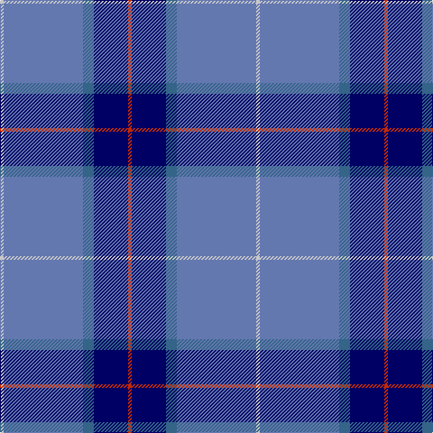

This page is one **sett** — a single exact thread-count. It belongs to the [tartan](/tartans/r2db19n6b44lb2/)
(the same proportion at any scale), whose colour order is pattern [RBBBW](/stripes/rbbbw/).

Sourced from tartans-authority.  It is a [5 stripe tartan](/stripes/stripes5/).

Original link http://www.tartansauthority.com/tartan-ferret/display/2699/

## Register references

External register numbers recorded for this tartan.

- Scottish Tartans Authority (ITI): 2699

## Thread count
N/4 B88 Ba12 DB38 R/4

## Palette

Palette: <strong>Tartan Register</strong> <small style="color:#888">(2 of 5 colours)</small>
<table><thead><tr><th>Colour</th><th>Threads</th><th>Shade</th><th>Base</th><th>OKLCh</th></tr></thead><tbody><tr><td>N/</td><td style="text-align:right;font-variant-numeric:tabular-nums">4</td><td><code style="background-color:#C8C8C8;">#C8C8C8</code> <small style="color:#888">#C8C8C8</small></td><td>W <code style="background-color:#F7F7F7;">#F7F7F7</code></td><td><small style="color:#888">oklch(83.3% 0.000 89.9)</small></td></tr><tr><td>B</td><td style="text-align:right;font-variant-numeric:tabular-nums">88</td><td><code style="background-color:#6478B0;">#6478B0</code> <small style="color:#888">#6478B0</small></td><td>B <code style="background-color:#2A418A;">#2A418A</code></td><td><small style="color:#888">oklch(58.0% 0.090 268.5)</small></td></tr><tr><td>Ba</td><td style="text-align:right;font-variant-numeric:tabular-nums">12</td><td><code style="background-color:#346488;">#346488</code> <small style="color:#888">#346488</small></td><td>B <code style="background-color:#2A418A;">#2A418A</code></td><td><small style="color:#888">oklch(48.6% 0.078 243.0)</small></td></tr><tr><td>DB</td><td style="text-align:right;font-variant-numeric:tabular-nums">38</td><td><code style="background-color:#000064;">#000064</code> <small style="color:#888">#000064</small></td><td>B <code style="background-color:#2A418A;">#2A418A</code></td><td><small style="color:#888">oklch(22.7% 0.158 264.1)</small></td></tr><tr><td>R/</td><td style="text-align:right;font-variant-numeric:tabular-nums">4</td><td><code style="background-color:#C82800;">#C82800</code> <small style="color:#888">#C82800</small></td><td>R <code style="background-color:#CC0000;">#CC0000</code></td><td><small style="color:#888">oklch(54.0% 0.199 33.0)</small></td></tr></tbody></table>

# Sample pattern

## Nearest tartans

The nearest existing variants by ΔTartan distance, with this tartan at the top so the swatches line up against it.

ΔTartan

Tartan

Sett

—

<a href="/ttd/edit/#slug=r2db19n6b44lb2~x2">World Fed. of Bldg Contractors (Corp</a> <a class="nn-out" href="/setts/s5/r2db19n6b44lb2~x2/" title="open its dictionary page">↗</a>

1.14

<a href="/ttd/edit/#slug=w4t34db60ly3~x2">MacKerral Family Tartan Tartan Number: 1757. Earliest known date: 1975 A sample was presented to the Scottish Tartans Society by John Drummond Bowman. This version of the tartan has the unusual feature of exchanging red for yellow in the weft. It is larger than the sett recorded in the Lyon Court Books in 1982. The name, MacKerral or MacKerrell, is recorded in Ayrshire in the 12th century. See products available Copyright © Blair Urquhart, Comrie, 2015</a> <a class="nn-out" href="/setts/s4/w4t34db60ly3~x2/" title="open its dictionary page">↗</a>

1.23

<a href="/ttd/edit/#slug=t72r16k5ly2dt16~x2">Thomas, Jean Marc (Personal)</a> <a class="nn-out" href="/setts/s5/t72r16k5ly2dt16~x2/" title="open its dictionary page">↗</a>

1.30

<a href="/ttd/edit/#slug=db3dbi2t31db34w2~x2">Gilt Edge (Corporate)</a> <a class="nn-out" href="/setts/s5/db3dbi2t31db34w2~x2/" title="open its dictionary page">↗</a>

1.33

<a href="/ttd/edit/#slug=r2t21r2db6ly1r1~x4">Lauder Primary School (Corporate)</a> <a class="nn-out" href="/setts/s6/r2t21r2db6ly1r1~x4/" title="open its dictionary page">↗</a>

1.37

<a href="/setts/s6/g6ni16db49n14db2w6~x2/">Gorman Family (Canada) (Personal)</a>

1.44

<a href="/ttd/edit/#slug=r2db61k13w2o20lo2~x2">Lloyd of Astargus</a> <a class="nn-out" href="/setts/s6/r2db61k13w2o20lo2~x2/" title="open its dictionary page">↗</a>

1.46

<a href="/ttd/edit/#slug=n42db2n2db17lo8db4~x2">Connecticut State Police PB (Cor.)</a> <a class="nn-out" href="/setts/s6/n42db2n2db17lo8db4~x2/" title="open its dictionary page">↗</a>

1.47

<a href="/ttd/edit/#slug=t20dp3db7ly1~x4">Peacock (Samantha)</a> <a class="nn-out" href="/setts/s4/t20dp3db7ly1~x4/" title="open its dictionary page">↗</a>

1.52

<a href="/ttd/edit/#slug=w4t28db49ly3~x2">McKerrell of Hillhouse</a> <a class="nn-out" href="/setts/s4/w4t28db49ly3~x2/" title="open its dictionary page">↗</a>

1.52

<a href="/ttd/edit/#slug=k2db36g12w3r2~x2">Cleland</a> <a class="nn-out" href="/setts/s5/k2db36g12w3r2~x2/" title="open its dictionary page">↗</a>

## Neighbour map

Every grey dot is one of 14359 variants placed by the first two principal components of the ΔTartan feature space (44% of its variance). Red is this tartan; blue dots are its nearest — click one to open its page.

<svg viewBox="0 0 640 380" role="img" style="max-width:100%;height:auto;border:1px solid #e0e0e0;border-radius:4px;display:block" xmlns="http://www.w3.org/2000/svg"><image href="/nn/cloud.v1.png" width="640" height="380"/><a href="/setts/s4/w4t34db60ly3~x2/"><circle cx="380.2" cy="208.0" r="4" fill="#3465a4"><title>MacKerral Family Tartan Tartan Number: 1757. Earliest known date: 1975 A sample was presented to the Scottish Tartans Society by John Drummond Bowman. This version of the tartan has the unusual feature of exchanging red for yellow in the weft. It is larger than the sett recorded in the Lyon Court Books in 1982. The name, MacKerral or MacKerrell, is recorded in Ayrshire in the 12th century. See products available Copyright © Blair Urquhart, Comrie, 2015</title></circle></a><a href="/setts/s5/t72r16k5ly2dt16~x2/"><circle cx="410.6" cy="146.2" r="4" fill="#3465a4"><title>Thomas, Jean Marc (Personal)</title></circle></a><a href="/setts/s5/db3dbi2t31db34w2~x2/"><circle cx="345.5" cy="202.6" r="4" fill="#3465a4"><title>Gilt Edge (Corporate)</title></circle></a><a href="/setts/s6/r2t21r2db6ly1r1~x4/"><circle cx="413.6" cy="165.4" r="4" fill="#3465a4"><title>Lauder Primary School (Corporate)</title></circle></a><a href="/setts/s6/g6ni16db49n14db2w6~x2/"><circle cx="305.6" cy="160.0" r="4" fill="#3465a4"><title>Gorman Family (Canada) (Personal)</title></circle></a><a href="/setts/s6/r2db61k13w2o20lo2~x2/"><circle cx="370.8" cy="125.8" r="4" fill="#3465a4"><title>Lloyd of Astargus</title></circle></a><a href="/setts/s6/n42db2n2db17lo8db4~x2/"><circle cx="380.8" cy="179.8" r="4" fill="#3465a4"><title>Connecticut State Police PB (Cor.)</title></circle></a><a href="/setts/s4/t20dp3db7ly1~x4/"><circle cx="420.9" cy="213.2" r="4" fill="#3465a4"><title>Peacock (Samantha)</title></circle></a><a href="/setts/s4/w4t28db49ly3~x2/"><circle cx="345.4" cy="211.7" r="4" fill="#3465a4"><title>McKerrell of Hillhouse</title></circle></a><a href="/setts/s5/k2db36g12w3r2~x2/"><circle cx="387.3" cy="169.2" r="4" fill="#3465a4"><title>Cleland</title></circle></a><circle cx="370.3" cy="170.8" r="5" fill="#c00000"/></svg>

ID: /setts/s5/r2db19n6b44lb2~x2/
