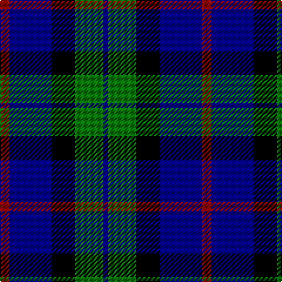

In pattern [BGKBR](/stripes/bgkbr/).

This was sourced from register-of-tartans.  It is a [5 stripe tartan](/stripes/stripes5/).

Original link https://www.tartanregister.gov.uk/tartanDetails.aspx?ref=1283

## Register references

External register numbers recorded for this tartan.

- Scottish Register of Tartans: [1283](https://www.tartanregister.gov.uk/tartanDetails.aspx?ref=1283)
- Scottish Tartans Authority (ITI): 4940

## Thread count
DR/8 DB36 K20 G24 DB/4

## Palette
Each colour and the base-6 reference it is a variant of.

| Colour | Shade | Base |
|---|---|---|
| DB | <code style="background-color:#00008C;">#00008C</code> `oklch(28.9% 0.200 264.1)` <small>#00008C</small> | B <code style="background-color:#2A418A;">#2A418A</code> |
| DR | <code style="background-color:#8C0000;">#8C0000</code> `oklch(40.2% 0.165 29.2)` <small>#8C0000</small> | R <code style="background-color:#CC0000;">#CC0000</code> |
| G | <code style="background-color:#007800;">#007800</code> `oklch(49.6% 0.169 142.5)` <small>#007800</small> | G <code style="background-color:#006100;">#006100</code> |
| K | <code style="background-color:#000000;">#000000</code> `oklch(0.0% 0.000 0.0)` <small>#000000</small> | K <code style="background-color:#000000;">#000000</code> |

# Sample pattern

## Nearest tartans

The nearest existing variants by ΔTartan distance, with this tartan at the top so the swatches line up against it.

ΔTartan

Tartan

Sett

—

<a href="/ttd/edit/#slug=r2db9k5g6db1~x4">Frobo Nairn</a> <a class="nn-out" href="/setts/s5/r2db9k5g6db1~x4/" title="open its dictionary page">↗</a>

0.93

<a href="/ttd/edit/#slug=g1k9t4db9t1~x6">Wallace Blue Dress Tartan Tartan Number: 6569. Earliest known date: See products available Copyright © Blair Urquhart, Comrie, 2015</a> <a class="nn-out" href="/setts/s5/g1k9t4db9t1~x6/" title="open its dictionary page">↗</a>

1.00

<a href="/ttd/edit/#slug=k4lb2dg8db8lb1">Douglas Green</a> <a class="nn-out" href="/setts/s5/k4lb2dg8db8lb1/" title="open its dictionary page">↗</a>

1.01

<a href="/ttd/edit/#slug=k2lb2dg8db8lb1">Douglas</a> <a class="nn-out" href="/setts/s5/k2lb2dg8db8lb1/" title="open its dictionary page">↗</a>

1.14

<a href="/ttd/edit/#slug=n6db3n6db20k20db8w4~x2">Allianz Deutschland 2012</a> <a class="nn-out" href="/setts/s7/n6db3n6db20k20db8w4~x2/" title="open its dictionary page">↗</a>

1.14

<a href="/ttd/edit/#slug=k5lb2dg18k17dp16k3">Melville</a> <a class="nn-out" href="/setts/s6/k5lb2dg18k17dp16k3/" title="open its dictionary page">↗</a>

1.19

<a href="/ttd/edit/#slug=b10k10b10dg26ly5~x2">Marshall of Keith (Personal)</a> <a class="nn-out" href="/setts/s5/b10k10b10dg26ly5~x2/" title="open its dictionary page">↗</a>

1.21

<a href="/ttd/edit/#slug=k7lt3dg18db18w2~x2">Bhatti</a> <a class="nn-out" href="/setts/s5/k7lt3dg18db18w2~x2/" title="open its dictionary page">↗</a>

1.23

<a href="/ttd/edit/#slug=db6k1db6k8r1g8k2~x2">Fletcher</a> <a class="nn-out" href="/setts/s7/db6k1db6k8r1g8k2~x2/" title="open its dictionary page">↗</a>

1.26

<a href="/ttd/edit/#slug=db4k2db16k10g18k3~x2">Wartley Htg (Fashion)</a> <a class="nn-out" href="/setts/s6/db4k2db16k10g18k3~x2/" title="open its dictionary page">↗</a>

1.28

<a href="/ttd/edit/#slug=db6k1db6k8r1dg8r2">Fletcher C</a> <a class="nn-out" href="/setts/s7/db6k1db6k8r1dg8r2/" title="open its dictionary page">↗</a>

## Neighbour map

Every grey dot is one of 14299 variants placed by the first two principal components of the ΔTartan feature space (44% of its variance). Red is this tartan; blue dots are its nearest — click one to open its page.

<svg viewBox="0 0 640 380" role="img" style="max-width:100%;height:auto;border:1px solid #e0e0e0;border-radius:4px;display:block" xmlns="http://www.w3.org/2000/svg"><image href="/nn/cloud.v1.png" width="640" height="380"/><a href="/setts/s5/g1k9t4db9t1~x6/"><circle cx="183.9" cy="232.9" r="4" fill="#3465a4"><title>Wallace Blue Dress Tartan Tartan Number: 6569. Earliest known date: See products available Copyright © Blair Urquhart, Comrie, 2015</title></circle></a><a href="/setts/s5/k4lb2dg8db8lb1/"><circle cx="135.9" cy="243.1" r="4" fill="#3465a4"><title>Douglas Green</title></circle></a><a href="/setts/s5/k2lb2dg8db8lb1/"><circle cx="168.2" cy="233.3" r="4" fill="#3465a4"><title>Douglas</title></circle></a><a href="/setts/s7/n6db3n6db20k20db8w4~x2/"><circle cx="199.7" cy="236.2" r="4" fill="#3465a4"><title>Allianz Deutschland 2012</title></circle></a><a href="/setts/s6/k5lb2dg18k17dp16k3/"><circle cx="187.5" cy="231.6" r="4" fill="#3465a4"><title>Melville</title></circle></a><a href="/setts/s5/b10k10b10dg26ly5~x2/"><circle cx="157.7" cy="263.9" r="4" fill="#3465a4"><title>Marshall of Keith (Personal)</title></circle></a><a href="/setts/s5/k7lt3dg18db18w2~x2/"><circle cx="165.2" cy="225.1" r="4" fill="#3465a4"><title>Bhatti</title></circle></a><a href="/setts/s7/db6k1db6k8r1g8k2~x2/"><circle cx="158.3" cy="232.2" r="4" fill="#3465a4"><title>Fletcher</title></circle></a><a href="/setts/s6/db4k2db16k10g18k3~x2/"><circle cx="195.1" cy="248.0" r="4" fill="#3465a4"><title>Wartley Htg (Fashion)</title></circle></a><a href="/setts/s7/db6k1db6k8r1dg8r2/"><circle cx="168.2" cy="243.1" r="4" fill="#3465a4"><title>Fletcher C</title></circle></a><circle cx="186.4" cy="247.5" r="5" fill="#c00000"/></svg>

ID: /setts/s5/r2db9k5g6db1~x4/
