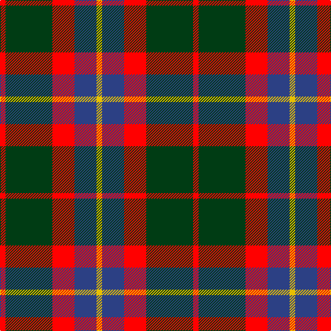

In pattern [RGRBY](/stripes/rgrby/).

This was sourced from register-of-tartans.  It is a [5 stripe tartan](/stripes/stripes5/).

Original link https://www.tartanregister.gov.uk/tartanDetails.aspx?ref=11235

## Register references

External register numbers recorded for this tartan.

- Scottish Register of Tartans: [11235](https://www.tartanregister.gov.uk/tartanDetails.aspx?ref=11235)

## Thread count
R/8 DG68 R32 B32 Y/8

## Palette
Each colour and the base-6 reference it is a variant of.

| Colour | Shade | Base |
|---|---|---|
| B | <code style="background-color:#2C4084;">#2C4084</code> `oklch(39.4% 0.117 268.3)` <small>#2C4084</small> | B <code style="background-color:#2A418A;">#2A418A</code> |
| DG | <code style="background-color:#003C14;">#003C14</code> `oklch(31.1% 0.089 148.5)` <small>#003C14</small> | G <code style="background-color:#006100;">#006100</code> |
| R | <code style="background-color:#FF0000;">#FF0000</code> `oklch(62.8% 0.258 29.2)` <small>#FF0000</small> | R <code style="background-color:#CC0000;">#CC0000</code> |
| Y | <code style="background-color:#E8C000;">#E8C000</code> `oklch(81.9% 0.168 93.7)` <small>#E8C000</small> | Y <code style="background-color:#F2BF00;">#F2BF00</code> |

# Sample pattern

## Nearest tartans

The nearest existing variants by ΔTartan distance, with this tartan at the top so the swatches line up against it.

ΔTartan

Tartan

Sett

—

<a href="/ttd/edit/#slug=r2dg17r8db8ly2~x4">British Hills</a> <a class="nn-out" href="/setts/s5/r2dg17r8db8ly2~x4/" title="open its dictionary page">↗</a>

0.75

<a href="/ttd/edit/#slug=g3k15r8g2o8k2~x4">Thompson Black (Fashion)</a> <a class="nn-out" href="/setts/s6/g3k15r8g2o8k2~x4/" title="open its dictionary page">↗</a>

0.77

<a href="/ttd/edit/#slug=r10dy60dt13lb24dt24dy8">Bronte House Check (Fashion)</a> <a class="nn-out" href="/setts/s6/r10dy60dt13lb24dt24dy8/" title="open its dictionary page">↗</a>

0.78

<a href="/ttd/edit/#slug=r3y27k6lo13k14r3~x2">Thompson/Thomson/MacTavish special grey</a> <a class="nn-out" href="/setts/s6/r3y27k6lo13k14r3~x2/" title="open its dictionary page">↗</a>

0.94

<a href="/ttd/edit/#slug=lb5o34k24o4r24o4~x2">Wcwm 759-3</a> <a class="nn-out" href="/setts/s6/lb5o34k24o4r24o4~x2/" title="open its dictionary page">↗</a>

0.97

<a href="/ttd/edit/#slug=do2o11do2k11do16lb2~x4">Portrait, The</a> <a class="nn-out" href="/setts/s6/do2o11do2k11do16lb2~x4/" title="open its dictionary page">↗</a>

1.00

<a href="/ttd/edit/#slug=k2o20k8dg18o3w2~x2">Celtic Combat</a> <a class="nn-out" href="/setts/s6/k2o20k8dg18o3w2~x2/" title="open its dictionary page">↗</a>

1.00

<a href="/ttd/edit/#slug=ly5g22dp15dp11dp5g2~x2">Scottish Ballet</a> <a class="nn-out" href="/setts/s6/ly5g22dp15dp11dp5g2~x2/" title="open its dictionary page">↗</a>

1.02

<a href="/ttd/edit/#slug=k3lo18dg6r17k31dg3~x2">MacMillan - 2002 (Black - Unofficial</a> <a class="nn-out" href="/setts/s6/k3lo18dg6r17k31dg3~x2/" title="open its dictionary page">↗</a>

1.03

<a href="/ttd/edit/#slug=y26k10r10ly10y3~x2">Ikelman No 2</a> <a class="nn-out" href="/setts/s5/y26k10r10ly10y3~x2/" title="open its dictionary page">↗</a>

1.04

<a href="/ttd/edit/#slug=r3db12r4g18r6k2~x2">Eyre (Personal)</a> <a class="nn-out" href="/setts/s6/r3db12r4g18r6k2~x2/" title="open its dictionary page">↗</a>

## Neighbour map

Every grey dot is one of 14299 variants placed by the first two principal components of the ΔTartan feature space (44% of its variance). Red is this tartan; blue dots are its nearest — click one to open its page.

<svg viewBox="0 0 640 380" role="img" style="max-width:100%;height:auto;border:1px solid #e0e0e0;border-radius:4px;display:block" xmlns="http://www.w3.org/2000/svg"><image href="/nn/cloud.v1.png" width="640" height="380"/><a href="/setts/s6/g3k15r8g2o8k2~x4/"><circle cx="201.2" cy="223.0" r="4" fill="#3465a4"><title>Thompson Black (Fashion)</title></circle></a><a href="/setts/s6/r10dy60dt13lb24dt24dy8/"><circle cx="232.2" cy="220.2" r="4" fill="#3465a4"><title>Bronte House Check (Fashion)</title></circle></a><a href="/setts/s6/r3y27k6lo13k14r3~x2/"><circle cx="192.4" cy="206.6" r="4" fill="#3465a4"><title>Thompson/Thomson/MacTavish special grey</title></circle></a><a href="/setts/s6/lb5o34k24o4r24o4~x2/"><circle cx="190.9" cy="202.0" r="4" fill="#3465a4"><title>Wcwm 759-3</title></circle></a><a href="/setts/s6/do2o11do2k11do16lb2~x4/"><circle cx="232.8" cy="225.9" r="4" fill="#3465a4"><title>Portrait, The</title></circle></a><a href="/setts/s6/k2o20k8dg18o3w2~x2/"><circle cx="237.3" cy="204.2" r="4" fill="#3465a4"><title>Celtic Combat</title></circle></a><a href="/setts/s6/ly5g22dp15dp11dp5g2~x2/"><circle cx="194.9" cy="212.8" r="4" fill="#3465a4"><title>Scottish Ballet</title></circle></a><a href="/setts/s6/k3lo18dg6r17k31dg3~x2/"><circle cx="218.1" cy="210.6" r="4" fill="#3465a4"><title>MacMillan - 2002 (Black - Unofficial</title></circle></a><a href="/setts/s5/y26k10r10ly10y3~x2/"><circle cx="200.0" cy="215.3" r="4" fill="#3465a4"><title>Ikelman No 2</title></circle></a><a href="/setts/s6/r3db12r4g18r6k2~x2/"><circle cx="215.7" cy="223.8" r="4" fill="#3465a4"><title>Eyre (Personal)</title></circle></a><circle cx="220.6" cy="221.1" r="5" fill="#c00000"/></svg>

ID: /setts/s5/r2dg17r8db8ly2~x4/
