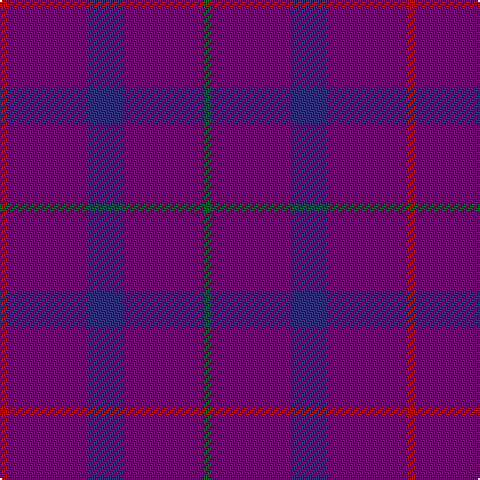

This page is one **sett** — a single exact thread-count. It belongs to the [tartan](/tartans/r2dp20db9dp20g2/)
(the same proportion at any scale), whose colour order is pattern [GBBBR](/stripes/gbbbr/).

Sourced from tartans-authority.  It is a [5 stripe tartan](/stripes/stripes5/).

Original link http://www.tartansauthority.com/tartan-ferret/display/689/

## Also known as

This cloth is also recorded under:

- Scottish Netball Association

2 attestations — the source records this cloth was collapsed from (oldest owns this page)

<ul>
<li>1987 — Scottish Netball (1987) (Corporate) (tartans-authority, <a href="http://www.tartansauthority.com/tartan-ferret/display/689/">record</a>)</li>
<li>undated — Scottish Netball Association Corporate Tartan Tartan Number: 689. Earliest known date: 1987 Designed for the World Netball Championship held in 1987. See products available Copyright © Blair Urquhart, Comrie, 2015 (house-of-tartan, <a href="http://www.house-of-tartan.scotland.net/house/TartanViewjs.asp?colr=Def&tnam=689">record</a>)</li>
</ul>

## Register references

External register numbers recorded for this tartan.

- Scottish Tartans Authority (ITI): 689

## Thread count
R/4 P40 DB18 P40 G/4

## Palette

Palette: <strong>Tartan Register</strong>
<table><thead><tr><th>Colour</th><th>Threads</th><th>Shade</th><th>Base</th><th>OKLCh</th></tr></thead><tbody><tr><td>R/</td><td style="text-align:right;font-variant-numeric:tabular-nums">4</td><td><code style="background-color:#C80000;">#C80000</code> <small style="color:#888">#C80000</small></td><td>R <code style="background-color:#CC0000;">#CC0000</code></td><td><small style="color:#888">oklch(52.3% 0.215 29.2)</small></td></tr><tr><td>P</td><td style="text-align:right;font-variant-numeric:tabular-nums">40</td><td><code style="background-color:#780078;">#780078</code> <small style="color:#888">#780078</small></td><td>B <code style="background-color:#2A418A;">#2A418A</code></td><td><small style="color:#888">oklch(40.2% 0.185 328.4)</small></td></tr><tr><td>DB</td><td style="text-align:right;font-variant-numeric:tabular-nums">18</td><td><code style="background-color:#2C2C80;">#2C2C80</code> <small style="color:#888">#2C2C80</small></td><td>B <code style="background-color:#2A418A;">#2A418A</code></td><td><small style="color:#888">oklch(35.0% 0.138 276.6)</small></td></tr><tr><td>P</td><td style="text-align:right;font-variant-numeric:tabular-nums">40</td><td><code style="background-color:#780078;">#780078</code> <small style="color:#888">#780078</small></td><td>B <code style="background-color:#2A418A;">#2A418A</code></td><td><small style="color:#888">oklch(40.2% 0.185 328.4)</small></td></tr><tr><td>G/</td><td style="text-align:right;font-variant-numeric:tabular-nums">4</td><td><code style="background-color:#006818;">#006818</code> <small style="color:#888">#006818</small></td><td>G <code style="background-color:#006100;">#006100</code></td><td><small style="color:#888">oklch(45.0% 0.142 145.0)</small></td></tr></tbody></table>

# Sample pattern

## Nearest tartans

The nearest existing variants by ΔTartan distance, with this tartan at the top so the swatches line up against it.

ΔTartan

Tartan

Sett

—

<a href="/ttd/edit/#slug=r2dp20db9dp20g2~x2">Scottish Netball (1987) (Corporate)</a> <a class="nn-out" href="/setts/s5/r2dp20db9dp20g2~x2/" title="open its dictionary page">↗</a>

0.48

<a href="/ttd/edit/#slug=r2p20db9p20g2~x2">Scottish Netball Association</a> <a class="nn-out" href="/setts/s5/r2p20db9p20g2~x2/" title="open its dictionary page">↗</a>

1.59

<a href="/ttd/edit/#slug=dp20db9dp20r2dp20db9dp20g2~x2">Scottish Netball Association (1987)</a> <a class="nn-out" href="/setts/s8/dp20db9dp20r2dp20db9dp20g2~x2/" title="open its dictionary page">↗</a>

1.99

<a href="/ttd/edit/#slug=dp30db10m5db10dp30db3dpi5db3dp30~x2">Meanwood McMain (Personal)</a> <a class="nn-out" href="/setts/s9/dp30db10m5db10dp30db3dpi5db3dp30~x2/" title="open its dictionary page">↗</a>

2.14

<a href="/ttd/edit/#slug=dp5g2dp19r5~x2">Highland Spring Corporate Tartan Tartan Number: 130. Earliest known date: 1987 Highland Spring manufacture bottled drinking water at Blackford in Perthshire, Scotland. See products available Copyright © Blair Urquhart, Comrie, 2015</a> <a class="nn-out" href="/setts/s4/dp5g2dp19r5~x2/" title="open its dictionary page">↗</a>

2.59

<a href="/ttd/edit/#slug=db16m4db3r1~x2">Elliot</a> <a class="nn-out" href="/setts/s4/db16m4db3r1~x2/" title="open its dictionary page">↗</a>

2.64

<a href="/ttd/edit/#slug=db44dy12db9r3~x2">Elliot (Clan)</a> <a class="nn-out" href="/setts/s4/db44dy12db9r3~x2/" title="open its dictionary page">↗</a>

2.67

<a href="/ttd/edit/#slug=r5p19g3p5~x2">Highland Spring</a> <a class="nn-out" href="/setts/s4/r5p19g3p5~x2/" title="open its dictionary page">↗</a>

2.70

<a href="/ttd/edit/#slug=db9dy12db44dy12db9r3~x2">Elliot</a> <a class="nn-out" href="/setts/s6/db9dy12db44dy12db9r3~x2/" title="open its dictionary page">↗</a>

2.91

<a href="/ttd/edit/#slug=dr30db10dr3db30m3~x2">Feniston (Personal)</a> <a class="nn-out" href="/setts/s5/dr30db10dr3db30m3~x2/" title="open its dictionary page">↗</a>

2.93

<a href="/ttd/edit/#slug=db4dr16o6dr16o6dr16db8dr6db4dr16db2o1~x2">Thomas Blake Glover</a> <a class="nn-out" href="/setts/s12/db4dr16o6dr16o6dr16db8dr6db4dr16db2o1~x2/" title="open its dictionary page">↗</a>

## Neighbour map

Every grey dot is one of 14359 variants placed by the first two principal components of the ΔTartan feature space (44% of its variance). Red is this tartan; blue dots are its nearest — click one to open its page.

<svg viewBox="0 0 640 380" role="img" style="max-width:100%;height:auto;border:1px solid #e0e0e0;border-radius:4px;display:block" xmlns="http://www.w3.org/2000/svg"><image href="/nn/cloud.v1.png" width="640" height="380"/><a href="/setts/s5/r2p20db9p20g2~x2/"><circle cx="542.9" cy="273.5" r="4" fill="#3465a4"><title>Scottish Netball Association</title></circle></a><a href="/setts/s8/dp20db9dp20r2dp20db9dp20g2~x2/"><circle cx="584.8" cy="294.7" r="4" fill="#3465a4"><title>Scottish Netball Association (1987)</title></circle></a><a href="/setts/s9/dp30db10m5db10dp30db3dpi5db3dp30~x2/"><circle cx="539.3" cy="272.9" r="4" fill="#3465a4"><title>Meanwood McMain (Personal)</title></circle></a><a href="/setts/s4/dp5g2dp19r5~x2/"><circle cx="560.7" cy="272.4" r="4" fill="#3465a4"><title>Highland Spring Corporate Tartan Tartan Number: 130. Earliest known date: 1987 Highland Spring manufacture bottled drinking water at Blackford in Perthshire, Scotland. See products available Copyright © Blair Urquhart, Comrie, 2015</title></circle></a><a href="/setts/s4/db16m4db3r1~x2/"><circle cx="626.0" cy="291.6" r="4" fill="#3465a4"><title>Elliot</title></circle></a><a href="/setts/s4/db44dy12db9r3~x2/"><circle cx="611.5" cy="291.0" r="4" fill="#3465a4"><title>Elliot (Clan)</title></circle></a><a href="/setts/s4/r5p19g3p5~x2/"><circle cx="500.5" cy="280.0" r="4" fill="#3465a4"><title>Highland Spring</title></circle></a><a href="/setts/s6/db9dy12db44dy12db9r3~x2/"><circle cx="532.0" cy="267.9" r="4" fill="#3465a4"><title>Elliot</title></circle></a><a href="/setts/s5/dr30db10dr3db30m3~x2/"><circle cx="424.9" cy="285.6" r="4" fill="#3465a4"><title>Feniston (Personal)</title></circle></a><a href="/setts/s12/db4dr16o6dr16o6dr16db8dr6db4dr16db2o1~x2/"><circle cx="502.1" cy="246.3" r="4" fill="#3465a4"><title>Thomas Blake Glover</title></circle></a><circle cx="555.3" cy="281.7" r="5" fill="#c00000"/></svg>

ID: /setts/s5/r2dp20db9dp20g2~x2/
