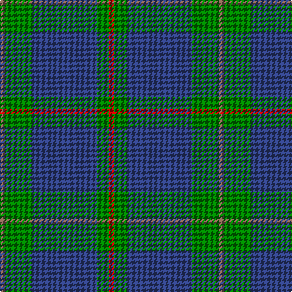

In pattern [RGBGR](/patterns/rgbgr/).

This was sourced from weddslist.  It is a [5 stripes tartan](/stripes/stripes5/).

Original link http://www.weddslist.com/cgi-bin/tartans/pg.pl?source=sts

## Thread count
LT/4 G22 B54 G10 R/4

## Palette
Each colour and its ΔE from the base-6 reference it is a variant of.

| Colour | Shade | Base | ΔE (OKLab) |
|---|---|---|---|
| B | <code style="background-color:#304080;">#304080</code> `#304080` | B <code style="background-color:#2A418A;">#2A418A</code> | 0.02 |
| G | <code style="background-color:#008000;">#008000</code> `#008000` | G <code style="background-color:#006100;">#006100</code> | 0.10 |
| LT | <code style="background-color:#806050;">#806050</code> `#806050` | R <code style="background-color:#CC0000;">#CC0000</code> | 0.17 |
| R | <code style="background-color:#C00000;">#C00000</code> `#C00000` | R <code style="background-color:#CC0000;">#CC0000</code> | 0.03 |

# Sample pattern

## Nearest tartans

The nearest existing variants by ΔTartan distance.

1. [Rowan (Personal)](/setts/s5/g12y1b8k1b1x4~b2c2c80-g006818-k101010-yd09800/) — ΔT 0.81
1. [MacIntyre](/setts/s6/g4b12r3b12g32w4x2~b304080-g004010-rc00000-we0e0e0/) — ΔT 1.10
1. [Irvine Clan Tartan Tartan Number: 733. Earliest known date: c.1889 Scottish Tartans Society notes say that this tartan was 'first made by Peter MacArthur and Co, Hamilton'. MacKinlay, a tartan collector between 1930 and 1950, gives the earliest date as 1889 but it is not known upon what evidence. The name Irvine derives from an old parish name in Dumfries-shire, and from Irvine in Ayrshire. William de Irwyne obtained the forest of Drum in 1324, and is thus the ancestor of the Irvines of Drum. See products available Copyright © Blair Urquhart, Comrie, 2015](/setts/s5/g18b9k1b1w1x4~b2c2c80-g006818-k101010-we0e0e0/) — ΔT 1.13
1. [Shaw (Clan 1)](/setts/s6/g24k2b3k2b8r2x2~b2c2c80-g006818-k101010-rc80000/) — ΔT 1.15
1. [Thorburn (Lochcarron)](/setts/s6/b3ba14b3r16b34ra3x2~b003c64-ba5c8ca8-r888888-rac80000/) — ΔT 1.15
1. [North Sea Commission](/setts/s5/b9ba3b1ba12y1x4~b5c8ca8-ba344054-ye8c000/) — ΔT 1.18
1. [Connaught Green](/setts/s6/r1b12g5b2g4w1x2~b202060-g5c6428-ra00000-wc0c0c0/) — ΔT 1.21
1. [Gracie (Name)](/setts/s5/g47r3g6b35y3x2~b1c0070-g006818-r880000-yd09800/) — ΔT 1.22
1. [Port Authority of NY & NJ](/setts/s6/b9ba2b39bb33y2bb5x2~b5c8ca8-ba1c0070-bb003c64-ybc8c00/) — ΔT 1.25
1. [MacHardy](/setts/s8/b3r3g18b16w2b26r3g3x2~b304080-g008000-rc00000-we0e0e0/) — ΔT 1.26

## Neighbour map

Every grey dot is one of 15726 variants placed by the first two principal components of the ΔTartan feature space (44% of its variance). Red is this tartan; blue dots are its nearest — click one to open its page.

<svg viewBox="0 0 640 380" role="img" style="max-width:100%;height:auto;border:1px solid #e0e0e0;border-radius:4px;display:block" xmlns="http://www.w3.org/2000/svg"><image href="/nn/cloud.v1.png" width="640" height="380"/><a href="/setts/s5/g12y1b8k1b1x4~b2c2c80-g006818-k101010-yd09800/"><circle cx="337.4" cy="222.7" r="4" fill="#3465a4"><title>Rowan (Personal)</title></circle></a><a href="/setts/s6/g4b12r3b12g32w4x2~b304080-g004010-rc00000-we0e0e0/"><circle cx="320.7" cy="223.1" r="4" fill="#3465a4"><title>MacIntyre</title></circle></a><a href="/setts/s5/g18b9k1b1w1x4~b2c2c80-g006818-k101010-we0e0e0/"><circle cx="395.0" cy="200.3" r="4" fill="#3465a4"><title>Irvine Clan Tartan Tartan Number: 733. Earliest known date: c.1889 Scottish Tartans Society notes say that this tartan was 'first made by Peter MacArthur and Co, Hamilton'. MacKinlay, a tartan collector between 1930 and 1950, gives the earliest date as 1889 but it is not known upon what evidence. The name Irvine derives from an old parish name in Dumfries-shire, and from Irvine in Ayrshire. William de Irwyne obtained the forest of Drum in 1324, and is thus the ancestor of the Irvines of Drum. See products available Copyright © Blair Urquhart, Comrie, 2015</title></circle></a><a href="/setts/s6/g24k2b3k2b8r2x2~b2c2c80-g006818-k101010-rc80000/"><circle cx="367.2" cy="205.2" r="4" fill="#3465a4"><title>Shaw (Clan 1)</title></circle></a><a href="/setts/s6/b3ba14b3r16b34ra3x2~b003c64-ba5c8ca8-r888888-rac80000/"><circle cx="330.6" cy="220.5" r="4" fill="#3465a4"><title>Thorburn (Lochcarron)</title></circle></a><a href="/setts/s5/b9ba3b1ba12y1x4~b5c8ca8-ba344054-ye8c000/"><circle cx="396.1" cy="249.5" r="4" fill="#3465a4"><title>North Sea Commission</title></circle></a><a href="/setts/s6/r1b12g5b2g4w1x2~b202060-g5c6428-ra00000-wc0c0c0/"><circle cx="351.5" cy="217.6" r="4" fill="#3465a4"><title>Connaught Green</title></circle></a><a href="/setts/s5/g47r3g6b35y3x2~b1c0070-g006818-r880000-yd09800/"><circle cx="353.9" cy="209.6" r="4" fill="#3465a4"><title>Gracie (Name)</title></circle></a><a href="/setts/s6/b9ba2b39bb33y2bb5x2~b5c8ca8-ba1c0070-bb003c64-ybc8c00/"><circle cx="379.0" cy="198.4" r="4" fill="#3465a4"><title>Port Authority of NY &amp; NJ</title></circle></a><a href="/setts/s8/b3r3g18b16w2b26r3g3x2~b304080-g008000-rc00000-we0e0e0/"><circle cx="358.1" cy="196.6" r="4" fill="#3465a4"><title>MacHardy</title></circle></a><circle cx="376.7" cy="220.3" r="5" fill="#c00000"/></svg>

ID: /setts/s5/r2g11b27g5ra2x2~b304080-g008000-r806050-rac00000/
