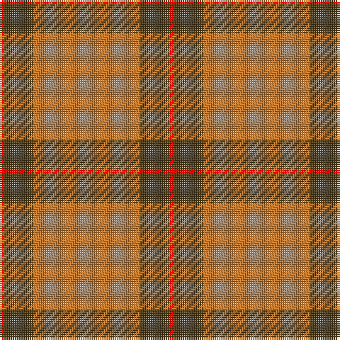

In pattern [RGRGR](/patterns/rgrgr/).

This was sourced from register-of-tartans.  It is a [5 stripes tartan](/stripes/stripes5/).

Original link https://www.tartanregister.gov.uk/tartanDetails.aspx?ref=4411

## Thread count
R/2 T14 DO50 T14 R/2

## Palette
Each colour and its ΔE from the base-6 reference it is a variant of.

| Colour | Shade | Base | ΔE (OKLab) |
|---|---|---|---|
| DO | <code style="background-color:#BE7832;">#BE7832</code> `#BE7832` | R <code style="background-color:#C80000;">#C80000</code> | 0.17 |
| R | <code style="background-color:#DC0000;">#DC0000</code> `#DC0000` | R <code style="background-color:#C80000;">#C80000</code> | 0.04 |
| T | <code style="background-color:#503C14;">#503C14</code> `#503C14` | G <code style="background-color:#006400;">#006400</code> | 0.15 |

# Sample pattern

## Nearest tartans

The nearest existing variants by ΔTartan distance.

1. [MacKintosh 2](/setts/s6/r96b4r6g56r8b4-b304080-g008000-rc00000/) — ΔT 1.29
1. [MacKintosh 1](/setts/s6/r44b10r4g22r6b2-b304080-g008000-rc00000/) — ΔT 1.45
1. [Cameron](/setts/s6/r4g12r4g12r32y2-g11450d-raa0000-yaaaa00/) — ΔT 1.47
1. [MacKintosh, Red](/setts/s6/r96g20r12g36r12b4-b2c2c80-g006818-rc80000/) — ΔT 1.50
1. [Robertson 6](/setts/s6/g4r72b16r4g40r4-b304080-g008000-rc00000/) — ΔT 1.50
1. [Cameron Clan D](/setts/s6/r2g12r2g12r30y2-g11450d-raa0000-yaaaa00/) — ΔT 1.50
1. [MacKintosh 3](/setts/s6/r136b36r18g68r18b6-b304080-g008000-rc00000/) — ΔT 1.51
1. [Cameron (Clan)](/setts/s6/r8g24r8g24r64y4-g006818-rc80000-ye8c000/) — ΔT 1.51
1. [Cameron Clan Tartan Tartan Number: 1538. Earliest known date: 1842 First illustrated in the 'Vestiarium Scoticum' this sett is known as the Cameron Clan tartan. It may be derived from the tartan worn by the MacFees who also had a close association with Lochaber. The sett was recorded by Lord Lyon in the Public Register of All Arms and Bearings in 1947. See products available Copyright © Blair Urquhart, Comrie, 2015](/setts/s6/r4g12r4g12r32y2-g006818-rc80000-ye8c000/) — ΔT 1.51
1. [Cameron](/setts/s6/r4g12r4g12r32y2-g008000-rc00000-yf0c000/) — ΔT 1.52

## Neighbour map

Every grey dot is one of 15726 variants placed by the first two principal components of the ΔTartan feature space (44% of its variance). Red is this tartan; blue dots are its nearest — click one to open its page.

<svg viewBox="0 0 640 380" role="img" style="max-width:100%;height:auto;border:1px solid #e0e0e0;border-radius:4px;display:block" xmlns="http://www.w3.org/2000/svg"><image href="/nn/cloud.v1.png" width="640" height="380"/><a href="/setts/s6/r96b4r6g56r8b4-b304080-g008000-rc00000/"><circle cx="467.8" cy="170.0" r="4" fill="#3465a4"><title>MacKintosh 2</title></circle></a><a href="/setts/s6/r44b10r4g22r6b2-b304080-g008000-rc00000/"><circle cx="425.9" cy="184.9" r="4" fill="#3465a4"><title>MacKintosh 1</title></circle></a><a href="/setts/s6/r4g12r4g12r32y2-g11450d-raa0000-yaaaa00/"><circle cx="443.3" cy="215.3" r="4" fill="#3465a4"><title>Cameron</title></circle></a><a href="/setts/s6/r96g20r12g36r12b4-b2c2c80-g006818-rc80000/"><circle cx="491.7" cy="183.5" r="4" fill="#3465a4"><title>MacKintosh, Red</title></circle></a><a href="/setts/s6/g4r72b16r4g40r4-b304080-g008000-rc00000/"><circle cx="398.0" cy="185.9" r="4" fill="#3465a4"><title>Robertson 6</title></circle></a><a href="/setts/s6/r2g12r2g12r30y2-g11450d-raa0000-yaaaa00/"><circle cx="422.7" cy="211.6" r="4" fill="#3465a4"><title>Cameron Clan D</title></circle></a><a href="/setts/s6/r136b36r18g68r18b6-b304080-g008000-rc00000/"><circle cx="420.0" cy="187.5" r="4" fill="#3465a4"><title>MacKintosh 3</title></circle></a><a href="/setts/s6/r8g24r8g24r64y4-g006818-rc80000-ye8c000/"><circle cx="423.5" cy="202.4" r="4" fill="#3465a4"><title>Cameron (Clan)</title></circle></a><a href="/setts/s6/r4g12r4g12r32y2-g006818-rc80000-ye8c000/"><circle cx="423.5" cy="202.4" r="4" fill="#3465a4"><title>Cameron Clan Tartan Tartan Number: 1538. Earliest known date: 1842 First illustrated in the 'Vestiarium Scoticum' this sett is known as the Cameron Clan tartan. It may be derived from the tartan worn by the MacFees who also had a close association with Lochaber. The sett was recorded by Lord Lyon in the Public Register of All Arms and Bearings in 1947. See products available Copyright © Blair Urquhart, Comrie, 2015</title></circle></a><a href="/setts/s6/r4g12r4g12r32y2-g008000-rc00000-yf0c000/"><circle cx="418.4" cy="201.2" r="4" fill="#3465a4"><title>Cameron</title></circle></a><circle cx="476.0" cy="197.7" r="5" fill="#c00000"/></svg>

ID: /setts/s5/r2g14ra50g14r2-g503c14-rdc0000-rabe7832/
