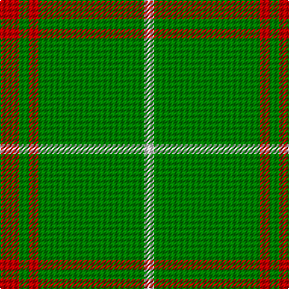

In pattern [RGRGW](/stripes/rgrgw/).

This was sourced from weddslist.  It is a [5 stripe tartan](/stripes/stripes5/).

Original link http://www.weddslist.com/cgi-bin/tartans/pg.pl?source=sts

## Thread count
R/16 G8 R8 G88 LN/8

## Palette
Each colour and the base-6 reference it is a variant of.

| Colour | Shade | Base |
|---|---|---|
| G | <code style="background-color:#008000;">#008000</code> `oklch(52.0% 0.177 142.5)` <small>#008000</small> | G <code style="background-color:#006100;">#006100</code> |
| LN | <code style="background-color:#E0E0E0;">#E0E0E0</code> `oklch(90.7% 0.000 89.9)` <small>#E0E0E0</small> | W <code style="background-color:#F7F7F7;">#F7F7F7</code> |
| R | <code style="background-color:#C00000;">#C00000</code> `oklch(50.7% 0.208 29.2)` <small>#C00000</small> | R <code style="background-color:#CC0000;">#CC0000</code> |

# Sample pattern

## Nearest tartans

The nearest existing variants by ΔTartan distance, with this tartan at the top so the swatches line up against it.

ΔTartan

Tartan

Sett

—

<a href="/ttd/edit/#slug=r2g1r1g11w1~x8">Welsh, National</a> <a class="nn-out" href="/setts/s5/r2g1r1g11w1~x8/" title="open its dictionary page">↗</a>

1.04

<a href="/ttd/edit/#slug=r19g6r7g101k7g7">Loch Laggan</a> <a class="nn-out" href="/setts/s6/r19g6r7g101k7g7/" title="open its dictionary page">↗</a>

1.35

<a href="/ttd/edit/#slug=r4g2r1g20k1g1~x4">Loch Laggan (District)</a> <a class="nn-out" href="/setts/s6/r4g2r1g20k1g1~x4/" title="open its dictionary page">↗</a>

1.39

<a href="/ttd/edit/#slug=g49w4lo11~x2">Hibernian S3</a> <a class="nn-out" href="/setts/s3/g49w4lo11~x2/" title="open its dictionary page">↗</a>

1.44

<a href="/ttd/edit/#slug=dg10o1dg1o1lr2dg1o1~x4">Green Watch</a> <a class="nn-out" href="/setts/s7/dg10o1dg1o1lr2dg1o1~x4/" title="open its dictionary page">↗</a>

1.53

<a href="/ttd/edit/#slug=r8g3r4g44w4~x2">Welsh National (District)</a> <a class="nn-out" href="/setts/s5/r8g3r4g44w4~x2/" title="open its dictionary page">↗</a>

1.60

<a href="/ttd/edit/#slug=g81r10ly20~x2">McMoosie</a> <a class="nn-out" href="/setts/s3/g81r10ly20~x2/" title="open its dictionary page">↗</a>

1.70

<a href="/ttd/edit/#slug=r2g2r1g12r3k1~x4">Connell (Personal?)</a> <a class="nn-out" href="/setts/s6/r2g2r1g12r3k1~x4/" title="open its dictionary page">↗</a>

1.72

<a href="/ttd/edit/#slug=m2g1m1g10w1~x4">Welsh National District Tartan Tartan Number: 1523. Earliest known date: 1968 The Welsh Tartan owes its origin to a Society formed in Cardiff in 1967. Its aims were cultural and political - to strengthen Celtic ties and give visible signs of being an individual nation in culture, language and dress. The colours are those of the Welsh flag. It is said that the design was based on the Lord of the Isles tartan because the present Lord is also Prince of Wales. However comparison reveals similarity only to MacDonald, MacDonald of the Isles, or perhaps Applecross district. See products available Copyright © Blair Urquhart, Comrie, 2015</a> <a class="nn-out" href="/setts/s5/m2g1m1g10w1~x4/" title="open its dictionary page">↗</a>

1.75

<a href="/ttd/edit/#slug=g7r3g23m7~x2">Highland Spring (Green)</a> <a class="nn-out" href="/setts/s4/g7r3g23m7~x2/" title="open its dictionary page">↗</a>

1.77

<a href="/ttd/edit/#slug=g10r4g1r4g15r4g1~x4">Logan</a> <a class="nn-out" href="/setts/s7/g10r4g1r4g15r4g1~x4/" title="open its dictionary page">↗</a>

## Neighbour map

Every grey dot is one of 14299 variants placed by the first two principal components of the ΔTartan feature space (44% of its variance). Red is this tartan; blue dots are its nearest — click one to open its page.

<svg viewBox="0 0 640 380" role="img" style="max-width:100%;height:auto;border:1px solid #e0e0e0;border-radius:4px;display:block" xmlns="http://www.w3.org/2000/svg"><image href="/nn/cloud.v1.png" width="640" height="380"/><a href="/setts/s6/r19g6r7g101k7g7/"><circle cx="528.6" cy="189.3" r="4" fill="#3465a4"><title>Loch Laggan</title></circle></a><a href="/setts/s6/r4g2r1g20k1g1~x4/"><circle cx="555.3" cy="183.2" r="4" fill="#3465a4"><title>Loch Laggan (District)</title></circle></a><a href="/setts/s3/g49w4lo11~x2/"><circle cx="492.4" cy="257.0" r="4" fill="#3465a4"><title>Hibernian S3</title></circle></a><a href="/setts/s7/dg10o1dg1o1lr2dg1o1~x4/"><circle cx="459.3" cy="214.5" r="4" fill="#3465a4"><title>Green Watch</title></circle></a><a href="/setts/s5/r8g3r4g44w4~x2/"><circle cx="504.5" cy="208.0" r="4" fill="#3465a4"><title>Welsh National (District)</title></circle></a><a href="/setts/s3/g81r10ly20~x2/"><circle cx="441.5" cy="273.7" r="4" fill="#3465a4"><title>McMoosie</title></circle></a><a href="/setts/s6/r2g2r1g12r3k1~x4/"><circle cx="445.8" cy="217.8" r="4" fill="#3465a4"><title>Connell (Personal?)</title></circle></a><a href="/setts/s5/m2g1m1g10w1~x4/"><circle cx="479.5" cy="228.3" r="4" fill="#3465a4"><title>Welsh National District Tartan Tartan Number: 1523. Earliest known date: 1968 The Welsh Tartan owes its origin to a Society formed in Cardiff in 1967. Its aims were cultural and political - to strengthen Celtic ties and give visible signs of being an individual nation in culture, language and dress. The colours are those of the Welsh flag. It is said that the design was based on the Lord of the Isles tartan because the present Lord is also Prince of Wales. However comparison reveals similarity only to MacDonald, MacDonald of the Isles, or perhaps Applecross district. See products available Copyright © Blair Urquhart, Comrie, 2015</title></circle></a><a href="/setts/s4/g7r3g23m7~x2/"><circle cx="474.2" cy="288.5" r="4" fill="#3465a4"><title>Highland Spring (Green)</title></circle></a><a href="/setts/s7/g10r4g1r4g15r4g1~x4/"><circle cx="445.0" cy="223.1" r="4" fill="#3465a4"><title>Logan</title></circle></a><circle cx="491.4" cy="219.6" r="5" fill="#c00000"/></svg>

ID: /setts/s5/r2g1r1g11w1~x8/
