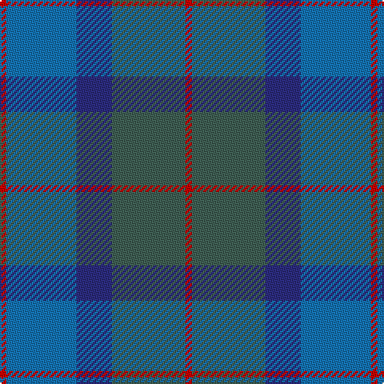

In pattern [RBBGR](/patterns/rbbgr/).

This was sourced from tartans-authority.  It is a [5 stripes tartan](/stripes/stripes5/).

Original link http://www.tartansauthority.com/tartan-ferret/display/2550/

## Thread count
R/4 B44 DB22 N46 R/4

## Palette
Each colour and its ΔE from the base-6 reference it is a variant of.

| Colour | Shade | Base | ΔE (OKLab) |
|---|---|---|---|
| B | <code style="background-color:#1474B4;">#1474B4</code> `#1474B4` | B <code style="background-color:#2A418A;">#2A418A</code> | 0.15 |
| DB | <code style="background-color:#2C2C80;">#2C2C80</code> `#2C2C80` | B <code style="background-color:#2A418A;">#2A418A</code> | 0.06 |
| N | <code style="background-color:#406054;">#406054</code> `#406054` | G <code style="background-color:#006100;">#006100</code> | 0.11 |
| R | <code style="background-color:#C80000;">#C80000</code> `#C80000` | R <code style="background-color:#CC0000;">#CC0000</code> | 0.01 |

# Sample pattern

## Nearest tartans

The nearest existing variants by ΔTartan distance.

1. [Skibo](/setts/s8/g23b11ba22r2ba22b11g23r2~b2c2c80-ba1474b4-g406054-rc80000~x2/) — ΔT 1.32
1. [Bryson](/setts/s5/b8r3ba29bb29b4~b3c82af-ba2c4084-bb141e46-rdc0000~x2/) — ΔT 1.49
1. [Sugiyama](/setts/s6/b7ba2b25ba10g21ba2~b2c4084-ba1c1c50-g408060~x2/) — ΔT 1.53
1. [Unidentified No 17](/setts/s7/g10b2g2b6ba5b1ba2~b2c4084-ba3c82af-g005020~x2/) — ΔT 1.56
1. [Dunans Rising](/setts/s5/g35ga25r15b2b21~b5e82a3-g006752-ga5e6639-raf23a5~x2/) — ΔT 1.62
1. [Sugiyama Jogakuen University (Corp)](/setts/s6/b7ba2b25ba10g21ba2~b2c2c80-ba202060-g006818~x2/) — ΔT 1.66
1. [Unamed, Riding cloak 1745](/setts/s5/b1ba8r2ra8r1~b5480b0-ba304080-rc00000-ra806050~x2/) — ΔT 1.69
1. [Rhode Island, The State of](/setts/s6/g15b2w2b11ba28b4~b102040-ba606080-g407050-we0e0e0~x2/) — ΔT 1.73
1. [United Colours of Scotland (Corporat](/setts/s7/g7b3g7ba22b22w3b5~b2c2c80-ba003c64-g003820-we0e0e0~x2/) — ΔT 1.74
1. [Riley's Theme](/setts/s6/b20ba4g5bb14y1b2~b667aa3-ba292929-bb683c66-g6f8070-yccc7ad~x2/) — ΔT 1.78

## Neighbour map

Every grey dot is one of 15726 variants placed by the first two principal components of the ΔTartan feature space (44% of its variance). Red is this tartan; blue dots are its nearest — click one to open its page.

<svg viewBox="0 0 640 380" role="img" style="max-width:100%;height:auto;border:1px solid #e0e0e0;border-radius:4px;display:block" xmlns="http://www.w3.org/2000/svg"><image href="/nn/cloud.v1.png" width="640" height="380"/><a href="/setts/s8/g23b11ba22r2ba22b11g23r2~b2c2c80-ba1474b4-g406054-rc80000~x2/"><circle cx="286.8" cy="260.8" r="4" fill="#3465a4"><title>Skibo</title></circle></a><a href="/setts/s5/b8r3ba29bb29b4~b3c82af-ba2c4084-bb141e46-rdc0000~x2/"><circle cx="280.9" cy="253.1" r="4" fill="#3465a4"><title>Bryson</title></circle></a><a href="/setts/s6/b7ba2b25ba10g21ba2~b2c4084-ba1c1c50-g408060~x2/"><circle cx="343.2" cy="258.2" r="4" fill="#3465a4"><title>Sugiyama</title></circle></a><a href="/setts/s7/g10b2g2b6ba5b1ba2~b2c4084-ba3c82af-g005020~x2/"><circle cx="306.6" cy="266.6" r="4" fill="#3465a4"><title>Unidentified No 17</title></circle></a><a href="/setts/s5/g35ga25r15b2b21~b5e82a3-g006752-ga5e6639-raf23a5~x2/"><circle cx="261.7" cy="258.8" r="4" fill="#3465a4"><title>Dunans Rising</title></circle></a><a href="/setts/s6/b7ba2b25ba10g21ba2~b2c2c80-ba202060-g006818~x2/"><circle cx="345.1" cy="261.8" r="4" fill="#3465a4"><title>Sugiyama Jogakuen University (Corp)</title></circle></a><a href="/setts/s5/b1ba8r2ra8r1~b5480b0-ba304080-rc00000-ra806050~x2/"><circle cx="298.5" cy="254.8" r="4" fill="#3465a4"><title>Unamed, Riding cloak 1745</title></circle></a><a href="/setts/s6/g15b2w2b11ba28b4~b102040-ba606080-g407050-we0e0e0~x2/"><circle cx="297.2" cy="215.9" r="4" fill="#3465a4"><title>Rhode Island, The State of</title></circle></a><a href="/setts/s7/g7b3g7ba22b22w3b5~b2c2c80-ba003c64-g003820-we0e0e0~x2/"><circle cx="286.5" cy="262.3" r="4" fill="#3465a4"><title>United Colours of Scotland (Corporat</title></circle></a><a href="/setts/s6/b20ba4g5bb14y1b2~b667aa3-ba292929-bb683c66-g6f8070-yccc7ad~x2/"><circle cx="344.0" cy="197.0" r="4" fill="#3465a4"><title>Riley's Theme</title></circle></a><circle cx="288.7" cy="256.0" r="5" fill="#c00000"/></svg>

ID: /setts/s5/r2g23b11ba22r2~b2c2c80-ba1474b4-g406054-rc80000~x2/
