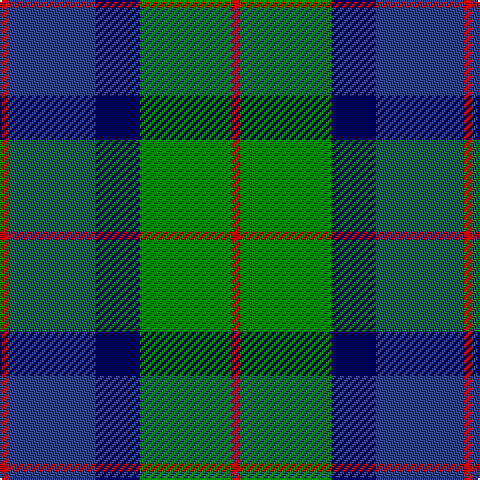

In pattern [RBBGR](/stripes/rbbgr/).

This was sourced from weddslist.  It is a [5 stripe tartan](/stripes/stripes5/).

Original link http://www.weddslist.com/cgi-bin/tartans/pg.pl?source=sts

## Thread count
R/4 G46 DB22 B44 R/4

## Palette
Each colour and the base-6 reference it is a variant of.

| Colour | Shade | Base |
|---|---|---|
| B | <code style="background-color:#304080;">#304080</code> `oklch(39.4% 0.109 270.2)` <small>#304080</small> | B <code style="background-color:#2A418A;">#2A418A</code> |
| DB | <code style="background-color:#000050;">#000050</code> `oklch(19.5% 0.135 264.1)` <small>#000050</small> | B <code style="background-color:#2A418A;">#2A418A</code> |
| G | <code style="background-color:#008000;">#008000</code> `oklch(52.0% 0.177 142.5)` <small>#008000</small> | G <code style="background-color:#006100;">#006100</code> |
| R | <code style="background-color:#C00000;">#C00000</code> `oklch(50.7% 0.208 29.2)` <small>#C00000</small> | R <code style="background-color:#CC0000;">#CC0000</code> |

# Sample pattern

## Nearest tartans

The nearest existing variants by ΔTartan distance.

1. [Wallace Blue (Fashion)](/setts/s5/t2db29t12g29w2~x2/) — ΔT 0.76
1. [MacKirdy](/setts/s5/k2g12k11b12w1~x2/) — ΔT 0.77
1. [Sinclair of Ulbster](/setts/s6/b12k4g6ly1~x8/) — ΔT 0.87
1. [Campbell of Argyll (Smiths)](/setts/s6/db2k2db12k11g16w2~x2/) — ΔT 0.87
1. [Herd Family Tartan Tartan Number: 170. Earliest known date: 1978 Woven for the wedding of William Hurd to Heather Petit. From JCT: STS monitoring committee recorded 1978. In march 2005. STS Record has the application being made by Councillor R J Herd, C.Eng, M.I.C.E., A.M.B.I.M. who had been granted arms by Lord Lyon. See products available Copyright © Blair Urquhart, Comrie, 2015](/setts/s6/db2g12k13w1db13w2~x2/) — ΔT 0.93
1. [MacRobart (Personal)](/setts/s6/db30k10g10lb2g15lb2~x2/) — ΔT 0.95
1. [Flower of Scotland](/setts/s6/r3b25k16b3g25b3~x2/) — ΔT 0.96
1. [Blaylock Annandale](/setts/s7/g24b6lb3k6b12k15g4~x2/) — ΔT 0.96
1. [Redland](/setts/s6/g52lb7g9k35db35k7/) — ΔT 0.98
1. [Unidentified #28](/setts/s6/k2dg9t1k6b4dg2~x2/) — ΔT 1.03

## Neighbour map

Every grey dot is one of 14299 variants placed by the first two principal components of the ΔTartan feature space (44% of its variance). Red is this tartan; blue dots are its nearest — click one to open its page.

<svg viewBox="0 0 640 380" role="img" style="max-width:100%;height:auto;border:1px solid #e0e0e0;border-radius:4px;display:block" xmlns="http://www.w3.org/2000/svg"><image href="/nn/cloud.v1.png" width="640" height="380"/><a href="/setts/s5/t2db29t12g29w2~x2/"><circle cx="249.0" cy="223.1" r="4" fill="#3465a4"><title>Wallace Blue (Fashion)</title></circle></a><a href="/setts/s5/k2g12k11b12w1~x2/"><circle cx="179.3" cy="232.8" r="4" fill="#3465a4"><title>MacKirdy</title></circle></a><a href="/setts/s6/b12k4g6ly1~x8/"><circle cx="192.0" cy="239.5" r="4" fill="#3465a4"><title>Sinclair of Ulbster</title></circle></a><a href="/setts/s6/db2k2db12k11g16w2~x2/"><circle cx="184.6" cy="237.1" r="4" fill="#3465a4"><title>Campbell of Argyll (Smiths)</title></circle></a><a href="/setts/s6/db2g12k13w1db13w2~x2/"><circle cx="187.9" cy="213.2" r="4" fill="#3465a4"><title>Herd Family Tartan Tartan Number: 170. Earliest known date: 1978 Woven for the wedding of William Hurd to Heather Petit. From JCT: STS monitoring committee recorded 1978. In march 2005. STS Record has the application being made by Councillor R J Herd, C.Eng, M.I.C.E., A.M.B.I.M. who had been granted arms by Lord Lyon. See products available Copyright © Blair Urquhart, Comrie, 2015</title></circle></a><a href="/setts/s6/db30k10g10lb2g15lb2~x2/"><circle cx="264.2" cy="217.4" r="4" fill="#3465a4"><title>MacRobart (Personal)</title></circle></a><a href="/setts/s6/r3b25k16b3g25b3~x2/"><circle cx="210.4" cy="230.2" r="4" fill="#3465a4"><title>Flower of Scotland</title></circle></a><a href="/setts/s7/g24b6lb3k6b12k15g4~x2/"><circle cx="189.5" cy="235.8" r="4" fill="#3465a4"><title>Blaylock Annandale</title></circle></a><a href="/setts/s6/g52lb7g9k35db35k7/"><circle cx="207.6" cy="246.5" r="4" fill="#3465a4"><title>Redland</title></circle></a><a href="/setts/s6/k2dg9t1k6b4dg2~x2/"><circle cx="229.3" cy="242.6" r="4" fill="#3465a4"><title>Unidentified #28</title></circle></a><circle cx="216.4" cy="231.8" r="5" fill="#c00000"/></svg>

ID: /setts/s5/r2g23db11db22r2~x2/
