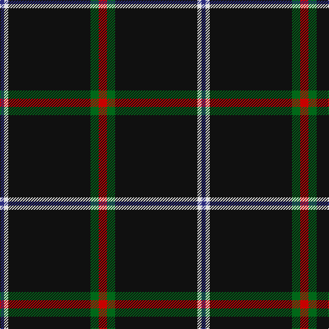

In pattern [BWKGR](/patterns/bwkgr/).

This was sourced from tartans-authority.  It is a [5 stripes tartan](/stripes/stripes5/).

Original link http://www.tartansauthority.com/tartan-ferret/display/10335/

## Thread count
DB/6 LN6 K120 G12 R/12

## Palette
Each colour and its ΔE from the base-6 reference it is a variant of.

| Colour | Shade | Base | ΔE (OKLab) |
|---|---|---|---|
| DB | <code style="background-color:#2C2C80;">#2C2C80</code> `#2C2C80` | B <code style="background-color:#2A418A;">#2A418A</code> | 0.06 |
| G | <code style="background-color:#006818;">#006818</code> `#006818` | G <code style="background-color:#006100;">#006100</code> | 0.02 |
| K | <code style="background-color:#101010;">#101010</code> `#101010` | K <code style="background-color:#000000;">#000000</code> | 0.17 |
| LN | <code style="background-color:#E0E0E0;">#E0E0E0</code> `#E0E0E0` | W <code style="background-color:#F7F7F7;">#F7F7F7</code> | 0.07 |
| R | <code style="background-color:#C80000;">#C80000</code> `#C80000` | R <code style="background-color:#CC0000;">#CC0000</code> | 0.01 |

# Sample pattern

## Nearest tartans

The nearest existing variants by ΔTartan distance.

1. [Fily, Sylvain Roger](/setts/s5/r2g2k20w1b1~b0000cd-g008b00-k101010-rff0000-wffffff~x6/) — ΔT 0.74
1. [Friends of Nordegg (Corporate)](/setts/s5/k50b6r6ra6w3~b2c2c80-k101010-rc80000-ra888888-we0e0e0~x2/) — ΔT 1.20
1. [Harley Davidson (Corporate)](/setts/s6/r4b6k4ra8k49r2~b5c5c5c-k101010-r888888-rab84c00/) — ΔT 1.20
1. [Rogues (United States), The](/setts/s4/r3b12k50y3~b506987-k101010-rff2400-yffc125~x2/) — ΔT 1.30
1. [Rogues, The (Corporate)](/setts/s4/r3b12k50y3~b5c8ca8-k101010-rc80000-yfccc00~x2/) — ΔT 1.42
1. [McCuaig (Glenelg and the Western Isles) Hunting](/setts/s9/k20b2k2b4g4y2k40r2w3~b2c2c80-g003c14-k101010-rc82828-wffffff-ye8c000~x2/) — ΔT 1.51
1. [Dellen](/setts/s6/k80r6g3r12k2w2~g006818-k101010-rcc4438-wfcfcfc~x2/) — ΔT 1.54
1. [Laird Abdullah (Personal)](/setts/s8/k10b2k2b8k40r4k5ra2~b5c5c5c-k101010-rc80000-rae87878~x2/) — ΔT 1.56
1. [London Fog Black](/setts/s6/k10y2w5y4k50b2~b1474b4-k101010-we0e0e0-yb8b8b8~x2/) — ΔT 1.61
1. [Dhillon (Personal)](/setts/s4/k35y3w3g3~g006818-k101010-wf8f8f8-yd87c00~x4/) — ΔT 1.61

## Neighbour map

Every grey dot is one of 15726 variants placed by the first two principal components of the ΔTartan feature space (44% of its variance). Red is this tartan; blue dots are its nearest — click one to open its page.

<svg viewBox="0 0 640 380" role="img" style="max-width:100%;height:auto;border:1px solid #e0e0e0;border-radius:4px;display:block" xmlns="http://www.w3.org/2000/svg"><image href="/nn/cloud.v1.png" width="640" height="380"/><a href="/setts/s5/r2g2k20w1b1~b0000cd-g008b00-k101010-rff0000-wffffff~x6/"><circle cx="474.6" cy="155.4" r="4" fill="#3465a4"><title>Fily, Sylvain Roger</title></circle></a><a href="/setts/s5/k50b6r6ra6w3~b2c2c80-k101010-rc80000-ra888888-we0e0e0~x2/"><circle cx="416.8" cy="168.1" r="4" fill="#3465a4"><title>Friends of Nordegg (Corporate)</title></circle></a><a href="/setts/s6/r4b6k4ra8k49r2~b5c5c5c-k101010-r888888-rab84c00/"><circle cx="488.0" cy="166.8" r="4" fill="#3465a4"><title>Harley Davidson (Corporate)</title></circle></a><a href="/setts/s4/r3b12k50y3~b506987-k101010-rff2400-yffc125~x2/"><circle cx="464.0" cy="205.1" r="4" fill="#3465a4"><title>Rogues (United States), The</title></circle></a><a href="/setts/s4/r3b12k50y3~b5c8ca8-k101010-rc80000-yfccc00~x2/"><circle cx="454.1" cy="201.7" r="4" fill="#3465a4"><title>Rogues, The (Corporate)</title></circle></a><a href="/setts/s9/k20b2k2b4g4y2k40r2w3~b2c2c80-g003c14-k101010-rc82828-wffffff-ye8c000~x2/"><circle cx="473.1" cy="124.8" r="4" fill="#3465a4"><title>McCuaig (Glenelg and the Western Isles) Hunting</title></circle></a><a href="/setts/s6/k80r6g3r12k2w2~g006818-k101010-rcc4438-wfcfcfc~x2/"><circle cx="556.3" cy="136.6" r="4" fill="#3465a4"><title>Dellen</title></circle></a><a href="/setts/s8/k10b2k2b8k40r4k5ra2~b5c5c5c-k101010-rc80000-rae87878~x2/"><circle cx="537.1" cy="175.4" r="4" fill="#3465a4"><title>Laird Abdullah (Personal)</title></circle></a><a href="/setts/s6/k10y2w5y4k50b2~b1474b4-k101010-we0e0e0-yb8b8b8~x2/"><circle cx="537.5" cy="159.7" r="4" fill="#3465a4"><title>London Fog Black</title></circle></a><a href="/setts/s4/k35y3w3g3~g006818-k101010-wf8f8f8-yd87c00~x4/"><circle cx="488.1" cy="209.7" r="4" fill="#3465a4"><title>Dhillon (Personal)</title></circle></a><circle cx="496.6" cy="164.4" r="5" fill="#c00000"/></svg>

ID: /setts/s5/r2g2k20w1b1~b2c2c80-g006818-k101010-rc80000-we0e0e0~x6/
