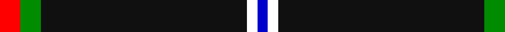
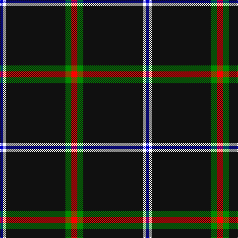

This page is one **sett** — a single exact thread-count. It belongs to the [tartan](/tartans/r2g2k20w1db1/)
(the same proportion at any scale), whose colour order is pattern [BWKGR](/stripes/bwkgr/).

Sourced from register-of-tartans.  It is a [5 stripe tartan](/stripes/stripes5/).

Original link https://www.tartanregister.gov.uk/tartanDetails.aspx?ref=10277

## Also known as

This cloth is also recorded under:

- Fily, Sylvain Roger

2 attestations — the source records this cloth was collapsed from (oldest owns this page)

<ul>
<li>07/04/2010 — Fily, Sylvain Roger (register-of-tartans, <a href="https://www.tartanregister.gov.uk/tartanDetails.aspx?ref=10277">record</a>)</li>
<li>7th April 2010 — Fily (Personal) (tartans-authority, <a href="http://www.tartansauthority.com/tartan-ferret/display/10335/">record</a>)</li>
</ul>

## Register references

External register numbers recorded for this tartan.

- Scottish Register of Tartans: [10277](https://www.tartanregister.gov.uk/tartanDetails.aspx?ref=10277)

## Thread count
R/12 G12 K120 W6 B/6

## Palette

Palette: <strong>Tartan Register</strong>
<table><thead><tr><th>Colour</th><th>Threads</th><th>Shade</th><th>Base</th><th>OKLCh</th></tr></thead><tbody><tr><td>R/</td><td style="text-align:right;font-variant-numeric:tabular-nums">12</td><td><code style="background-color:#FF0000;">#FF0000</code> <small style="color:#888">#FF0000</small></td><td>R <code style="background-color:#CC0000;">#CC0000</code></td><td><small style="color:#888">oklch(62.8% 0.258 29.2)</small></td></tr><tr><td>G</td><td style="text-align:right;font-variant-numeric:tabular-nums">12</td><td><code style="background-color:#008B00;">#008B00</code> <small style="color:#888">#008B00</small></td><td>G <code style="background-color:#006100;">#006100</code></td><td><small style="color:#888">oklch(55.2% 0.188 142.5)</small></td></tr><tr><td>K</td><td style="text-align:right;font-variant-numeric:tabular-nums">120</td><td><code style="background-color:#101010;">#101010</code> <small style="color:#888">#101010</small></td><td>K <code style="background-color:#000000;">#000000</code></td><td><small style="color:#888">oklch(17.3% 0.000 89.9)</small></td></tr><tr><td>W</td><td style="text-align:right;font-variant-numeric:tabular-nums">6</td><td><code style="background-color:#FFFFFF;">#FFFFFF</code> <small style="color:#888">#FFFFFF</small></td><td>W <code style="background-color:#F7F7F7;">#F7F7F7</code></td><td><small style="color:#888">oklch(100.0% 0.000 89.9)</small></td></tr><tr><td>B/</td><td style="text-align:right;font-variant-numeric:tabular-nums">6</td><td><code style="background-color:#0000CD;">#0000CD</code> <small style="color:#888">#0000CD</small></td><td>B <code style="background-color:#2A418A;">#2A418A</code></td><td><small style="color:#888">oklch(38.3% 0.266 264.1)</small></td></tr></tbody></table>

# Sample pattern

## Nearest tartans

The nearest existing variants by ΔTartan distance, with this tartan at the top so the swatches line up against it.

ΔTartan

Tartan

Sett

—

<a href="/ttd/edit/#slug=r2g2k20w1db1~x6">Fily, Sylvain Roger</a> <a class="nn-out" href="/setts/s5/r2g2k20w1db1~x6/" title="open its dictionary page">↗</a>

1.17

<a href="/ttd/edit/#slug=k50db6r6o6w3~x2">Friends of Nordegg (Corporate)</a> <a class="nn-out" href="/setts/s5/k50db6r6o6w3~x2/" title="open its dictionary page">↗</a>

1.27

<a href="/ttd/edit/#slug=r3t12k50ly3~x2">Rogues, The (Corporate)</a> <a class="nn-out" href="/setts/s4/r3t12k50ly3~x2/" title="open its dictionary page">↗</a>

1.32

<a href="/ttd/edit/#slug=r3n12k50ly3~x2">Rogues (United States), The</a> <a class="nn-out" href="/setts/s4/r3n12k50ly3~x2/" title="open its dictionary page">↗</a>

1.34

<a href="/ttd/edit/#slug=k10lr2w5lr4k50b2~x2">London Fog Black</a> <a class="nn-out" href="/setts/s6/k10lr2w5lr4k50b2~x2/" title="open its dictionary page">↗</a>

1.39

<a href="/ttd/edit/#slug=k35lo3w3g3~x4">Dhillon (Personal)</a> <a class="nn-out" href="/setts/s4/k35lo3w3g3~x4/" title="open its dictionary page">↗</a>

1.46

<a href="/ttd/edit/#slug=k75r10g7ly3db2w5~x2">Charlotte Fire Department</a> <a class="nn-out" href="/setts/s6/k75r10g7ly3db2w5~x2/" title="open its dictionary page">↗</a>

1.48

<a href="/ttd/edit/#slug=k78r10dg7ly3t2w5~x2">Charlotte Fire Department</a> <a class="nn-out" href="/setts/s6/k78r10dg7ly3t2w5~x2/" title="open its dictionary page">↗</a>

1.52

<a href="/ttd/edit/#slug=k21r1k1ly1k1r1k3w3~x6">Black Country (District)</a> <a class="nn-out" href="/setts/s8/k21r1k1ly1k1r1k3w3~x6/" title="open its dictionary page">↗</a>

1.53

<a href="/ttd/edit/#slug=o4n6k4o8k49o2">Harley Davidson (Corporate)</a> <a class="nn-out" href="/setts/s6/o4n6k4o8k49o2/" title="open its dictionary page">↗</a>

1.59

<a href="/ttd/edit/#slug=k31w1k2w2dt3k2t4w2~x4">Capco</a> <a class="nn-out" href="/setts/s8/k31w1k2w2dt3k2t4w2~x4/" title="open its dictionary page">↗</a>

## Neighbour map

Every grey dot is one of 14299 variants placed by the first two principal components of the ΔTartan feature space (44% of its variance). Red is this tartan; blue dots are its nearest — click one to open its page.

<svg viewBox="0 0 640 380" role="img" style="max-width:100%;height:auto;border:1px solid #e0e0e0;border-radius:4px;display:block" xmlns="http://www.w3.org/2000/svg"><image href="/nn/cloud.v1.png" width="640" height="380"/><a href="/setts/s5/k50db6r6o6w3~x2/"><circle cx="418.8" cy="164.7" r="4" fill="#3465a4"><title>Friends of Nordegg (Corporate)</title></circle></a><a href="/setts/s4/r3t12k50ly3~x2/"><circle cx="456.2" cy="196.1" r="4" fill="#3465a4"><title>Rogues, The (Corporate)</title></circle></a><a href="/setts/s4/r3n12k50ly3~x2/"><circle cx="465.9" cy="200.3" r="4" fill="#3465a4"><title>Rogues (United States), The</title></circle></a><a href="/setts/s6/k10lr2w5lr4k50b2~x2/"><circle cx="539.5" cy="152.5" r="4" fill="#3465a4"><title>London Fog Black</title></circle></a><a href="/setts/s4/k35lo3w3g3~x4/"><circle cx="490.0" cy="202.4" r="4" fill="#3465a4"><title>Dhillon (Personal)</title></circle></a><a href="/setts/s6/k75r10g7ly3db2w5~x2/"><circle cx="455.5" cy="96.9" r="4" fill="#3465a4"><title>Charlotte Fire Department</title></circle></a><a href="/setts/s6/k78r10dg7ly3t2w5~x2/"><circle cx="461.2" cy="93.4" r="4" fill="#3465a4"><title>Charlotte Fire Department</title></circle></a><a href="/setts/s8/k21r1k1ly1k1r1k3w3~x6/"><circle cx="528.7" cy="133.7" r="4" fill="#3465a4"><title>Black Country (District)</title></circle></a><a href="/setts/s6/o4n6k4o8k49o2/"><circle cx="489.6" cy="164.4" r="4" fill="#3465a4"><title>Harley Davidson (Corporate)</title></circle></a><a href="/setts/s8/k31w1k2w2dt3k2t4w2~x4/"><circle cx="484.1" cy="117.0" r="4" fill="#3465a4"><title>Capco</title></circle></a><circle cx="476.6" cy="149.8" r="5" fill="#c00000"/></svg>

ID: /setts/s5/r2g2k20w1db1~x6/
