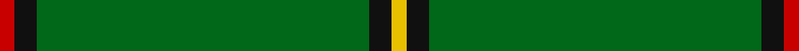
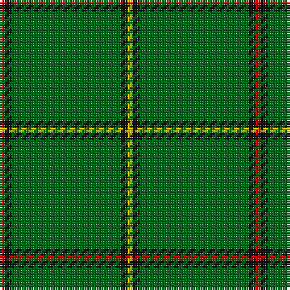

In pattern [RKGKY](/stripes/rkgky/).

This was sourced from register-of-tartans.  It is a [5 stripe tartan](/stripes/stripes5/).

Original link https://www.tartanregister.gov.uk/tartanDetails.aspx?ref=2829

## Register references

External register numbers recorded for this tartan.

- Scottish Register of Tartans: [2829](https://www.tartanregister.gov.uk/tartanDetails.aspx?ref=2829)
- Scottish Tartans Authority (ITI): 1586
- Scottish Tartans World Register: 1586

## Thread count
R/2 K3 G45 K3 Y/2

## Palette
Each colour and its ΔE from the base-6 reference it is a variant of.

| Colour | Shade | Base | ΔE (OKLab) |
|---|---|---|---|
| G | <code style="background-color:#006818;">#006818</code> `#006818` | G <code style="background-color:#006100;">#006100</code> | 0.02 |
| K | <code style="background-color:#101010;">#101010</code> `#101010` | K <code style="background-color:#000000;">#000000</code> | 0.17 |
| R | <code style="background-color:#C80000;">#C80000</code> `#C80000` | R <code style="background-color:#CC0000;">#CC0000</code> | 0.01 |
| Y | <code style="background-color:#E8C000;">#E8C000</code> `#E8C000` | Y <code style="background-color:#F2BF00;">#F2BF00</code> | 0.02 |

# Sample pattern

## Nearest tartans

The nearest existing variants by ΔTartan distance.

1. [Mar, Tribe of (Clan)](/setts/s5/r2k4g45k3ly2~x2/) — ΔT 0.27
1. [Braemar Royal Highland Gathering](/setts/s6/r3k4lb2g64k6ly3~x2/) — ΔT 1.33
1. [Crane of Cluny (Personal)](/setts/s8/g82k6g3k9r2k5g2ly2~x2/) — ΔT 1.50
1. [Loch Laggan](/setts/s6/r19g6r7g101k7g7/) — ΔT 1.65
1. [Asher (Personal)](/setts/s8/g40ly2db3r4db3ly2g40w3~x2/) — ΔT 1.69
1. [Mar, (Tribe of..)](/setts/s5/r2k4g45k3ly2/) — ΔT 1.76
1. [Highland Hospice (Fashion)](/setts/s10/g51dp3g5lo3g5dp5g5dp5g5lo3~x2/) — ΔT 1.78
1. [Loch Laggan (District)](/setts/s6/r4g2r1g20k1g1~x4/) — ΔT 1.81
1. [Skene or Tribe of Mar](/setts/s5/r1k2dg16k2ly1~x2/) — ΔT 1.88
1. [Welsh National](/setts/s8/r8g3r4g44w4~x2/) — ΔT 1.92

## Neighbour map

Every grey dot is one of 14299 variants placed by the first two principal components of the ΔTartan feature space (44% of its variance). Red is this tartan; blue dots are its nearest — click one to open its page.

<svg viewBox="0 0 640 380" role="img" style="max-width:100%;height:auto;border:1px solid #e0e0e0;border-radius:4px;display:block" xmlns="http://www.w3.org/2000/svg"><image href="/nn/cloud.v1.png" width="640" height="380"/><a href="/setts/s5/r2k4g45k3ly2~x2/"><circle cx="577.2" cy="187.3" r="4" fill="#3465a4"><title>Mar, Tribe of (Clan)</title></circle></a><a href="/setts/s6/r3k4lb2g64k6ly3~x2/"><circle cx="539.5" cy="136.6" r="4" fill="#3465a4"><title>Braemar Royal Highland Gathering</title></circle></a><a href="/setts/s8/g82k6g3k9r2k5g2ly2~x2/"><circle cx="589.7" cy="132.9" r="4" fill="#3465a4"><title>Crane of Cluny (Personal)</title></circle></a><a href="/setts/s6/r19g6r7g101k7g7/"><circle cx="528.6" cy="189.3" r="4" fill="#3465a4"><title>Loch Laggan</title></circle></a><a href="/setts/s8/g40ly2db3r4db3ly2g40w3~x2/"><circle cx="541.4" cy="156.6" r="4" fill="#3465a4"><title>Asher (Personal)</title></circle></a><a href="/setts/s5/r2k4g45k3ly2/"><circle cx="525.2" cy="162.5" r="4" fill="#3465a4"><title>Mar, (Tribe of..)</title></circle></a><a href="/setts/s10/g51dp3g5lo3g5dp5g5dp5g5lo3~x2/"><circle cx="559.5" cy="179.0" r="4" fill="#3465a4"><title>Highland Hospice (Fashion)</title></circle></a><a href="/setts/s6/r4g2r1g20k1g1~x4/"><circle cx="555.3" cy="183.2" r="4" fill="#3465a4"><title>Loch Laggan (District)</title></circle></a><a href="/setts/s5/r1k2dg16k2ly1~x2/"><circle cx="489.5" cy="201.3" r="4" fill="#3465a4"><title>Skene or Tribe of Mar</title></circle></a><a href="/setts/s8/r8g3r4g44w4~x2/"><circle cx="576.1" cy="207.4" r="4" fill="#3465a4"><title>Welsh National</title></circle></a><circle cx="589.4" cy="184.8" r="5" fill="#c00000"/></svg>

ID: /setts/s5/r2k3g45k3ly2/
