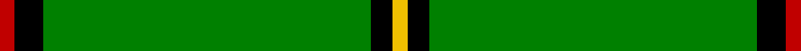
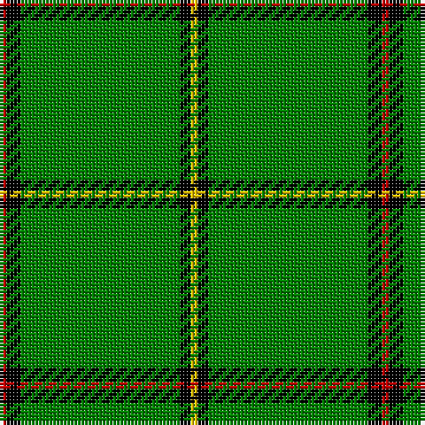

In pattern [RKGKY](/stripes/rkgky/).

This was sourced from weddslist.  It is a [5 stripe tartan](/stripes/stripes5/).

Original link http://www.weddslist.com/cgi-bin/tartans/pg.pl?source=sts

## Also known as

This cloth is also recorded under:

- Mar,

## Attestations

This cloth appears in 2 source records; the oldest owns this page.

- undated — Mar, (Tribe of..) (weddslist, [record](http://www.weddslist.com/cgi-bin/tartans/pg.pl?source=sts))
- undated — Mar (Tribe of..) District Tartan Tartan Number: 1586. Earliest known date: 1978 There is much debate over the true representation of the Mar District tartan. In order that the matter should be settled and the design be "known and recognised as the proper tartan of the Tribe of Mar", the Rt Hon Margaret of Mar, Countess of Mar, made a petition to the Lord Lyon to record this sett. The designer is unknown and the date is possibly pre 1850. Frank Adam called the sett Skene, and said it came from the Duke of Fife whose ancestors owned Mar Lodge. Both Skenes and Robertsons lived in the Mar district in the north east of Scotland. See products available Copyright © Blair Urquhart, Comrie, 2015 (house-of-tartan, [record](http://www.house-of-tartan.scotland.net/house/TartanViewjs.asp?colr=Def&tnam=1586))

## Thread count
R/2 K4 G45 K3 Y/2

## Palette
Each colour and the base-6 reference it is a variant of.

| Colour | Shade | Base |
|---|---|---|
| G | <code style="background-color:#008000;">#008000</code> `oklch(52.0% 0.177 142.5)` <small>#008000</small> | G <code style="background-color:#006100;">#006100</code> |
| K | <code style="background-color:#000000;">#000000</code> `oklch(0.0% 0.000 0.0)` <small>#000000</small> | K <code style="background-color:#000000;">#000000</code> |
| R | <code style="background-color:#C00000;">#C00000</code> `oklch(50.7% 0.208 29.2)` <small>#C00000</small> | R <code style="background-color:#CC0000;">#CC0000</code> |
| Y | <code style="background-color:#F0C000;">#F0C000</code> `oklch(82.7% 0.169 90.5)` <small>#F0C000</small> | Y <code style="background-color:#F2BF00;">#F2BF00</code> |

# Sample pattern

## Nearest tartans

The nearest existing variants by ΔTartan distance.

1. [Skene, or Tribe of Mar](/setts/s5/r1k2g16k2ly1~x2/) — ΔT 1.39
1. [Crane of Clunie](/setts/s8/g165k12g6k18r4k10g4y4/) — ΔT 1.50
1. [Loch Laggan](/setts/s6/r19g6r7g101k7g7/) — ΔT 1.51
1. [Marshall University](/setts/s8/g25w1dg2w1g6k2w2dg3~x2/) — ΔT 1.60
1. [Mar Tribe](/setts/s5/r2k3g45k3ly2/) — ΔT 1.76
1. [Braemar Royal Highland Gathering](/setts/s6/r3k4lb2g64k6ly3~x2/) — ΔT 1.79
1. [Mar, Tribe of (Clan)](/setts/s5/r2k4g45k3ly2~x2/) — ΔT 1.80
1. [Loch Laggan (District)](/setts/s6/r4g2r1g20k1g1~x4/) — ΔT 1.82
1. [Suffolk County Police](/setts/s11/g74g6k12ly3k3w3g16g8k3g4w3~x2/) — ΔT 1.90
1. [Glen of Daviot (Dalgleish)](/setts/s5/g50k6db11g25ly4~x2/) — ΔT 1.99

## Neighbour map

Every grey dot is one of 14299 variants placed by the first two principal components of the ΔTartan feature space (44% of its variance). Red is this tartan; blue dots are its nearest — click one to open its page.

<svg viewBox="0 0 640 380" role="img" style="max-width:100%;height:auto;border:1px solid #e0e0e0;border-radius:4px;display:block" xmlns="http://www.w3.org/2000/svg"><image href="/nn/cloud.v1.png" width="640" height="380"/><a href="/setts/s5/r1k2g16k2ly1~x2/"><circle cx="432.7" cy="174.8" r="4" fill="#3465a4"><title>Skene, or Tribe of Mar</title></circle></a><a href="/setts/s8/g165k12g6k18r4k10g4y4/"><circle cx="536.0" cy="107.9" r="4" fill="#3465a4"><title>Crane of Clunie</title></circle></a><a href="/setts/s6/r19g6r7g101k7g7/"><circle cx="528.6" cy="189.3" r="4" fill="#3465a4"><title>Loch Laggan</title></circle></a><a href="/setts/s8/g25w1dg2w1g6k2w2dg3~x2/"><circle cx="472.2" cy="144.1" r="4" fill="#3465a4"><title>Marshall University</title></circle></a><a href="/setts/s5/r2k3g45k3ly2/"><circle cx="589.4" cy="184.8" r="4" fill="#3465a4"><title>Mar Tribe</title></circle></a><a href="/setts/s6/r3k4lb2g64k6ly3~x2/"><circle cx="539.5" cy="136.6" r="4" fill="#3465a4"><title>Braemar Royal Highland Gathering</title></circle></a><a href="/setts/s5/r2k4g45k3ly2~x2/"><circle cx="577.2" cy="187.3" r="4" fill="#3465a4"><title>Mar, Tribe of (Clan)</title></circle></a><a href="/setts/s6/r4g2r1g20k1g1~x4/"><circle cx="555.3" cy="183.2" r="4" fill="#3465a4"><title>Loch Laggan (District)</title></circle></a><a href="/setts/s11/g74g6k12ly3k3w3g16g8k3g4w3~x2/"><circle cx="494.5" cy="110.6" r="4" fill="#3465a4"><title>Suffolk County Police</title></circle></a><a href="/setts/s5/g50k6db11g25ly4~x2/"><circle cx="462.7" cy="229.3" r="4" fill="#3465a4"><title>Glen of Daviot (Dalgleish)</title></circle></a><circle cx="525.2" cy="162.5" r="5" fill="#c00000"/></svg>

ID: /setts/s5/r2k4g45k3ly2/
