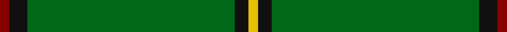

This page is one **sett** — a single exact thread-count. It belongs to the [tartan](/tartans/r2k4g45k3ly2/)
(the same proportion at any scale), whose colour order is pattern [RKGKY](/stripes/rkgky/).

Sourced from tartans-authority.  It is a [5 stripe tartan](/stripes/stripes5/).

Original link http://www.tartansauthority.com/tartan-ferret/display/1586/

## Also known as

This cloth is also recorded under:

- Mar,
- Mar, Tribe of

## Register references

External register numbers recorded for this tartan.

- Scottish Tartans Authority (ITI): 1586

## Thread count
DR/4 K8 G90 K6 Y/4

## Palette

Palette: <strong>Tartan Register</strong>
<table><thead><tr><th>Colour</th><th>Threads</th><th>Shade</th><th>Base</th><th>OKLCh</th></tr></thead><tbody><tr><td>DR/</td><td style="text-align:right;font-variant-numeric:tabular-nums">4</td><td><code style="background-color:#880000;">#880000</code> <small style="color:#888">#880000</small></td><td>R <code style="background-color:#CC0000;">#CC0000</code></td><td><small style="color:#888">oklch(39.4% 0.162 29.2)</small></td></tr><tr><td>K</td><td style="text-align:right;font-variant-numeric:tabular-nums">8</td><td><code style="background-color:#101010;">#101010</code> <small style="color:#888">#101010</small></td><td>K <code style="background-color:#000000;">#000000</code></td><td><small style="color:#888">oklch(17.3% 0.000 89.9)</small></td></tr><tr><td>G</td><td style="text-align:right;font-variant-numeric:tabular-nums">90</td><td><code style="background-color:#006818;">#006818</code> <small style="color:#888">#006818</small></td><td>G <code style="background-color:#006100;">#006100</code></td><td><small style="color:#888">oklch(45.0% 0.142 145.0)</small></td></tr><tr><td>K</td><td style="text-align:right;font-variant-numeric:tabular-nums">6</td><td><code style="background-color:#101010;">#101010</code> <small style="color:#888">#101010</small></td><td>K <code style="background-color:#000000;">#000000</code></td><td><small style="color:#888">oklch(17.3% 0.000 89.9)</small></td></tr><tr><td>Y/</td><td style="text-align:right;font-variant-numeric:tabular-nums">4</td><td><code style="background-color:#E8C000;">#E8C000</code> <small style="color:#888">#E8C000</small></td><td>Y <code style="background-color:#F2BF00;">#F2BF00</code></td><td><small style="color:#888">oklch(81.9% 0.168 93.7)</small></td></tr></tbody></table>

# Sample pattern

## Nearest tartans

The nearest existing variants by ΔTartan distance, with this tartan at the top so the swatches line up against it.

ΔTartan

Tartan

Sett

—

<a href="/ttd/edit/#slug=r2k4g45k3ly2~x2">Mar, Tribe of (Clan)</a> <a class="nn-out" href="/setts/s5/r2k4g45k3ly2~x2/" title="open its dictionary page">↗</a>

0.27

<a href="/ttd/edit/#slug=r2k3g45k3ly2">Mar Tribe</a> <a class="nn-out" href="/setts/s5/r2k3g45k3ly2/" title="open its dictionary page">↗</a>

1.27

<a href="/ttd/edit/#slug=r3k4lb2g64k6ly3~x2">Braemar Royal Highland Gathering</a> <a class="nn-out" href="/setts/s6/r3k4lb2g64k6ly3~x2/" title="open its dictionary page">↗</a>

1.46

<a href="/ttd/edit/#slug=g82k6g3k9r2k5g2ly2~x2">Crane of Cluny (Personal)</a> <a class="nn-out" href="/setts/s8/g82k6g3k9r2k5g2ly2~x2/" title="open its dictionary page">↗</a>

1.64

<a href="/ttd/edit/#slug=r19g6r7g101k7g7">Loch Laggan</a> <a class="nn-out" href="/setts/s6/r19g6r7g101k7g7/" title="open its dictionary page">↗</a>

1.67

<a href="/ttd/edit/#slug=r1k2dg16k2ly1~x2">Skene or Tribe of Mar</a> <a class="nn-out" href="/setts/s5/r1k2dg16k2ly1~x2/" title="open its dictionary page">↗</a>

1.71

<a href="/ttd/edit/#slug=g40ly2db3r4db3ly2g40w3~x2">Asher (Personal)</a> <a class="nn-out" href="/setts/s8/g40ly2db3r4db3ly2g40w3~x2/" title="open its dictionary page">↗</a>

1.74

<a href="/ttd/edit/#slug=g51dp3g5lo3g5dp5g5dp5g5lo3~x2">Highland Hospice (Fashion)</a> <a class="nn-out" href="/setts/s10/g51dp3g5lo3g5dp5g5dp5g5lo3~x2/" title="open its dictionary page">↗</a>

1.80

<a href="/ttd/edit/#slug=r2k4g45k3ly2">Mar, (Tribe of..)</a> <a class="nn-out" href="/setts/s5/r2k4g45k3ly2/" title="open its dictionary page">↗</a>

1.81

<a href="/ttd/edit/#slug=g30t8g5lb4g5r2~x4">Annapolis Valley</a> <a class="nn-out" href="/setts/s6/g30t8g5lb4g5r2~x4/" title="open its dictionary page">↗</a>

1.87

<a href="/ttd/edit/#slug=r4g2r1g20k1g1~x4">Loch Laggan (District)</a> <a class="nn-out" href="/setts/s6/r4g2r1g20k1g1~x4/" title="open its dictionary page">↗</a>

## Neighbour map

Every grey dot is one of 14359 variants placed by the first two principal components of the ΔTartan feature space (44% of its variance). Red is this tartan; blue dots are its nearest — click one to open its page.

<svg viewBox="0 0 640 380" role="img" style="max-width:100%;height:auto;border:1px solid #e0e0e0;border-radius:4px;display:block" xmlns="http://www.w3.org/2000/svg"><image href="/nn/cloud.v1.png" width="640" height="380"/><a href="/setts/s5/r2k3g45k3ly2/"><circle cx="588.3" cy="184.8" r="4" fill="#3465a4"><title>Mar Tribe</title></circle></a><a href="/setts/s6/r3k4lb2g64k6ly3~x2/"><circle cx="538.5" cy="136.4" r="4" fill="#3465a4"><title>Braemar Royal Highland Gathering</title></circle></a><a href="/setts/s8/g82k6g3k9r2k5g2ly2~x2/"><circle cx="588.8" cy="132.6" r="4" fill="#3465a4"><title>Crane of Cluny (Personal)</title></circle></a><a href="/setts/s6/r19g6r7g101k7g7/"><circle cx="527.5" cy="189.5" r="4" fill="#3465a4"><title>Loch Laggan</title></circle></a><a href="/setts/s5/r1k2dg16k2ly1~x2/"><circle cx="488.8" cy="201.6" r="4" fill="#3465a4"><title>Skene or Tribe of Mar</title></circle></a><a href="/setts/s8/g40ly2db3r4db3ly2g40w3~x2/"><circle cx="540.3" cy="156.6" r="4" fill="#3465a4"><title>Asher (Personal)</title></circle></a><a href="/setts/s10/g51dp3g5lo3g5dp5g5dp5g5lo3~x2/"><circle cx="558.6" cy="179.1" r="4" fill="#3465a4"><title>Highland Hospice (Fashion)</title></circle></a><a href="/setts/s5/r2k4g45k3ly2/"><circle cx="524.0" cy="162.7" r="4" fill="#3465a4"><title>Mar, (Tribe of..)</title></circle></a><a href="/setts/s6/g30t8g5lb4g5r2~x4/"><circle cx="477.5" cy="213.3" r="4" fill="#3465a4"><title>Annapolis Valley</title></circle></a><a href="/setts/s6/r4g2r1g20k1g1~x4/"><circle cx="554.0" cy="183.2" r="4" fill="#3465a4"><title>Loch Laggan (District)</title></circle></a><circle cx="576.3" cy="187.3" r="5" fill="#c00000"/></svg>

ID: /setts/s5/r2k4g45k3ly2~x2/
