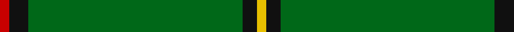

In pattern [RKGKY](/patterns/rkgky/).

This was sourced from house-of-tartan.  It is a [5 stripes tartan](/stripes/stripes5/).

Original link http://www.house-of-tartan.scotland.net/house/TartanViewjs.asp?colr=Def&tnam=1586

## Thread count
R/2 K4 G45 K3 Y/2

## Palette
Each colour and its ΔE from the base-6 reference it is a variant of.

| Colour | Shade | Base | ΔE (OKLab) |
|---|---|---|---|
| G | <code style="background-color:#006818;">#006818</code> `#006818` | G <code style="background-color:#006100;">#006100</code> | 0.02 |
| K | <code style="background-color:#101010;">#101010</code> `#101010` | K <code style="background-color:#000000;">#000000</code> | 0.17 |
| R | <code style="background-color:#C80000;">#C80000</code> `#C80000` | R <code style="background-color:#CC0000;">#CC0000</code> | 0.01 |
| Y | <code style="background-color:#E8C000;">#E8C000</code> `#E8C000` | Y <code style="background-color:#F2BF00;">#F2BF00</code> | 0.02 |

# Sample pattern

## Nearest tartans

The nearest existing variants by ΔTartan distance.

1. [Mar, Tribe of (Clan)](/setts/s5/r4k8g90k6y4-g006818-k101010-r880000-ye8c000/) — ΔT 0.16
1. [Mar Tribe](/setts/s5/r2k3g45k3y2-g006818-k101010-rc80000-ye8c000/) — ΔT 0.27
1. [Braemar Royal Highland Gathering](/setts/s6/r6k8w4g128k12y6-g006818-k101010-rc80000-wc0c0c0-ye8c000/) — ΔT 1.21
1. [Loch Laggan District Tartan Tartan Number: 796. Earliest known date: pre 1820 Loch Laggan lies on the historic route between Lochaber and the Great Glen and the Central Highlands of Badenoch at the head of Glen Spean. See products available Copyright © Blair Urquhart, Comrie, 2015](/setts/s6/r19g6r7g101k7g7-g006818-k101010-rc80000/) — ΔT 1.31
1. [Crane of Cluny (Personal)](/setts/s8/g164k12g6k18r4k10g4y4-g006818-k101010-rc8002c-ye8c000/) — ΔT 1.47
1. [Loch Laggan](/setts/s6/r19g6r7g101k7g7-g008000-k000000-rc00000/) — ΔT 1.53
1. [Mar, (Tribe of..)](/setts/s5/r2k4g45k3y2-g008000-k000000-rc00000-yf0c000/) — ΔT 1.64
1. [Skene or Tribe of Mar](/setts/s5/r2k4g32k4y2-g005020-k101010-rdc0000-ye8c000/) — ΔT 1.65
1. [Asher (Personal)](/setts/s8/g80y4b6r8b6y4g80w6-b1c0070-g007444-rc80000-we0e0e0-ye8c000/) — ΔT 1.68
1. [Highland Hospice (Fashion)](/setts/s10/g102b6g10y6g10b10g10b10g10y6-b28003c-g006818-ybc8c00/) — ΔT 1.74

## Neighbour map

Every grey dot is one of 15726 variants placed by the first two principal components of the ΔTartan feature space (44% of its variance). Red is this tartan; blue dots are its nearest — click one to open its page.

<svg viewBox="0 0 640 380" role="img" style="max-width:100%;height:auto;border:1px solid #e0e0e0;border-radius:4px;display:block" xmlns="http://www.w3.org/2000/svg"><image href="/nn/cloud.v1.png" width="640" height="380"/><a href="/setts/s5/r4k8g90k6y4-g006818-k101010-r880000-ye8c000/"><circle cx="575.9" cy="183.2" r="4" fill="#3465a4"><title>Mar, Tribe of (Clan)</title></circle></a><a href="/setts/s5/r2k3g45k3y2-g006818-k101010-rc80000-ye8c000/"><circle cx="588.2" cy="181.0" r="4" fill="#3465a4"><title>Mar Tribe</title></circle></a><a href="/setts/s6/r6k8w4g128k12y6-g006818-k101010-rc80000-wc0c0c0-ye8c000/"><circle cx="537.0" cy="133.1" r="4" fill="#3465a4"><title>Braemar Royal Highland Gathering</title></circle></a><a href="/setts/s6/r19g6r7g101k7g7-g006818-k101010-rc80000/"><circle cx="560.3" cy="200.7" r="4" fill="#3465a4"><title>Loch Laggan District Tartan Tartan Number: 796. Earliest known date: pre 1820 Loch Laggan lies on the historic route between Lochaber and the Great Glen and the Central Highlands of Badenoch at the head of Glen Spean. See products available Copyright © Blair Urquhart, Comrie, 2015</title></circle></a><a href="/setts/s8/g164k12g6k18r4k10g4y4-g006818-k101010-rc8002c-ye8c000/"><circle cx="586.8" cy="128.0" r="4" fill="#3465a4"><title>Crane of Cluny (Personal)</title></circle></a><a href="/setts/s6/r19g6r7g101k7g7-g008000-k000000-rc00000/"><circle cx="528.4" cy="188.0" r="4" fill="#3465a4"><title>Loch Laggan</title></circle></a><a href="/setts/s5/r2k4g45k3y2-g008000-k000000-rc00000-yf0c000/"><circle cx="524.1" cy="162.1" r="4" fill="#3465a4"><title>Mar, (Tribe of..)</title></circle></a><a href="/setts/s5/r2k4g32k4y2-g005020-k101010-rdc0000-ye8c000/"><circle cx="487.8" cy="197.5" r="4" fill="#3465a4"><title>Skene or Tribe of Mar</title></circle></a><a href="/setts/s8/g80y4b6r8b6y4g80w6-b1c0070-g007444-rc80000-we0e0e0-ye8c000/"><circle cx="539.6" cy="153.3" r="4" fill="#3465a4"><title>Asher (Personal)</title></circle></a><a href="/setts/s10/g102b6g10y6g10b10g10b10g10y6-b28003c-g006818-ybc8c00/"><circle cx="557.8" cy="174.8" r="4" fill="#3465a4"><title>Highland Hospice (Fashion)</title></circle></a><circle cx="571.5" cy="180.7" r="5" fill="#c00000"/></svg>

ID: /setts/s5/r2k4g45k3y2-g006818-k101010-rc80000-ye8c000/
