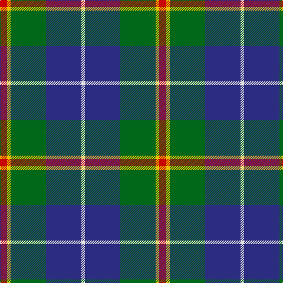

**Bands:** [RYGBW](/stripes/rygbw/) · **Stripes:** [R LY G DB W](/stripes/stripes5/) R LY G DB W

This was sourced from tartans-authority.  It is a [5 band tartan](/bands/bands5/).

Original link http://www.tartansauthority.com/tartan-ferret/display/1714/

## Variants

Other setts woven to the same stripe pattern.

- [Turnbull, hunting](/setts/s5/r7ly3g28db28w3~x2/)

## Thread count
R/12 Y6 G60 DB60 LN/6

## Palette
Each colour and its ΔE from the base-6 reference it is a variant of.

| Colour | Shade | Base | ΔE (OKLab) |
|---|---|---|---|
| DB | <code style="background-color:#2C2C80;">#2C2C80</code> `#2C2C80` | B <code style="background-color:#2A418A;">#2A418A</code> | 0.06 |
| G | <code style="background-color:#006818;">#006818</code> `#006818` | G <code style="background-color:#006100;">#006100</code> | 0.02 |
| LN | <code style="background-color:#E0E0E0;">#E0E0E0</code> `#E0E0E0` | W <code style="background-color:#F7F7F7;">#F7F7F7</code> | 0.07 |
| R | <code style="background-color:#C80000;">#C80000</code> `#C80000` | R <code style="background-color:#CC0000;">#CC0000</code> | 0.01 |
| Y | <code style="background-color:#E8C000;">#E8C000</code> `#E8C000` | Y <code style="background-color:#F2BF00;">#F2BF00</code> | 0.02 |

# Sample pattern

## Nearest tartans

The nearest existing variants by ΔTartan distance.

1. [Turnbull Hunting (1983) #2](/setts/s5/k2ly1g10db10w1~x6/) — ΔT 0.46
1. [Highlander, Highland Laddie Kilts](/setts/s5/k7m3g29db29w3~x2/) — ΔT 0.70
1. [Turnbull, hunting](/setts/s5/r7ly3g28db28w3~x2/) — ΔT 0.71
1. [DeLoughery (Personal)](/setts/s6/db20k6lo4db3g20w2~x2/) — ΔT 0.73
1. [Turnbull Hunting](/setts/s5/r7ly3dg28db28w3~x2/) — ΔT 0.74
1. [Douglas, Green (Wilsons)](/setts/s5/k1db1g8db8w1~x4/) — ΔT 0.75
1. [Canine All Dogs](/setts/s6/r5t3g24db24r4ly2~x2/) — ΔT 0.79
1. [Inglis (Name)](/setts/s6/lr4g24db10r3db12lo4~x2/) — ΔT 0.80
1. [Afternoon Tea / Darjeeling](/setts/s6/w15dg98dt72r25dt8ly15/) — ΔT 0.81
1. [Douglas](/setts/s5/k1t1g8db8w1~x4/) — ΔT 0.82

## Neighbour map

Every grey dot is one of 14299 variants placed by the first two principal components of the ΔTartan feature space (44% of its variance). Red is this tartan; blue dots are its nearest — click one to open its page.

<svg viewBox="0 0 640 380" role="img" style="max-width:100%;height:auto;border:1px solid #e0e0e0;border-radius:4px;display:block" xmlns="http://www.w3.org/2000/svg"><image href="/nn/cloud.v1.png" width="640" height="380"/><a href="/setts/s5/k2ly1g10db10w1~x6/"><circle cx="215.6" cy="204.5" r="4" fill="#3465a4"><title>Turnbull Hunting (1983) #2</title></circle></a><a href="/setts/s5/k7m3g29db29w3~x2/"><circle cx="198.4" cy="204.9" r="4" fill="#3465a4"><title>Highlander, Highland Laddie Kilts</title></circle></a><a href="/setts/s5/r7ly3g28db28w3~x2/"><circle cx="207.2" cy="208.8" r="4" fill="#3465a4"><title>Turnbull, hunting</title></circle></a><a href="/setts/s6/db20k6lo4db3g20w2~x2/"><circle cx="206.8" cy="203.1" r="4" fill="#3465a4"><title>DeLoughery (Personal)</title></circle></a><a href="/setts/s5/r7ly3dg28db28w3~x2/"><circle cx="224.8" cy="218.4" r="4" fill="#3465a4"><title>Turnbull Hunting</title></circle></a><a href="/setts/s5/k1db1g8db8w1~x4/"><circle cx="219.2" cy="217.1" r="4" fill="#3465a4"><title>Douglas, Green (Wilsons)</title></circle></a><a href="/setts/s6/r5t3g24db24r4ly2~x2/"><circle cx="218.8" cy="188.2" r="4" fill="#3465a4"><title>Canine All Dogs</title></circle></a><a href="/setts/s6/lr4g24db10r3db12lo4~x2/"><circle cx="183.4" cy="208.8" r="4" fill="#3465a4"><title>Inglis (Name)</title></circle></a><a href="/setts/s6/w15dg98dt72r25dt8ly15/"><circle cx="206.2" cy="187.6" r="4" fill="#3465a4"><title>Afternoon Tea / Darjeeling</title></circle></a><a href="/setts/s5/k1t1g8db8w1~x4/"><circle cx="210.4" cy="211.7" r="4" fill="#3465a4"><title>Douglas</title></circle></a><circle cx="220.9" cy="202.5" r="5" fill="#c00000"/></svg>

ID: /setts/s5/r2ly1g10db10w1~x6/
