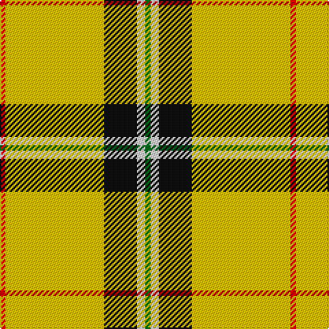

This page is one **sett** — a single exact thread-count. It belongs to the [tartan](/tartans/r2ly36k12w3g2/)
(the same proportion at any scale), whose colour order is pattern [GWKYR](/stripes/gwkyr/).

Sourced from register-of-tartans.  It is a [5 stripe tartan](/stripes/stripes5/).

Original link https://www.tartanregister.gov.uk/tartanDetails.aspx?ref=5361

## Also known as

This cloth is also recorded under:

- Port Moresby City Pipes & Drums

2 attestations — the source records this cloth was collapsed from (oldest owns this page)

<ul>
<li>01/01/2007 — Port Moresby City Pipes & Drums (register-of-tartans, <a href="https://www.tartanregister.gov.uk/tartanDetails.aspx?ref=5361">record</a>)</li>
<li>pre 2007 — Port Moresby City (P&D) (tartans-authority, <a href="http://www.tartansauthority.com/tartan-ferret/display/7236/">record</a>)</li>
</ul>

## Register references

External register numbers recorded for this tartan.

- Scottish Register of Tartans: [5361](https://www.tartanregister.gov.uk/tartanDetails.aspx?ref=5361)
- Scottish Tartans Authority (ITI): 7236

## Thread count
R/4 Y72 K24 LN6 G/4

## Palette

Palette: <strong>Tartan Register</strong>
<table><thead><tr><th>Colour</th><th>Threads</th><th>Shade</th><th>Base</th><th>OKLCh</th></tr></thead><tbody><tr><td>R/</td><td style="text-align:right;font-variant-numeric:tabular-nums">4</td><td><code style="background-color:#C80000;">#C80000</code> <small style="color:#888">#C80000</small></td><td>R <code style="background-color:#CC0000;">#CC0000</code></td><td><small style="color:#888">oklch(52.3% 0.215 29.2)</small></td></tr><tr><td>Y</td><td style="text-align:right;font-variant-numeric:tabular-nums">72</td><td><code style="background-color:#E8C000;">#E8C000</code> <small style="color:#888">#E8C000</small></td><td>Y <code style="background-color:#F2BF00;">#F2BF00</code></td><td><small style="color:#888">oklch(81.9% 0.168 93.7)</small></td></tr><tr><td>K</td><td style="text-align:right;font-variant-numeric:tabular-nums">24</td><td><code style="background-color:#101010;">#101010</code> <small style="color:#888">#101010</small></td><td>K <code style="background-color:#000000;">#000000</code></td><td><small style="color:#888">oklch(17.3% 0.000 89.9)</small></td></tr><tr><td>LN</td><td style="text-align:right;font-variant-numeric:tabular-nums">6</td><td><code style="background-color:#E0E0E0;">#E0E0E0</code> <small style="color:#888">#E0E0E0</small></td><td>W <code style="background-color:#F7F7F7;">#F7F7F7</code></td><td><small style="color:#888">oklch(90.7% 0.000 89.9)</small></td></tr><tr><td>G/</td><td style="text-align:right;font-variant-numeric:tabular-nums">4</td><td><code style="background-color:#006818;">#006818</code> <small style="color:#888">#006818</small></td><td>G <code style="background-color:#006100;">#006100</code></td><td><small style="color:#888">oklch(45.0% 0.142 145.0)</small></td></tr></tbody></table>

# Sample pattern

## Nearest tartans

The nearest existing variants by ΔTartan distance, with this tartan at the top so the swatches line up against it.

ΔTartan

Tartan

Sett

—

<a href="/ttd/edit/#slug=r2ly36k12w3g2~x2">Port Moresby City Pipes &amp; Drums</a> <a class="nn-out" href="/setts/s5/r2ly36k12w3g2~x2/" title="open its dictionary page">↗</a>

1.37

<a href="/ttd/edit/#slug=r2ly33k5w3g2~x2">Port Moresby City Pipes and Drums</a> <a class="nn-out" href="/setts/s5/r2ly33k5w3g2~x2/" title="open its dictionary page">↗</a>

1.44

<a href="/ttd/edit/#slug=r12g4k8dr3ly62r8~x2">Shawn Jones Afghan Memorial, The</a> <a class="nn-out" href="/setts/s6/r12g4k8dr3ly62r8~x2/" title="open its dictionary page">↗</a>

1.68

<a href="/ttd/edit/#slug=r1ly13k8g1~x6">Billy Apple® Yellow</a> <a class="nn-out" href="/setts/s4/r1ly13k8g1~x6/" title="open its dictionary page">↗</a>

1.73

<a href="/ttd/edit/#slug=r12g4k8dy3ly62r8~x2">Shawn Jones Afghan Memorial, The</a> <a class="nn-out" href="/setts/s6/r12g4k8dy3ly62r8~x2/" title="open its dictionary page">↗</a>

1.82

<a href="/ttd/edit/#slug=ly5k9ly2k7lo35r4lo35k4~x2">Wilbers</a> <a class="nn-out" href="/setts/s8/ly5k9ly2k7lo35r4lo35k4~x2/" title="open its dictionary page">↗</a>

1.84

<a href="/ttd/edit/#slug=ly70k30w3dg30k3ly10">Jacobite #2</a> <a class="nn-out" href="/setts/s6/ly70k30w3dg30k3ly10/" title="open its dictionary page">↗</a>

1.90

<a href="/ttd/edit/#slug=ly70k30w3g30k3ly10">Jacobite</a> <a class="nn-out" href="/setts/s6/ly70k30w3g30k3ly10/" title="open its dictionary page">↗</a>

1.92

<a href="/ttd/edit/#slug=ly75k26k3ly4k6~x2">Perry Ancient (Personal)</a> <a class="nn-out" href="/setts/s5/ly75k26k3ly4k6~x2/" title="open its dictionary page">↗</a>

2.07

<a href="/ttd/edit/#slug=ly30r2ly2k5ly3o2ly3o22ly3k2ly3~x2">Dunbarton</a> <a class="nn-out" href="/setts/s11/ly30r2ly2k5ly3o2ly3o22ly3k2ly3~x2/" title="open its dictionary page">↗</a>

2.08

<a href="/ttd/edit/#slug=ly30r2ly2k5ly3dy2ly3dy22ly3k2ly3~x2">Dunbarton Trade Tartan Tartan Number: 1886. Earliest known date: pre 2003 Dunbarton, Quebec. Different warp and weft See products available Copyright © Blair Urquhart, Comrie, 2015</a> <a class="nn-out" href="/setts/s11/ly30r2ly2k5ly3dy2ly3dy22ly3k2ly3~x2/" title="open its dictionary page">↗</a>

## Neighbour map

Every grey dot is one of 14299 variants placed by the first two principal components of the ΔTartan feature space (44% of its variance). Red is this tartan; blue dots are its nearest — click one to open its page.

<svg viewBox="0 0 640 380" role="img" style="max-width:100%;height:auto;border:1px solid #e0e0e0;border-radius:4px;display:block" xmlns="http://www.w3.org/2000/svg"><image href="/nn/cloud.v1.png" width="640" height="380"/><a href="/setts/s5/r2ly33k5w3g2~x2/"><circle cx="422.2" cy="128.6" r="4" fill="#3465a4"><title>Port Moresby City Pipes and Drums</title></circle></a><a href="/setts/s6/r12g4k8dr3ly62r8~x2/"><circle cx="340.3" cy="102.5" r="4" fill="#3465a4"><title>Shawn Jones Afghan Memorial, The</title></circle></a><a href="/setts/s4/r1ly13k8g1~x6/"><circle cx="283.4" cy="182.3" r="4" fill="#3465a4"><title>Billy Apple® Yellow</title></circle></a><a href="/setts/s6/r12g4k8dy3ly62r8~x2/"><circle cx="334.5" cy="92.3" r="4" fill="#3465a4"><title>Shawn Jones Afghan Memorial, The</title></circle></a><a href="/setts/s8/ly5k9ly2k7lo35r4lo35k4~x2/"><circle cx="399.9" cy="150.2" r="4" fill="#3465a4"><title>Wilbers</title></circle></a><a href="/setts/s6/ly70k30w3dg30k3ly10/"><circle cx="288.1" cy="145.6" r="4" fill="#3465a4"><title>Jacobite #2</title></circle></a><a href="/setts/s6/ly70k30w3g30k3ly10/"><circle cx="279.9" cy="142.3" r="4" fill="#3465a4"><title>Jacobite</title></circle></a><a href="/setts/s5/ly75k26k3ly4k6~x2/"><circle cx="429.2" cy="149.2" r="4" fill="#3465a4"><title>Perry Ancient (Personal)</title></circle></a><a href="/setts/s11/ly30r2ly2k5ly3o2ly3o22ly3k2ly3~x2/"><circle cx="313.8" cy="110.4" r="4" fill="#3465a4"><title>Dunbarton</title></circle></a><a href="/setts/s11/ly30r2ly2k5ly3dy2ly3dy22ly3k2ly3~x2/"><circle cx="317.9" cy="114.4" r="4" fill="#3465a4"><title>Dunbarton Trade Tartan Tartan Number: 1886. Earliest known date: pre 2003 Dunbarton, Quebec. Different warp and weft See products available Copyright © Blair Urquhart, Comrie, 2015</title></circle></a><circle cx="348.4" cy="128.1" r="5" fill="#c00000"/></svg>

ID: /setts/s5/r2ly36k12w3g2~x2/
