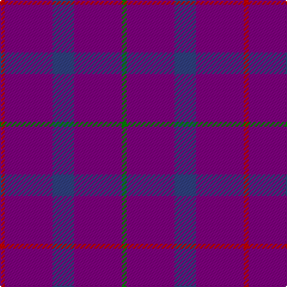

This page is one **sett** — a single exact thread-count. It belongs to the [tartan](/tartans/r2p20b9p20g2/)
(the same proportion at any scale), whose colour order is pattern [GBBBR](/stripes/gbbbr/).

Sourced from weddslist.  It is a [5 stripe tartan](/stripes/stripes5/).

Original link http://www.weddslist.com/cgi-bin/tartans/pg.pl?source=sts

## Thread count
R/4 P40 B18 P40 G/4

## Palette
Each colour and the base-6 reference it is a variant of.

| Colour | Shade | Base |
|---|---|---|
| B | <code style="background-color:#304080;">#304080</code> `oklch(39.4% 0.109 270.2)` <small>#304080</small> | B <code style="background-color:#2A418A;">#2A418A</code> |
| G | <code style="background-color:#008000;">#008000</code> `oklch(52.0% 0.177 142.5)` <small>#008000</small> | G <code style="background-color:#006100;">#006100</code> |
| P | <code style="background-color:#800080;">#800080</code> `oklch(42.1% 0.193 328.4)` <small>#800080</small> | B <code style="background-color:#2A418A;">#2A418A</code> |
| R | <code style="background-color:#C00000;">#C00000</code> `oklch(50.7% 0.208 29.2)` <small>#C00000</small> | R <code style="background-color:#CC0000;">#CC0000</code> |

# Sample pattern

## Nearest tartans

The nearest existing variants by ΔTartan distance, with this tartan at the top so the swatches line up against it.

ΔTartan

Tartan

Sett

—

<a href="/ttd/edit/#slug=r2p20db9p20g2~x2">Scottish Netball Association</a> <a class="nn-out" href="/setts/s5/r2p20db9p20g2~x2/" title="open its dictionary page">↗</a>

0.48

<a href="/ttd/edit/#slug=r2dp20db9dp20g2~x2">Scottish Netball (1987) (Corporate)</a> <a class="nn-out" href="/setts/s5/r2dp20db9dp20g2~x2/" title="open its dictionary page">↗</a>

1.81

<a href="/ttd/edit/#slug=dp5g2dp19r5~x2">Highland Spring Corporate Tartan Tartan Number: 130. Earliest known date: 1987 Highland Spring manufacture bottled drinking water at Blackford in Perthshire, Scotland. See products available Copyright © Blair Urquhart, Comrie, 2015</a> <a class="nn-out" href="/setts/s4/dp5g2dp19r5~x2/" title="open its dictionary page">↗</a>

1.90

<a href="/ttd/edit/#slug=dp20db9dp20r2dp20db9dp20g2~x2">Scottish Netball Association (1987)</a> <a class="nn-out" href="/setts/s8/dp20db9dp20r2dp20db9dp20g2~x2/" title="open its dictionary page">↗</a>

2.30

<a href="/ttd/edit/#slug=r5p19g3p5~x2">Highland Spring</a> <a class="nn-out" href="/setts/s4/r5p19g3p5~x2/" title="open its dictionary page">↗</a>

2.32

<a href="/ttd/edit/#slug=dp30db10m5db10dp30db3dp5db3dp30~x2">Meanwood McMain (Personal)</a> <a class="nn-out" href="/setts/s9/dp30db10m5db10dp30db3dp5db3dp30~x2/" title="open its dictionary page">↗</a>

2.69

<a href="/ttd/edit/#slug=db44dy12db9r3~x2">Elliot (Clan)</a> <a class="nn-out" href="/setts/s4/db44dy12db9r3~x2/" title="open its dictionary page">↗</a>

2.70

<a href="/ttd/edit/#slug=db9dy12db44dy12db9r3~x2">Elliot</a> <a class="nn-out" href="/setts/s6/db9dy12db44dy12db9r3~x2/" title="open its dictionary page">↗</a>

2.71

<a href="/ttd/edit/#slug=dp20t8g8db8dp33r3~x2">McIntosh, Stuart (Personal)</a> <a class="nn-out" href="/setts/s6/dp20t8g8db8dp33r3~x2/" title="open its dictionary page">↗</a>

2.73

<a href="/ttd/edit/#slug=db16m4db3r1~x2">Elliot</a> <a class="nn-out" href="/setts/s4/db16m4db3r1~x2/" title="open its dictionary page">↗</a>

2.80

<a href="/setts/s6/dp3g1dp9r3~x4/">Highland Spring (1988)</a>

## Neighbour map

Every grey dot is one of 14299 variants placed by the first two principal components of the ΔTartan feature space (44% of its variance). Red is this tartan; blue dots are its nearest — click one to open its page.

<svg viewBox="0 0 640 380" role="img" style="max-width:100%;height:auto;border:1px solid #e0e0e0;border-radius:4px;display:block" xmlns="http://www.w3.org/2000/svg"><image href="/nn/cloud.v1.png" width="640" height="380"/><a href="/setts/s5/r2dp20db9dp20g2~x2/"><circle cx="555.9" cy="281.1" r="4" fill="#3465a4"><title>Scottish Netball (1987) (Corporate)</title></circle></a><a href="/setts/s4/dp5g2dp19r5~x2/"><circle cx="561.7" cy="271.6" r="4" fill="#3465a4"><title>Highland Spring Corporate Tartan Tartan Number: 130. Earliest known date: 1987 Highland Spring manufacture bottled drinking water at Blackford in Perthshire, Scotland. See products available Copyright © Blair Urquhart, Comrie, 2015</title></circle></a><a href="/setts/s8/dp20db9dp20r2dp20db9dp20g2~x2/"><circle cx="585.3" cy="294.1" r="4" fill="#3465a4"><title>Scottish Netball Association (1987)</title></circle></a><a href="/setts/s4/r5p19g3p5~x2/"><circle cx="501.5" cy="278.9" r="4" fill="#3465a4"><title>Highland Spring</title></circle></a><a href="/setts/s9/dp30db10m5db10dp30db3dp5db3dp30~x2/"><circle cx="539.4" cy="272.4" r="4" fill="#3465a4"><title>Meanwood McMain (Personal)</title></circle></a><a href="/setts/s4/db44dy12db9r3~x2/"><circle cx="612.0" cy="290.5" r="4" fill="#3465a4"><title>Elliot (Clan)</title></circle></a><a href="/setts/s6/db9dy12db44dy12db9r3~x2/"><circle cx="532.3" cy="267.3" r="4" fill="#3465a4"><title>Elliot</title></circle></a><a href="/setts/s6/dp20t8g8db8dp33r3~x2/"><circle cx="387.3" cy="215.6" r="4" fill="#3465a4"><title>McIntosh, Stuart (Personal)</title></circle></a><a href="/setts/s4/db16m4db3r1~x2/"><circle cx="626.0" cy="291.2" r="4" fill="#3465a4"><title>Elliot</title></circle></a><a href="/setts/s6/dp3g1dp9r3~x4/"><circle cx="551.8" cy="265.0" r="4" fill="#3465a4"><title>Highland Spring (1988)</title></circle></a><circle cx="543.6" cy="272.8" r="5" fill="#c00000"/></svg>

ID: /setts/s5/r2p20db9p20g2~x2/
