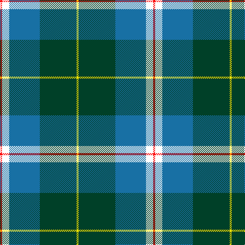

In pattern [RWBGY](/patterns/rwbgy/).

This was sourced from register-of-tartans.  It is a [5 stripes tartan](/stripes/stripes5/).

Original link https://www.tartanregister.gov.uk/tartanDetails.aspx?ref=10846

## Register references

External register numbers recorded for this tartan.

- Scottish Register of Tartans: [10846](https://www.tartanregister.gov.uk/tartanDetails.aspx?ref=10846)

## Thread count
R/4 W14 B60 DG72 Y/4

## Palette
Each colour and its ΔE from the base-6 reference it is a variant of.

| Colour | Shade | Base | ΔE (OKLab) |
|---|---|---|---|
| B | <code style="background-color:#1870A4;">#1870A4</code> `#1870A4` | B <code style="background-color:#2A418A;">#2A418A</code> | 0.13 |
| DG | <code style="background-color:#004028;">#004028</code> `#004028` | G <code style="background-color:#006100;">#006100</code> | 0.13 |
| R | <code style="background-color:#FF0000;">#FF0000</code> `#FF0000` | R <code style="background-color:#CC0000;">#CC0000</code> | 0.11 |
| W | <code style="background-color:#FFFFFF;">#FFFFFF</code> `#FFFFFF` | W <code style="background-color:#F7F7F7;">#F7F7F7</code> | 0.02 |
| Y | <code style="background-color:#FFE600;">#FFE600</code> `#FFE600` | Y <code style="background-color:#F2BF00;">#F2BF00</code> | 0.10 |

# Sample pattern

## Nearest tartans

The nearest existing variants by ΔTartan distance.

1. [Centennial-King George Lodge No.171](/setts/s5/r2w7b30g36y2~b202060-g006818-rc80000-wfcfcfc-ye8c000~x2/) — ΔT 0.61
1. [Phoenix Police Honor Guard](/setts/s5/b10k3ba65g56y6~b0a419e-ba2787c3-g00470d-k101010-yf7c413/) — ΔT 0.98
1. [Vancouver Centennial Commemorative Tartan Tartan Number: 2083. Earliest known date: 1988 Registered by Lord Lyon on 30th August, 1991. See products available Copyright © Blair Urquhart, Comrie, 2015](/setts/s6/g4y2g24w12b26r1~b2c2c80-g006818-rc80000-we0e0e0-ye8c000~x2/) — ΔT 1.01
1. [Emond, Kenneth (Personal)](/setts/s5/b36ba21y4w12bb2~b003c64-ba5c8ca8-bb5a008c-wc0c0c0-yffe600~x2/) — ΔT 1.01
1. [Solberg-Bell (Personal)](/setts/s6/y8k2b20ba4w1k2~b003c64-ba5c8ca8-k101010-wffffff-ye0a126~x4/) — ΔT 1.08
1. [Vance (Family Association) Corporate Family Tartan Tartan Number: 2208. Earliest known date: December 1994 Designed and Copyrighted in the US by Mark W. Vance. Details from Vance Family Association website. See products available Copyright © Blair Urquhart, Comrie, 2015](/setts/s6/k4b24k2g13b2ka3~b2888c4-g006818-k000000-ka101010~x4/) — ΔT 1.10
1. [MX-5 Owners' Club](/setts/s7/r6b27ba2g2ba2g30w4~b2c2c80-ba2888c4-g006818-rc80000-wfcfcfc~x2/) — ΔT 1.12
1. [Solberg-Bell](/setts/s6/y8k2b20ba4w1k2~b003c64-ba5c8ca8-k101010-wfcfcfc-yfccc00~x4/) — ΔT 1.13
1. [Rothesay & Caithness Fencibles (Mil)](/setts/s5/b32k10g15k2y4~b1474b4-g006818-k101010-ye8c000~x2/) — ΔT 1.14
1. [Turnbull Hunting (1983) #2](/setts/s5/k2y1g10b10w1~b2c2c80-g006818-k101010-wfcfcfc-ye8c000~x6/) — ΔT 1.18

## Neighbour map

Every grey dot is one of 15726 variants placed by the first two principal components of the ΔTartan feature space (44% of its variance). Red is this tartan; blue dots are its nearest — click one to open its page.

<svg viewBox="0 0 640 380" role="img" style="max-width:100%;height:auto;border:1px solid #e0e0e0;border-radius:4px;display:block" xmlns="http://www.w3.org/2000/svg"><image href="/nn/cloud.v1.png" width="640" height="380"/><a href="/setts/s5/r2w7b30g36y2~b202060-g006818-rc80000-wfcfcfc-ye8c000~x2/"><circle cx="249.3" cy="172.1" r="4" fill="#3465a4"><title>Centennial-King George Lodge No.171</title></circle></a><a href="/setts/s5/b10k3ba65g56y6~b0a419e-ba2787c3-g00470d-k101010-yf7c413/"><circle cx="281.8" cy="178.0" r="4" fill="#3465a4"><title>Phoenix Police Honor Guard</title></circle></a><a href="/setts/s6/g4y2g24w12b26r1~b2c2c80-g006818-rc80000-we0e0e0-ye8c000~x2/"><circle cx="215.4" cy="149.8" r="4" fill="#3465a4"><title>Vancouver Centennial Commemorative Tartan Tartan Number: 2083. Earliest known date: 1988 Registered by Lord Lyon on 30th August, 1991. See products available Copyright © Blair Urquhart, Comrie, 2015</title></circle></a><a href="/setts/s5/b36ba21y4w12bb2~b003c64-ba5c8ca8-bb5a008c-wc0c0c0-yffe600~x2/"><circle cx="237.3" cy="179.1" r="4" fill="#3465a4"><title>Emond, Kenneth (Personal)</title></circle></a><a href="/setts/s6/y8k2b20ba4w1k2~b003c64-ba5c8ca8-k101010-wffffff-ye0a126~x4/"><circle cx="278.2" cy="149.1" r="4" fill="#3465a4"><title>Solberg-Bell (Personal)</title></circle></a><a href="/setts/s6/k4b24k2g13b2ka3~b2888c4-g006818-k000000-ka101010~x4/"><circle cx="257.3" cy="178.0" r="4" fill="#3465a4"><title>Vance (Family Association) Corporate Family Tartan Tartan Number: 2208. Earliest known date: December 1994 Designed and Copyrighted in the US by Mark W. Vance. Details from Vance Family Association website. See products available Copyright © Blair Urquhart, Comrie, 2015</title></circle></a><a href="/setts/s7/r6b27ba2g2ba2g30w4~b2c2c80-ba2888c4-g006818-rc80000-wfcfcfc~x2/"><circle cx="239.7" cy="156.5" r="4" fill="#3465a4"><title>MX-5 Owners' Club</title></circle></a><a href="/setts/s6/y8k2b20ba4w1k2~b003c64-ba5c8ca8-k101010-wfcfcfc-yfccc00~x4/"><circle cx="264.0" cy="143.4" r="4" fill="#3465a4"><title>Solberg-Bell</title></circle></a><a href="/setts/s5/b32k10g15k2y4~b1474b4-g006818-k101010-ye8c000~x2/"><circle cx="273.6" cy="207.2" r="4" fill="#3465a4"><title>Rothesay &amp; Caithness Fencibles (Mil)</title></circle></a><a href="/setts/s5/k2y1g10b10w1~b2c2c80-g006818-k101010-wfcfcfc-ye8c000~x6/"><circle cx="212.1" cy="203.0" r="4" fill="#3465a4"><title>Turnbull Hunting (1983) #2</title></circle></a><circle cx="252.5" cy="173.3" r="5" fill="#c00000"/></svg>

ID: /setts/s5/r2w7b30g36y2~b1870a4-g004028-rff0000-wffffff-yffe600~x2/
