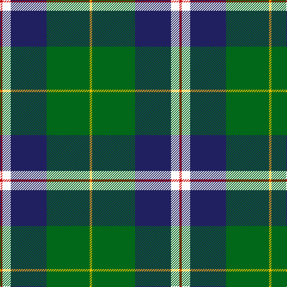

In pattern [RWBGY](/stripes/rwbgy/).

This was sourced from tartans-authority.  It is a [5 stripe tartan](/stripes/stripes5/).

Original link http://www.tartansauthority.com/tartan-ferret/display/10846/

## Thread count
R/4 W14 DB60 G72 Y/4

## Palette
Each colour and the base-6 reference it is a variant of.

| Colour | Shade | Base |
|---|---|---|
| DB | <code style="background-color:#202060;">#202060</code> `oklch(28.9% 0.111 276.9)` <small>#202060</small> | B <code style="background-color:#2A418A;">#2A418A</code> |
| G | <code style="background-color:#006818;">#006818</code> `oklch(45.0% 0.142 145.0)` <small>#006818</small> | G <code style="background-color:#006100;">#006100</code> |
| R | <code style="background-color:#C80000;">#C80000</code> `oklch(52.3% 0.215 29.2)` <small>#C80000</small> | R <code style="background-color:#CC0000;">#CC0000</code> |
| W | <code style="background-color:#FCFCFC;">#FCFCFC</code> `oklch(99.1% 0.000 89.9)` <small>#FCFCFC</small> | W <code style="background-color:#F7F7F7;">#F7F7F7</code> |
| Y | <code style="background-color:#E8C000;">#E8C000</code> `oklch(81.9% 0.168 93.7)` <small>#E8C000</small> | Y <code style="background-color:#F2BF00;">#F2BF00</code> |

# Sample pattern

## Nearest tartans

The nearest existing variants by ΔTartan distance, with this tartan at the top so the swatches line up against it.

ΔTartan

Tartan

Sett

—

<a href="/ttd/edit/#slug=r2w7db30g36ly2~x2">Centennial-King George Lodge No.171</a> <a class="nn-out" href="/setts/s5/r2w7db30g36ly2~x2/" title="open its dictionary page">↗</a>

0.61

<a href="/ttd/edit/#slug=r2w7b30dg36ly2~x2">Centennial-King George Lodge No.171</a> <a class="nn-out" href="/setts/s5/r2w7b30dg36ly2~x2/" title="open its dictionary page">↗</a>

1.07

<a href="/ttd/edit/#slug=ly8k2dt20t4w1k2~x4">Solberg-Bell</a> <a class="nn-out" href="/setts/s6/ly8k2dt20t4w1k2~x4/" title="open its dictionary page">↗</a>

1.08

<a href="/ttd/edit/#slug=lo8k2dt20t4w1k2~x4">Solberg-Bell (Personal)</a> <a class="nn-out" href="/setts/s6/lo8k2dt20t4w1k2~x4/" title="open its dictionary page">↗</a>

1.12

<a href="/ttd/edit/#slug=db24k8g8r2g8k1ly2~x2">MacLaren</a> <a class="nn-out" href="/setts/s7/db24k8g8r2g8k1ly2~x2/" title="open its dictionary page">↗</a>

1.14

<a href="/ttd/edit/#slug=db24k8g8r2g8k1w2~x2">Ferguson of Athol</a> <a class="nn-out" href="/setts/s7/db24k8g8r2g8k1w2~x2/" title="open its dictionary page">↗</a>

1.15

<a href="/ttd/edit/#slug=db48w2k20g22r3g4~x2">MacFadzean</a> <a class="nn-out" href="/setts/s6/db48w2k20g22r3g4~x2/" title="open its dictionary page">↗</a>

1.16

<a href="/ttd/edit/#slug=k3g36db28r2db2ly3~x2">Carmichael</a> <a class="nn-out" href="/setts/s6/k3g36db28r2db2ly3~x2/" title="open its dictionary page">↗</a>

1.17

<a href="/ttd/edit/#slug=k7m3g29db29w3~x2">Highlander, Highland Laddie Kilts</a> <a class="nn-out" href="/setts/s5/k7m3g29db29w3~x2/" title="open its dictionary page">↗</a>

1.18

<a href="/ttd/edit/#slug=lr2dg17w6b5r1~x4">Scotstown</a> <a class="nn-out" href="/setts/s5/lr2dg17w6b5r1~x4/" title="open its dictionary page">↗</a>

1.19

<a href="/ttd/edit/#slug=r6db27t2g2t2g30w4~x2">MX-5 Owners' Club</a> <a class="nn-out" href="/setts/s7/r6db27t2g2t2g30w4~x2/" title="open its dictionary page">↗</a>

## Neighbour map

Every grey dot is one of 14299 variants placed by the first two principal components of the ΔTartan feature space (44% of its variance). Red is this tartan; blue dots are its nearest — click one to open its page.

<svg viewBox="0 0 640 380" role="img" style="max-width:100%;height:auto;border:1px solid #e0e0e0;border-radius:4px;display:block" xmlns="http://www.w3.org/2000/svg"><image href="/nn/cloud.v1.png" width="640" height="380"/><a href="/setts/s5/r2w7b30dg36ly2~x2/"><circle cx="255.8" cy="173.5" r="4" fill="#3465a4"><title>Centennial-King George Lodge No.171</title></circle></a><a href="/setts/s6/ly8k2dt20t4w1k2~x4/"><circle cx="267.0" cy="141.0" r="4" fill="#3465a4"><title>Solberg-Bell</title></circle></a><a href="/setts/s6/lo8k2dt20t4w1k2~x4/"><circle cx="281.0" cy="148.0" r="4" fill="#3465a4"><title>Solberg-Bell (Personal)</title></circle></a><a href="/setts/s7/db24k8g8r2g8k1ly2~x2/"><circle cx="236.5" cy="147.1" r="4" fill="#3465a4"><title>MacLaren</title></circle></a><a href="/setts/s7/db24k8g8r2g8k1w2~x2/"><circle cx="234.9" cy="146.5" r="4" fill="#3465a4"><title>Ferguson of Athol</title></circle></a><a href="/setts/s6/db48w2k20g22r3g4~x2/"><circle cx="259.6" cy="154.7" r="4" fill="#3465a4"><title>MacFadzean</title></circle></a><a href="/setts/s6/k3g36db28r2db2ly3~x2/"><circle cx="296.5" cy="163.5" r="4" fill="#3465a4"><title>Carmichael</title></circle></a><a href="/setts/s5/k7m3g29db29w3~x2/"><circle cx="198.4" cy="204.9" r="4" fill="#3465a4"><title>Highlander, Highland Laddie Kilts</title></circle></a><a href="/setts/s5/lr2dg17w6b5r1~x4/"><circle cx="256.8" cy="164.8" r="4" fill="#3465a4"><title>Scotstown</title></circle></a><a href="/setts/s7/r6db27t2g2t2g30w4~x2/"><circle cx="242.9" cy="158.5" r="4" fill="#3465a4"><title>MX-5 Owners' Club</title></circle></a><circle cx="252.6" cy="171.4" r="5" fill="#c00000"/></svg>

ID: /setts/s5/r2w7db30g36ly2~x2/
