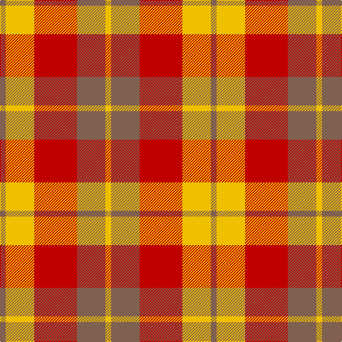

In pattern [RYRRY](/patterns/ryrry/).

This was sourced from weddslist.  It is a [5 stripes tartan](/stripes/stripes5/).

Original link http://www.weddslist.com/cgi-bin/tartans/pg.pl?source=sts

## Thread count
LT/8 Y40 R60 LT40 Y/8

## Palette
Each colour and its ΔE from the base-6 reference it is a variant of.

| Colour | Shade | Base | ΔE (OKLab) |
|---|---|---|---|
| LT | <code style="background-color:#806050;">#806050</code> `#806050` | R <code style="background-color:#CC0000;">#CC0000</code> | 0.17 |
| R | <code style="background-color:#C00000;">#C00000</code> `#C00000` | R <code style="background-color:#CC0000;">#CC0000</code> | 0.03 |
| Y | <code style="background-color:#F0C000;">#F0C000</code> `#F0C000` | Y <code style="background-color:#F2BF00;">#F2BF00</code> | 0.00 |

# Sample pattern

## Nearest tartans

The nearest existing variants by ΔTartan distance.

1. [Harmony 9](/setts/s5/g2y10r15g10y2x4~g503c14-rdc0000-ye8c000/) — ΔT 0.90
1. [Kozlosky (Personal)](/setts/s6/y21r8ra14y6r3ra10x2~re87878-rac80000-ye8c000/) — ΔT 1.09
1. [Kozlosky, Kilt](/setts/s6/y42r15ra28y12r6ra20~rd03030-rac00000-yf0c000/) — ΔT 1.12
1. [MacNab, Variant](/setts/s6/g1r1g7r4ra7r1x4~g008000-r900030-rac00000/) — ΔT 1.45
1. [Manx, Mannin Plaid](/setts/s4/w1r5ra5y1x4~rc00000-ra806050-we0e0e0-yf0c000/) — ΔT 1.48
1. [Manx Mannin Plaid](/setts/s4/w1r5g5y1x4~g503c14-rdc0000-we0e0e0-ye8c000/) — ΔT 1.59
1. [MacNab #2](/setts/s6/g1r1g7r4ra7r1x4~g006818-ra00048-rac80000/) — ΔT 1.63
1. [Manhattan Ethnic](/setts/s7/y36b15y9r31ya5b4r16x2~b441800-re87878-ya08858-yabc8c00/) — ΔT 1.63
1. [Buchele Check (Fashion?)](/setts/s6/r4y1r3ya1y8ya2x4~r901c38-ydcc08c-yad0c830/) — ΔT 1.63
1. [Plaid Wine](/setts/s6/r24b5ra9b2ra9w9x4~b5c5c5c-r880000-raa07c58-we8ccb8/) — ΔT 1.66

## Neighbour map

Every grey dot is one of 15726 variants placed by the first two principal components of the ΔTartan feature space (44% of its variance). Red is this tartan; blue dots are its nearest — click one to open its page.

<svg viewBox="0 0 640 380" role="img" style="max-width:100%;height:auto;border:1px solid #e0e0e0;border-radius:4px;display:block" xmlns="http://www.w3.org/2000/svg"><image href="/nn/cloud.v1.png" width="640" height="380"/><a href="/setts/s5/g2y10r15g10y2x4~g503c14-rdc0000-ye8c000/"><circle cx="211.8" cy="239.7" r="4" fill="#3465a4"><title>Harmony 9</title></circle></a><a href="/setts/s6/y21r8ra14y6r3ra10x2~re87878-rac80000-ye8c000/"><circle cx="251.0" cy="248.6" r="4" fill="#3465a4"><title>Kozlosky (Personal)</title></circle></a><a href="/setts/s6/y42r15ra28y12r6ra20~rd03030-rac00000-yf0c000/"><circle cx="249.5" cy="245.5" r="4" fill="#3465a4"><title>Kozlosky, Kilt</title></circle></a><a href="/setts/s6/g1r1g7r4ra7r1x4~g008000-r900030-rac00000/"><circle cx="251.4" cy="246.8" r="4" fill="#3465a4"><title>MacNab, Variant</title></circle></a><a href="/setts/s4/w1r5ra5y1x4~rc00000-ra806050-we0e0e0-yf0c000/"><circle cx="242.8" cy="263.1" r="4" fill="#3465a4"><title>Manx, Mannin Plaid</title></circle></a><a href="/setts/s4/w1r5g5y1x4~g503c14-rdc0000-we0e0e0-ye8c000/"><circle cx="210.3" cy="250.9" r="4" fill="#3465a4"><title>Manx Mannin Plaid</title></circle></a><a href="/setts/s6/g1r1g7r4ra7r1x4~g006818-ra00048-rac80000/"><circle cx="261.3" cy="249.2" r="4" fill="#3465a4"><title>MacNab #2</title></circle></a><a href="/setts/s7/y36b15y9r31ya5b4r16x2~b441800-re87878-ya08858-yabc8c00/"><circle cx="245.1" cy="217.7" r="4" fill="#3465a4"><title>Manhattan Ethnic</title></circle></a><a href="/setts/s6/r4y1r3ya1y8ya2x4~r901c38-ydcc08c-yad0c830/"><circle cx="260.2" cy="220.5" r="4" fill="#3465a4"><title>Buchele Check (Fashion?)</title></circle></a><a href="/setts/s6/r24b5ra9b2ra9w9x4~b5c5c5c-r880000-raa07c58-we8ccb8/"><circle cx="233.9" cy="206.0" r="4" fill="#3465a4"><title>Plaid Wine</title></circle></a><circle cx="234.0" cy="247.8" r="5" fill="#c00000"/></svg>

ID: /setts/s5/r2y10ra15r10y2x4~r806050-rac00000-yf0c000/
