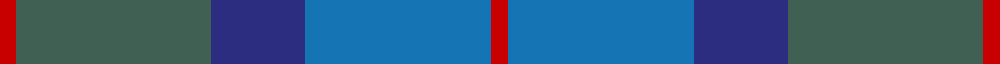
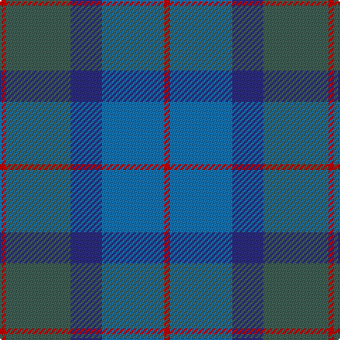

In pattern [RBBGR](/stripes/rbbgr/).

This was sourced from tartans-authority.  It is a [5 stripe tartan](/stripes/stripes5/).

Original link http://www.tartansauthority.com/tartan-ferret/display/2550/

## Thread count
R/4 N46 DB22 B44 R/4

## Palette
Each colour and the base-6 reference it is a variant of.

| Colour | Shade | Base |
|---|---|---|
| B | <code style="background-color:#1474B4;">#1474B4</code> `oklch(54.0% 0.129 245.1)` <small>#1474B4</small> | B <code style="background-color:#2A418A;">#2A418A</code> |
| DB | <code style="background-color:#2C2C80;">#2C2C80</code> `oklch(35.0% 0.138 276.6)` <small>#2C2C80</small> | B <code style="background-color:#2A418A;">#2A418A</code> |
| N | <code style="background-color:#406054;">#406054</code> `oklch(46.0% 0.042 169.0)` <small>#406054</small> | G <code style="background-color:#006100;">#006100</code> |
| R | <code style="background-color:#C80000;">#C80000</code> `oklch(52.3% 0.215 29.2)` <small>#C80000</small> | R <code style="background-color:#CC0000;">#CC0000</code> |

# Sample pattern

## Nearest tartans

The nearest existing variants by ΔTartan distance.

1. [Skibo](/setts/s8/y23db11b22r2b22db11y23r2~x2/) — ΔT 1.31
1. [Bryson](/setts/s5/t8r3db29db29t4~x2/) — ΔT 1.49
1. [Sugiyama](/setts/s6/db7db2db25db10g21db2~x2/) — ΔT 1.53
1. [Unidentified No 17](/setts/s7/dg10db2dg2db6t5db1t2~x2/) — ΔT 1.56
1. [Dunans Rising](/setts/s5/g35y25m15t2t21~x2/) — ΔT 1.62
1. [Unamed, Riding cloak 1745](/setts/s5/r1o8r2db8t1~x2/) — ΔT 1.70
1. [Rhode Island, The State of](/setts/s6/g15dt2w2dt11n28dt4~x2/) — ΔT 1.73
1. [United Colours of Scotland (Corporat](/setts/s7/dg7db3dg7dt22db22w3db5~x2/) — ΔT 1.74
1. [Riley's Theme](/setts/s6/t20dt4y5n14ly1t2~x2/) — ΔT 1.79
1. [Saorsa (Corporate)](/setts/s6/db11g15k2n5db3n11~x2/) — ΔT 1.83

## Neighbour map

Every grey dot is one of 14299 variants placed by the first two principal components of the ΔTartan feature space (44% of its variance). Red is this tartan; blue dots are its nearest — click one to open its page.

<svg viewBox="0 0 640 380" role="img" style="max-width:100%;height:auto;border:1px solid #e0e0e0;border-radius:4px;display:block" xmlns="http://www.w3.org/2000/svg"><image href="/nn/cloud.v1.png" width="640" height="380"/><a href="/setts/s8/y23db11b22r2b22db11y23r2~x2/"><circle cx="289.0" cy="275.1" r="4" fill="#3465a4"><title>Skibo</title></circle></a><a href="/setts/s5/t8r3db29db29t4~x2/"><circle cx="283.7" cy="262.1" r="4" fill="#3465a4"><title>Bryson</title></circle></a><a href="/setts/s6/db7db2db25db10g21db2~x2/"><circle cx="345.6" cy="267.2" r="4" fill="#3465a4"><title>Sugiyama</title></circle></a><a href="/setts/s7/dg10db2dg2db6t5db1t2~x2/"><circle cx="309.3" cy="277.2" r="4" fill="#3465a4"><title>Unidentified No 17</title></circle></a><a href="/setts/s5/g35y25m15t2t21~x2/"><circle cx="263.2" cy="271.6" r="4" fill="#3465a4"><title>Dunans Rising</title></circle></a><a href="/setts/s5/r1o8r2db8t1~x2/"><circle cx="299.5" cy="263.6" r="4" fill="#3465a4"><title>Unamed, Riding cloak 1745</title></circle></a><a href="/setts/s6/g15dt2w2dt11n28dt4~x2/"><circle cx="299.5" cy="222.8" r="4" fill="#3465a4"><title>Rhode Island, The State of</title></circle></a><a href="/setts/s7/dg7db3dg7dt22db22w3db5~x2/"><circle cx="289.1" cy="275.3" r="4" fill="#3465a4"><title>United Colours of Scotland (Corporat</title></circle></a><a href="/setts/s6/t20dt4y5n14ly1t2~x2/"><circle cx="345.2" cy="208.2" r="4" fill="#3465a4"><title>Riley's Theme</title></circle></a><a href="/setts/s6/db11g15k2n5db3n11~x2/"><circle cx="186.0" cy="261.8" r="4" fill="#3465a4"><title>Saorsa (Corporate)</title></circle></a><circle cx="291.0" cy="268.0" r="5" fill="#c00000"/></svg>

ID: /setts/s5/r2y23db11b22r2~x2/
