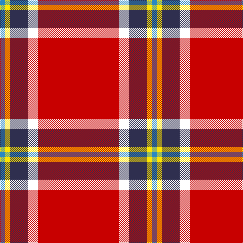

In pattern [BYBWR](/stripes/bybwr/).

This was sourced from register-of-tartans.  It is a [5 stripe tartan](/stripes/stripes5/).

Original link https://www.tartanregister.gov.uk/tartanDetails.aspx?ref=10780

## Register references

External register numbers recorded for this tartan.

- Scottish Register of Tartans: [10780](https://www.tartanregister.gov.uk/tartanDetails.aspx?ref=10780)

## Thread count
R/160 W20 DB35 Y10 B/10

## Palette
Each colour and the base-6 reference it is a variant of.

| Colour | Shade | Base |
|---|---|---|
| B | <code style="background-color:#2888C4;">#2888C4</code> `oklch(60.1% 0.125 241.5)` <small>#2888C4</small> | B <code style="background-color:#2A418A;">#2A418A</code> |
| DB | <code style="background-color:#2F2F4F;">#2F2F4F</code> `oklch(32.1% 0.056 282.8)` <small>#2F2F4F</small> | B <code style="background-color:#2A418A;">#2A418A</code> |
| R | <code style="background-color:#C80000;">#C80000</code> `oklch(52.3% 0.215 29.2)` <small>#C80000</small> | R <code style="background-color:#CC0000;">#CC0000</code> |
| W | <code style="background-color:#FFFFFF;">#FFFFFF</code> `oklch(100.0% 0.000 89.9)` <small>#FFFFFF</small> | W <code style="background-color:#F7F7F7;">#F7F7F7</code> |
| Y | <code style="background-color:#FFE600;">#FFE600</code> `oklch(91.7% 0.192 101.4)` <small>#FFE600</small> | Y <code style="background-color:#F2BF00;">#F2BF00</code> |

# Sample pattern

## Nearest tartans

The nearest existing variants by ΔTartan distance.

1. [Sildesalaten](/setts/s5/r32lb4dt7ly2t2~x5/) — ΔT 0.49
1. [Nicolson Dress (Clan)](/setts/s5/r62db8w20k3g4~x2/) — ΔT 0.71
1. [Turner (Personal)](/setts/s5/r48k12o7k5w3~x2/) — ΔT 1.19
1. [Princess Elizabeth #2](/setts/s8/r60db8w3db10ly3t4ly3r19~x2/) — ΔT 1.44
1. [Instakilt, Red (Fashion)](/setts/s7/r8w4r50k12r4k15g5~x2/) — ΔT 1.46
1. [Sinclair](/setts/s6/r30g12k5w2t6r30/) — ΔT 1.48
1. [Solberg-Wormald (Personal)](/setts/s7/r155lb16k34db48r18ly6r9/) — ΔT 1.50
1. [Perthshire Clayquhat District Tartan Tartan Number: 2800. Earliest known date: c.1739 Early historic plaid woven for (or by) Janet Craigie (nee Spalding) from the Braes of Clayquhat (now Cloquhat) in East Perthshire. Two pieces are now in the possession of the Scottish Tartans Authority (2014). See http://scottishtartans.co.uk/An_Unnamed_C18th_Plaid_from_Bridge_of_Cally.pdf See products available Copyright © Blair Urquhart, Comrie, 2015](/setts/s7/r23k1g9r3db1lr1r1~x4/) — ΔT 1.51
1. [Hackston or Halkerston Family Tartan Tartan Number: 907. Earliest known date: 1987 Taken from a portrait (c. 1746) Red pivot reduced by half for display. Should read R112. See products available Copyright © Blair Urquhart, Comrie, 2015](/setts/s8/r28w2k12ly3r12ly3r12g3~x2/) — ΔT 1.52
1. [Brock University Alumni Association](/setts/s6/r52lo2db16lo2db3w5~x2/) — ΔT 1.54

## Neighbour map

Every grey dot is one of 14299 variants placed by the first two principal components of the ΔTartan feature space (44% of its variance). Red is this tartan; blue dots are its nearest — click one to open its page.

<svg viewBox="0 0 640 380" role="img" style="max-width:100%;height:auto;border:1px solid #e0e0e0;border-radius:4px;display:block" xmlns="http://www.w3.org/2000/svg"><image href="/nn/cloud.v1.png" width="640" height="380"/><a href="/setts/s5/r32lb4dt7ly2t2~x5/"><circle cx="417.2" cy="142.4" r="4" fill="#3465a4"><title>Sildesalaten</title></circle></a><a href="/setts/s5/r62db8w20k3g4~x2/"><circle cx="375.7" cy="127.1" r="4" fill="#3465a4"><title>Nicolson Dress (Clan)</title></circle></a><a href="/setts/s5/r48k12o7k5w3~x2/"><circle cx="395.1" cy="161.0" r="4" fill="#3465a4"><title>Turner (Personal)</title></circle></a><a href="/setts/s8/r60db8w3db10ly3t4ly3r19~x2/"><circle cx="463.6" cy="114.7" r="4" fill="#3465a4"><title>Princess Elizabeth #2</title></circle></a><a href="/setts/s7/r8w4r50k12r4k15g5~x2/"><circle cx="366.4" cy="150.1" r="4" fill="#3465a4"><title>Instakilt, Red (Fashion)</title></circle></a><a href="/setts/s6/r30g12k5w2t6r30/"><circle cx="400.8" cy="169.2" r="4" fill="#3465a4"><title>Sinclair</title></circle></a><a href="/setts/s7/r155lb16k34db48r18ly6r9/"><circle cx="382.5" cy="110.9" r="4" fill="#3465a4"><title>Solberg-Wormald (Personal)</title></circle></a><a href="/setts/s7/r23k1g9r3db1lr1r1~x4/"><circle cx="464.7" cy="120.9" r="4" fill="#3465a4"><title>Perthshire Clayquhat District Tartan Tartan Number: 2800. Earliest known date: c.1739 Early historic plaid woven for (or by) Janet Craigie (nee Spalding) from the Braes of Clayquhat (now Cloquhat) in East Perthshire. Two pieces are now in the possession of the Scottish Tartans Authority (2014). See http://scottishtartans.co.uk/An_Unnamed_C18th_Plaid_from_Bridge_of_Cally.pdf See products available Copyright © Blair Urquhart, Comrie, 2015</title></circle></a><a href="/setts/s8/r28w2k12ly3r12ly3r12g3~x2/"><circle cx="384.4" cy="147.8" r="4" fill="#3465a4"><title>Hackston or Halkerston Family Tartan Tartan Number: 907. Earliest known date: 1987 Taken from a portrait (c. 1746) Red pivot reduced by half for display. Should read R112. See products available Copyright © Blair Urquhart, Comrie, 2015</title></circle></a><a href="/setts/s6/r52lo2db16lo2db3w5~x2/"><circle cx="420.6" cy="119.5" r="4" fill="#3465a4"><title>Brock University Alumni Association</title></circle></a><circle cx="403.6" cy="134.6" r="5" fill="#c00000"/></svg>

ID: /setts/s5/r32w4dt7ly2t2~x5/
