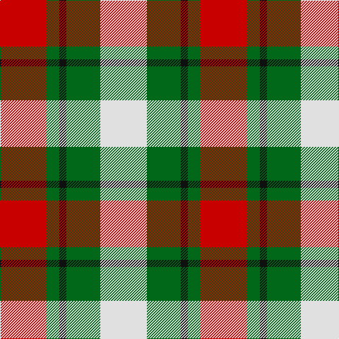

In pattern [RGKGW](/stripes/rgkgw/).

This was sourced from tartans-authority.  It is a [5 stripe tartan](/stripes/stripes5/).

Original link http://www.tartansauthority.com/tartan-ferret/display/10067/

## Thread count
R/66 G18 K10 G48 LN/66

## Palette
Each colour and its ΔE from the base-6 reference it is a variant of.

| Colour | Shade | Base | ΔE (OKLab) |
|---|---|---|---|
| G | <code style="background-color:#006818;">#006818</code> `#006818` | G <code style="background-color:#006100;">#006100</code> | 0.02 |
| K | <code style="background-color:#101010;">#101010</code> `#101010` | K <code style="background-color:#000000;">#000000</code> | 0.17 |
| LN | <code style="background-color:#E0E0E0;">#E0E0E0</code> `#E0E0E0` | W <code style="background-color:#F7F7F7;">#F7F7F7</code> | 0.07 |
| R | <code style="background-color:#C80000;">#C80000</code> `#C80000` | R <code style="background-color:#CC0000;">#CC0000</code> | 0.01 |

# Sample pattern

## Nearest tartans

The nearest existing variants by ΔTartan distance.

1. [Inverness Basque](/setts/s5/r22dg6k3dg16w22/) — ΔT 0.56
1. [MacKinnon Dress Hunting (Fashion)](/setts/s4/dg7dr7w7r1~x6/) — ΔT 1.06
1. [Fraser Dress](/setts/s6/r6k14r6dg14w27k4/) — ΔT 1.18
1. [MacKintosh Dress (Scott Adie)](/setts/s6/r3w8db4dg14r4db2~x4/) — ΔT 1.33
1. [MacKinnon Dress Trade Tartan Tartan Number: 921. Earliest known date: 1970-80 Canada. See products available Copyright © Blair Urquhart, Comrie, 2015](/setts/s4/g9dr7w7r1~x4/) — ΔT 1.33
1. [Fraser, dress](/setts/s6/r6k14r6g14w27k4/) — ΔT 1.37
1. [MacKinnon, dress](/setts/s4/g9o7w7r1~x4/) — ΔT 1.39
1. [Scottish American Athletic Assoc](/setts/s5/ly32k21r16lr6dt4~x2/) — ΔT 1.41
1. [MacIntosh, dress](/setts/s6/r3w8db4g14r4db2~x2/) — ΔT 1.41
1. [MacKinnon Dress](/setts/s4/dg9dy7w7r1~x4/) — ΔT 1.45

## Neighbour map

Every grey dot is one of 14299 variants placed by the first two principal components of the ΔTartan feature space (44% of its variance). Red is this tartan; blue dots are its nearest — click one to open its page.

<svg viewBox="0 0 640 380" role="img" style="max-width:100%;height:auto;border:1px solid #e0e0e0;border-radius:4px;display:block" xmlns="http://www.w3.org/2000/svg"><image href="/nn/cloud.v1.png" width="640" height="380"/><a href="/setts/s5/r22dg6k3dg16w22/"><circle cx="114.9" cy="216.4" r="4" fill="#3465a4"><title>Inverness Basque</title></circle></a><a href="/setts/s4/dg7dr7w7r1~x6/"><circle cx="107.6" cy="252.5" r="4" fill="#3465a4"><title>MacKinnon Dress Hunting (Fashion)</title></circle></a><a href="/setts/s6/r6k14r6dg14w27k4/"><circle cx="120.4" cy="207.7" r="4" fill="#3465a4"><title>Fraser Dress</title></circle></a><a href="/setts/s6/r3w8db4dg14r4db2~x4/"><circle cx="150.6" cy="213.9" r="4" fill="#3465a4"><title>MacKintosh Dress (Scott Adie)</title></circle></a><a href="/setts/s4/g9dr7w7r1~x4/"><circle cx="140.4" cy="243.3" r="4" fill="#3465a4"><title>MacKinnon Dress Trade Tartan Tartan Number: 921. Earliest known date: 1970-80 Canada. See products available Copyright © Blair Urquhart, Comrie, 2015</title></circle></a><a href="/setts/s6/r6k14r6g14w27k4/"><circle cx="113.2" cy="207.4" r="4" fill="#3465a4"><title>Fraser, dress</title></circle></a><a href="/setts/s4/g9o7w7r1~x4/"><circle cx="149.5" cy="246.7" r="4" fill="#3465a4"><title>MacKinnon, dress</title></circle></a><a href="/setts/s5/ly32k21r16lr6dt4~x2/"><circle cx="130.7" cy="196.8" r="4" fill="#3465a4"><title>Scottish American Athletic Assoc</title></circle></a><a href="/setts/s6/r3w8db4g14r4db2~x2/"><circle cx="151.1" cy="216.1" r="4" fill="#3465a4"><title>MacIntosh, dress</title></circle></a><a href="/setts/s4/dg9dy7w7r1~x4/"><circle cx="143.5" cy="246.9" r="4" fill="#3465a4"><title>MacKinnon Dress</title></circle></a><circle cx="117.9" cy="229.6" r="5" fill="#c00000"/></svg>

ID: /setts/s5/r33g9k5g24w33~x2/
