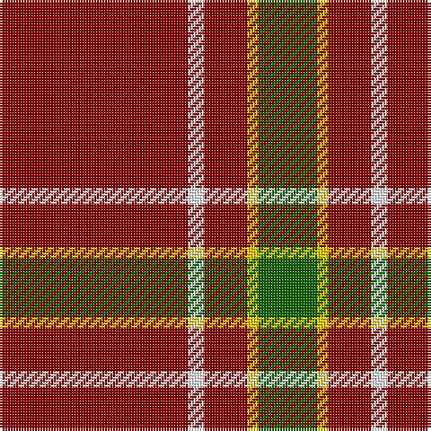

In pattern [GYRWR](/patterns/gyrwr/).

This was sourced from register-of-tartans.  It is a [5 stripes tartan](/stripes/stripes5/).

Original link https://www.tartanregister.gov.uk/tartanDetails.aspx?ref=10958

## Thread count
DR/70 W6 DR16 Y4 G/22

## Palette
Each colour and its ΔE from the base-6 reference it is a variant of.

| Colour | Shade | Base | ΔE (OKLab) |
|---|---|---|---|
| DR | <code style="background-color:#880000;">#880000</code> `#880000` | R <code style="background-color:#CC0000;">#CC0000</code> | 0.15 |
| G | <code style="background-color:#146400;">#146400</code> `#146400` | G <code style="background-color:#006100;">#006100</code> | 0.01 |
| W | <code style="background-color:#FFFFFF;">#FFFFFF</code> `#FFFFFF` | W <code style="background-color:#F7F7F7;">#F7F7F7</code> | 0.02 |
| Y | <code style="background-color:#FCCC00;">#FCCC00</code> `#FCCC00` | Y <code style="background-color:#F2BF00;">#F2BF00</code> | 0.04 |

# Sample pattern

## Nearest tartans

The nearest existing variants by ΔTartan distance.

1. [Highlands of Wyomissing (Corporate)](/setts/s8/r35w3r8y2g11y2r8w3~g003820-r880000-we8ccb8-ye8c000~x2/) — ΔT 1.11
1. [McPeek (Fictitious clan)](/setts/s4/r63k8ka8y5~k101010-ka000000-r9e0508-yffd700~x2/) — ΔT 1.25
1. [Sinclair](/setts/s6/r30g12k5w2b6r30~b5480b0-g008000-k000000-rc00000-we0e0e0/) — ΔT 1.39
1. [AON](/setts/s6/r5b10r5g5r25y1~b202060-g285800-rc80000-ye8c000~x4/) — ΔT 1.40
1. [Glen Shiel (Fashion)](/setts/s5/r13w3r1g3w1~g003820-r880000-we8ccb8~x6/) — ΔT 1.40
1. [Sinclair](/setts/s6/r30g12k5y2b6r30~b4367ae-g11450d-k000000-raa0000-yaaaaaa~x2/) — ΔT 1.43
1. [Sinclair](/setts/s6/r30g12k5y2b6r30~b4367ae-g11450d-k000000-raa0000-yaaaaaa/) — ΔT 1.43
1. [MacGregor](/setts/s6/r35g16r5g5w2k3~g005020-k101010-rdc0000-we0e0e0~x2/) — ΔT 1.47
1. [Howard, Vincent (Personal)](/setts/s6/r65g16r4b4r4w5~b440044-g006818-rc80000-wfcfcfc~x2/) — ΔT 1.49
1. [MacLaine of Lochbuie](/setts/s4/r32g8w4y1~g004c00-rc80000-wd0d0d0-yffc800/) — ΔT 1.49

## Neighbour map

Every grey dot is one of 15726 variants placed by the first two principal components of the ΔTartan feature space (44% of its variance). Red is this tartan; blue dots are its nearest — click one to open its page.

<svg viewBox="0 0 640 380" role="img" style="max-width:100%;height:auto;border:1px solid #e0e0e0;border-radius:4px;display:block" xmlns="http://www.w3.org/2000/svg"><image href="/nn/cloud.v1.png" width="640" height="380"/><a href="/setts/s8/r35w3r8y2g11y2r8w3~g003820-r880000-we8ccb8-ye8c000~x2/"><circle cx="448.7" cy="156.4" r="4" fill="#3465a4"><title>Highlands of Wyomissing (Corporate)</title></circle></a><a href="/setts/s4/r63k8ka8y5~k101010-ka000000-r9e0508-yffd700~x2/"><circle cx="476.6" cy="194.6" r="4" fill="#3465a4"><title>McPeek (Fictitious clan)</title></circle></a><a href="/setts/s6/r30g12k5w2b6r30~b5480b0-g008000-k000000-rc00000-we0e0e0/"><circle cx="401.8" cy="175.4" r="4" fill="#3465a4"><title>Sinclair</title></circle></a><a href="/setts/s6/r5b10r5g5r25y1~b202060-g285800-rc80000-ye8c000~x4/"><circle cx="455.1" cy="170.9" r="4" fill="#3465a4"><title>AON</title></circle></a><a href="/setts/s5/r13w3r1g3w1~g003820-r880000-we8ccb8~x6/"><circle cx="418.5" cy="199.8" r="4" fill="#3465a4"><title>Glen Shiel (Fashion)</title></circle></a><a href="/setts/s6/r30g12k5y2b6r30~b4367ae-g11450d-k000000-raa0000-yaaaaaa~x2/"><circle cx="420.6" cy="186.4" r="4" fill="#3465a4"><title>Sinclair</title></circle></a><a href="/setts/s6/r30g12k5y2b6r30~b4367ae-g11450d-k000000-raa0000-yaaaaaa/"><circle cx="420.6" cy="186.4" r="4" fill="#3465a4"><title>Sinclair</title></circle></a><a href="/setts/s6/r35g16r5g5w2k3~g005020-k101010-rdc0000-we0e0e0~x2/"><circle cx="388.0" cy="165.8" r="4" fill="#3465a4"><title>MacGregor</title></circle></a><a href="/setts/s6/r65g16r4b4r4w5~b440044-g006818-rc80000-wfcfcfc~x2/"><circle cx="505.0" cy="156.3" r="4" fill="#3465a4"><title>Howard, Vincent (Personal)</title></circle></a><a href="/setts/s4/r32g8w4y1~g004c00-rc80000-wd0d0d0-yffc800/"><circle cx="492.2" cy="162.6" r="4" fill="#3465a4"><title>MacLaine of Lochbuie</title></circle></a><circle cx="469.3" cy="187.0" r="5" fill="#c00000"/></svg>

ID: /setts/s5/r35w3r8y2g11~g146400-r880000-wffffff-yfccc00~x2/
