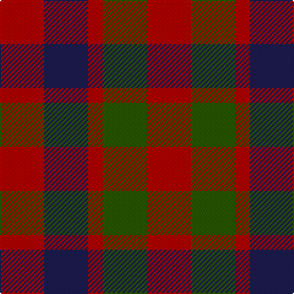

In pattern [RBRGR](/patterns/rbrgr/).

This was sourced from tartans-authority.  It is a [5 stripes tartan](/stripes/stripes5/).

Original link http://www.tartansauthority.com/tartan-ferret/display/1390/

## Thread count
R/36 DB36 R12 G36 R/36

## Palette
Each colour and its ΔE from the base-6 reference it is a variant of.

| Colour | Shade | Base | ΔE (OKLab) |
|---|---|---|---|
| DB | <code style="background-color:#1C1C50;">#1C1C50</code> `#1C1C50` | B <code style="background-color:#2C4084;">#2C4084</code> | 0.14 |
| G | <code style="background-color:#285800;">#285800</code> `#285800` | G <code style="background-color:#006400;">#006400</code> | 0.04 |
| R | <code style="background-color:#B40000;">#B40000</code> `#B40000` | R <code style="background-color:#C80000;">#C80000</code> | 0.04 |

# Sample pattern

ID: /setts/s5/r36b36r12g36r36-b1c1c50-g285800-rb40000/
