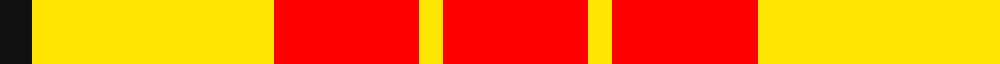
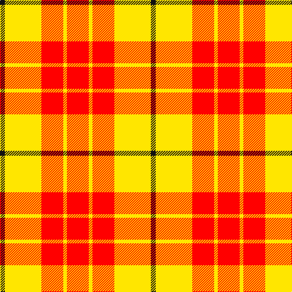

In pattern [KYRYR](/patterns/kyryr/).

This was sourced from register-of-tartans.  It is a [5 stripes tartan](/stripes/stripes5/).

Original link https://www.tartanregister.gov.uk/tartanDetails.aspx?ref=10409

## Thread count
K/8 Y60 R36 Y6 R/36

## Palette
Each colour and its ΔE from the base-6 reference it is a variant of.

| Colour | Shade | Base | ΔE (OKLab) |
|---|---|---|---|
| K | <code style="background-color:#101010;">#101010</code> `#101010` | K <code style="background-color:#000000;">#000000</code> | 0.17 |
| R | <code style="background-color:#FF0000;">#FF0000</code> `#FF0000` | R <code style="background-color:#C80000;">#C80000</code> | 0.11 |
| Y | <code style="background-color:#FFE600;">#FFE600</code> `#FFE600` | Y <code style="background-color:#E8C000;">#E8C000</code> | 0.10 |

# Sample pattern

## Nearest tartans

The nearest existing variants by ΔTartan distance.

1. [Shire of Hornwood (Corporate)](/setts/s5/r36y6r36y60k8-k101010-rc80000-yfccc00/) — ΔT 0.73
1. [Sands-Pingot (Name?)](/setts/s5/y30r5y20r20b10-b2c2c80-rc80000-yfccc00/) — ΔT 1.70
1. [Maguire, Black](/setts/s6/r116g8r8g8r24y84-g008b00-rff0000-yffe600/) — ΔT 1.71
1. [Glassary #3](/setts/s8/b16y4r48y8r8y48r4y16-b2c2c80-rc80000-ye8c000/) — ΔT 1.75
1. [Kozlosky, Kilt](/setts/s6/y42r15ra28y12r6ra20-rd03030-rac00000-yf0c000/) — ΔT 1.87
1. [Sands-Pingot Family, Alabama (Personal)](/setts/s5/y30r5y20r20b10-b0000cd-rff0000-yffe600/) — ΔT 1.91
1. [MacMillan](/setts/s9/r6y2r24y4r6y16r4y16r2-rc00000-yf0c000/) — ΔT 1.97
1. [Lewis, Red (Dance)](/setts/s4/r8w70r62w8-rd40000-wf0e0c8/) — ΔT 2.01
1. [MacMillan](/setts/s9/r3y1r12y2r3y8r2y8r1-rc80000-yc8c800/) — ΔT 2.01
1. [Kozlosky (Personal)](/setts/s6/y42r16ra28y12r6ra20-re87878-rac80000-ye8c000/) — ΔT 2.03

## Neighbour map

Every grey dot is one of 15726 variants placed by the first two principal components of the ΔTartan feature space (44% of its variance). Red is this tartan; blue dots are its nearest — click one to open its page.

<svg viewBox="0 0 640 380" role="img" style="max-width:100%;height:auto;border:1px solid #e0e0e0;border-radius:4px;display:block" xmlns="http://www.w3.org/2000/svg"><image href="/nn/cloud.v1.png" width="640" height="380"/><a href="/setts/s5/r36y6r36y60k8-k101010-rc80000-yfccc00/"><circle cx="293.9" cy="216.7" r="4" fill="#3465a4"><title>Shire of Hornwood (Corporate)</title></circle></a><a href="/setts/s5/y30r5y20r20b10-b2c2c80-rc80000-yfccc00/"><circle cx="274.6" cy="254.3" r="4" fill="#3465a4"><title>Sands-Pingot (Name?)</title></circle></a><a href="/setts/s6/r116g8r8g8r24y84-g008b00-rff0000-yffe600/"><circle cx="386.3" cy="166.7" r="4" fill="#3465a4"><title>Maguire, Black</title></circle></a><a href="/setts/s8/b16y4r48y8r8y48r4y16-b2c2c80-rc80000-ye8c000/"><circle cx="299.5" cy="174.9" r="4" fill="#3465a4"><title>Glassary #3</title></circle></a><a href="/setts/s6/y42r15ra28y12r6ra20-rd03030-rac00000-yf0c000/"><circle cx="251.4" cy="244.3" r="4" fill="#3465a4"><title>Kozlosky, Kilt</title></circle></a><a href="/setts/s5/y30r5y20r20b10-b0000cd-rff0000-yffe600/"><circle cx="261.1" cy="248.3" r="4" fill="#3465a4"><title>Sands-Pingot Family, Alabama (Personal)</title></circle></a><a href="/setts/s9/r6y2r24y4r6y16r4y16r2-rc00000-yf0c000/"><circle cx="367.5" cy="197.5" r="4" fill="#3465a4"><title>MacMillan</title></circle></a><a href="/setts/s4/r8w70r62w8-rd40000-wf0e0c8/"><circle cx="353.0" cy="238.0" r="4" fill="#3465a4"><title>Lewis, Red (Dance)</title></circle></a><a href="/setts/s9/r3y1r12y2r3y8r2y8r1-rc80000-yc8c800/"><circle cx="361.9" cy="199.4" r="4" fill="#3465a4"><title>MacMillan</title></circle></a><a href="/setts/s6/y42r16ra28y12r6ra20-re87878-rac80000-ye8c000/"><circle cx="252.9" cy="247.7" r="4" fill="#3465a4"><title>Kozlosky (Personal)</title></circle></a><circle cx="288.3" cy="210.0" r="5" fill="#c00000"/></svg>

ID: /setts/s5/r36y6r36y60k8-k101010-rff0000-yffe600/
