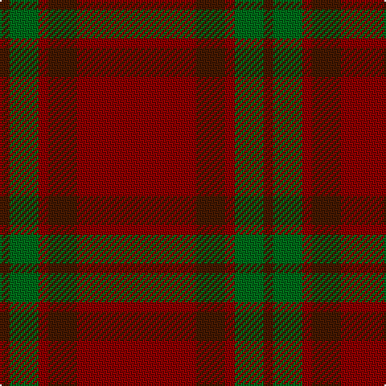

**Bands:** [BGRBR](/stripes/bgrbr/) · **Stripes:** [DO G R DO R](/stripes/stripes5/) DO G R DO R

This was sourced from tartans-authority.  It is a [5 band tartan](/bands/bands5/).

Original link http://www.tartansauthority.com/tartan-ferret/display/1662/

## Thread count
DR/6 G18 DRa6 DR18 DRa/74

## Palette
Each colour and its ΔE from the base-6 reference it is a variant of.

| Colour | Shade | Base | ΔE (OKLab) |
|---|---|---|---|
| DR | <code style="background-color:#441800;">#441800</code> `#441800` | B <code style="background-color:#2A418A;">#2A418A</code> | 0.23 |
| DRa | <code style="background-color:#880000;">#880000</code> `#880000` | R <code style="background-color:#CC0000;">#CC0000</code> | 0.15 |
| G | <code style="background-color:#006818;">#006818</code> `#006818` | G <code style="background-color:#006100;">#006100</code> | 0.02 |

# Sample pattern

## Nearest tartans

The nearest existing variants by ΔTartan distance.

1. [Glenshee #2](/setts/s5/r37dy9r3dg9dy3~x2/) — ΔT 0.69
1. [Glen Shee](/setts/s5/r37o9r3g9o3~x2/) — ΔT 1.20
1. [Glen Shee Trade Tartan Tartan Number: 1662. Earliest known date: pre 2003 May have been obtained from a hand made design procured in the Highlands for The Highland Society of London. See products available Copyright © Blair Urquhart, Comrie, 2015](/setts/s5/m37dy9m3g9dy3~x2/) — ΔT 1.24
1. [Crawford](/setts/s7/dr6lr2dr30dg12dr3dg12dr3~x2/) — ΔT 1.63
1. [Crawford](/setts/s7/dr6lr2dr30dg12dr3dg12dr3/) — ΔT 1.63
1. [MacIver of Strathendry Htg (Personal](/setts/s9/lo3o28do5o5do33o5do5o28r3~x2/) — ΔT 1.82
1. [Cairn O'Mount (Personal)](/setts/s6/r58n12r5y28r7lo5~x2/) — ΔT 1.84
1. [Waverley Care Aids Trust (Corporate)](/setts/s6/r8g2r2k1r1g2~x10/) — ΔT 1.95
1. [Scottish Watch (Corporate)](/setts/s3/r104dg39lo4~x2/) — ΔT 2.14
1. [Inverness Augustus](/setts/s7/m18dg1k5dg1k1dg1m9~x2/) — ΔT 2.15

## Neighbour map

Every grey dot is one of 14313 variants placed by the first two principal components of the ΔTartan feature space (44% of its variance). Red is this tartan; blue dots are its nearest — click one to open its page.

<svg viewBox="0 0 640 380" role="img" style="max-width:100%;height:auto;border:1px solid #e0e0e0;border-radius:4px;display:block" xmlns="http://www.w3.org/2000/svg"><image href="/nn/cloud.v1.png" width="640" height="380"/><a href="/setts/s5/r37dy9r3dg9dy3~x2/"><circle cx="526.2" cy="261.5" r="4" fill="#3465a4"><title>Glenshee #2</title></circle></a><a href="/setts/s5/r37o9r3g9o3~x2/"><circle cx="488.5" cy="239.9" r="4" fill="#3465a4"><title>Glen Shee</title></circle></a><a href="/setts/s5/m37dy9m3g9dy3~x2/"><circle cx="495.3" cy="241.5" r="4" fill="#3465a4"><title>Glen Shee Trade Tartan Tartan Number: 1662. Earliest known date: pre 2003 May have been obtained from a hand made design procured in the Highlands for The Highland Society of London. See products available Copyright © Blair Urquhart, Comrie, 2015</title></circle></a><a href="/setts/s7/dr6lr2dr30dg12dr3dg12dr3~x2/"><circle cx="492.7" cy="253.2" r="4" fill="#3465a4"><title>Crawford</title></circle></a><a href="/setts/s7/dr6lr2dr30dg12dr3dg12dr3/"><circle cx="492.7" cy="253.2" r="4" fill="#3465a4"><title>Crawford</title></circle></a><a href="/setts/s9/lo3o28do5o5do33o5do5o28r3~x2/"><circle cx="420.9" cy="217.3" r="4" fill="#3465a4"><title>MacIver of Strathendry Htg (Personal</title></circle></a><a href="/setts/s6/r58n12r5y28r7lo5~x2/"><circle cx="428.1" cy="215.6" r="4" fill="#3465a4"><title>Cairn O'Mount (Personal)</title></circle></a><a href="/setts/s6/r8g2r2k1r1g2~x10/"><circle cx="471.8" cy="254.1" r="4" fill="#3465a4"><title>Waverley Care Aids Trust (Corporate)</title></circle></a><a href="/setts/s3/r104dg39lo4~x2/"><circle cx="562.7" cy="256.7" r="4" fill="#3465a4"><title>Scottish Watch (Corporate)</title></circle></a><a href="/setts/s7/m18dg1k5dg1k1dg1m9~x2/"><circle cx="588.5" cy="221.7" r="4" fill="#3465a4"><title>Inverness Augustus</title></circle></a><circle cx="515.3" cy="257.3" r="5" fill="#c00000"/></svg>

ID: /setts/s5/r37do9r3g9do3~x2/
