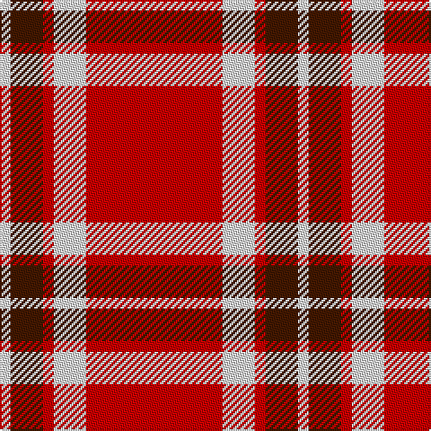

In pattern [RWRBW](/patterns/rwrbw/).

This was sourced from house-of-tartan.  It is a [5 stripes tartan](/stripes/stripes5/).

Original link http://www.house-of-tartan.scotland.net/house/TartanViewjs.asp?colr=Def&tnam=1701

## Thread count
LN/6 DR18 R6 LN18 R/76

## Palette
Each colour and its ΔE from the base-6 reference it is a variant of.

| Colour | Shade | Base | ΔE (OKLab) |
|---|---|---|---|
| DR | <code style="background-color:#441800;">#441800</code> `#441800` | B <code style="background-color:#2A418A;">#2A418A</code> | 0.23 |
| LN | <code style="background-color:#E0E0E0;">#E0E0E0</code> `#E0E0E0` | W <code style="background-color:#F7F7F7;">#F7F7F7</code> | 0.07 |
| R | <code style="background-color:#C80000;">#C80000</code> `#C80000` | R <code style="background-color:#CC0000;">#CC0000</code> | 0.01 |

# Sample pattern

## Nearest tartans

The nearest existing variants by ΔTartan distance.

1. [Loch Morar](/setts/s5/r38w9r3b9w3x2~b401000-rc00000-we0e0e0/) — ΔT 0.15
1. [Masai Shuka 26 (Artefact)](/setts/s4/y3k2r10k1x4~k101010-rc80000-ye8c000/) — ΔT 1.13
1. [Glen Shiel (Fashion)](/setts/s5/r13w3r1g3w1x6~g003820-r880000-we8ccb8/) — ΔT 1.23
1. [McPeek (Fashion)](/setts/s4/r125k26w20y16~k101010-rc80000-wa8d0ec-yfca428/) — ΔT 1.26
1. [Turner (Personal)](/setts/s5/r48k12ra7k5w3x2~k101010-rc80000-ra888888-wfcfcfc/) — ΔT 1.27
1. [MacQuarrie #7](/setts/s7/r4g5r2k6r18k2r4x2~g005020-k101010-rdc0000/) — ΔT 1.35
1. [Instakilt, Red (Fashion)](/setts/s7/r8w4r50k12r4k15g5x2~g289c18-k101010-re40018-wf8f8f8/) — ΔT 1.38
1. [Loch Morar](/setts/s5/r38w9r3k9w3x2~k101010-r880000-wfcfcfc/) — ΔT 1.42
1. [Masai Shuka 16 (Artefact)](/setts/s6/y8k3y4k2r30y6x2~k101010-rc80000-ye8c000/) — ΔT 1.45
1. [MacGregor, Black (Personal)](/setts/s5/r41k19r7k9w3x2~k101010-rc80000-wfcfcfc/) — ΔT 1.51

## Neighbour map

Every grey dot is one of 15726 variants placed by the first two principal components of the ΔTartan feature space (44% of its variance). Red is this tartan; blue dots are its nearest — click one to open its page.

<svg viewBox="0 0 640 380" role="img" style="max-width:100%;height:auto;border:1px solid #e0e0e0;border-radius:4px;display:block" xmlns="http://www.w3.org/2000/svg"><image href="/nn/cloud.v1.png" width="640" height="380"/><a href="/setts/s5/r38w9r3b9w3x2~b401000-rc00000-we0e0e0/"><circle cx="413.8" cy="191.5" r="4" fill="#3465a4"><title>Loch Morar</title></circle></a><a href="/setts/s4/y3k2r10k1x4~k101010-rc80000-ye8c000/"><circle cx="368.2" cy="221.1" r="4" fill="#3465a4"><title>Masai Shuka 26 (Artefact)</title></circle></a><a href="/setts/s5/r13w3r1g3w1x6~g003820-r880000-we8ccb8/"><circle cx="418.5" cy="199.8" r="4" fill="#3465a4"><title>Glen Shiel (Fashion)</title></circle></a><a href="/setts/s4/r125k26w20y16~k101010-rc80000-wa8d0ec-yfca428/"><circle cx="377.7" cy="209.2" r="4" fill="#3465a4"><title>McPeek (Fashion)</title></circle></a><a href="/setts/s5/r48k12ra7k5w3x2~k101010-rc80000-ra888888-wfcfcfc/"><circle cx="395.7" cy="168.2" r="4" fill="#3465a4"><title>Turner (Personal)</title></circle></a><a href="/setts/s7/r4g5r2k6r18k2r4x2~g005020-k101010-rdc0000/"><circle cx="409.2" cy="211.2" r="4" fill="#3465a4"><title>MacQuarrie #7</title></circle></a><a href="/setts/s7/r8w4r50k12r4k15g5x2~g289c18-k101010-re40018-wf8f8f8/"><circle cx="367.0" cy="158.6" r="4" fill="#3465a4"><title>Instakilt, Red (Fashion)</title></circle></a><a href="/setts/s5/r38w9r3k9w3x2~k101010-r880000-wfcfcfc/"><circle cx="390.4" cy="192.4" r="4" fill="#3465a4"><title>Loch Morar</title></circle></a><a href="/setts/s6/y8k3y4k2r30y6x2~k101010-rc80000-ye8c000/"><circle cx="362.8" cy="170.6" r="4" fill="#3465a4"><title>Masai Shuka 16 (Artefact)</title></circle></a><a href="/setts/s5/r41k19r7k9w3x2~k101010-rc80000-wfcfcfc/"><circle cx="383.0" cy="210.0" r="4" fill="#3465a4"><title>MacGregor, Black (Personal)</title></circle></a><circle cx="415.8" cy="191.1" r="5" fill="#c00000"/></svg>

ID: /setts/s5/r38w9r3b9w3x2~b441800-rc80000-we0e0e0/
