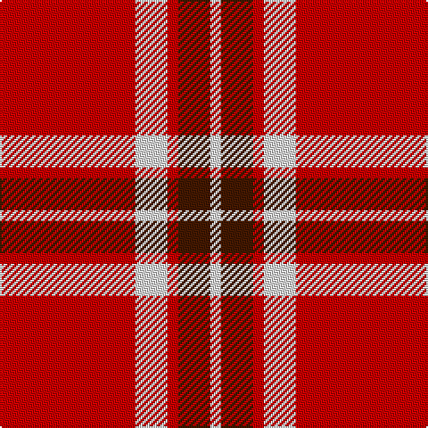

In pattern [RWRBW](/stripes/rwrbw/).

This was sourced from house-of-tartan.  It is a [5 stripe tartan](/stripes/stripes5/).

Original link http://www.house-of-tartan.scotland.net/house/TartanViewjs.asp?colr=Def&tnam=1701

## Thread count
R/76 LN18 R6 DR18 LN/6

## Palette
Each colour and the base-6 reference it is a variant of.

| Colour | Shade | Base |
|---|---|---|
| DR | <code style="background-color:#441800;">#441800</code> `oklch(27.3% 0.076 46.3)` <small>#441800</small> | B <code style="background-color:#2A418A;">#2A418A</code> |
| LN | <code style="background-color:#E0E0E0;">#E0E0E0</code> `oklch(90.7% 0.000 89.9)` <small>#E0E0E0</small> | W <code style="background-color:#F7F7F7;">#F7F7F7</code> |
| R | <code style="background-color:#C80000;">#C80000</code> `oklch(52.3% 0.215 29.2)` <small>#C80000</small> | R <code style="background-color:#CC0000;">#CC0000</code> |

# Sample pattern

## Nearest tartans

The nearest existing variants by ΔTartan distance.

1. [Loch Morar](/setts/s5/r38w9r3dr9w3~x2/) — ΔT 0.15
1. [Masai Shuka 26 (Artefact)](/setts/s4/ly3k2r10k1~x4/) — ΔT 1.13
1. [Glen Shiel (Fashion)](/setts/s5/r13lb3r1dg3lb1~x6/) — ΔT 1.24
1. [McPeek (Fashion)](/setts/s4/r125k26lb20lo16/) — ΔT 1.26
1. [Turner (Personal)](/setts/s5/r48k12o7k5w3~x2/) — ΔT 1.27
1. [MacQuarrie #7](/setts/s7/r4dg5r2k6r18k2r4~x2/) — ΔT 1.36
1. [Instakilt, Red (Fashion)](/setts/s7/r8w4r50k12r4k15g5~x2/) — ΔT 1.38
1. [Loch Morar](/setts/s5/r38w9r3k9w3~x2/) — ΔT 1.43
1. [Masai Shuka 16 (Artefact)](/setts/s6/ly8k3ly4k2r30ly6~x2/) — ΔT 1.45
1. [White Stripes Dress, (Corporate)](/setts/s7/k2r1k2r14w1r1w1~x8/) — ΔT 1.51

## Neighbour map

Every grey dot is one of 14299 variants placed by the first two principal components of the ΔTartan feature space (44% of its variance). Red is this tartan; blue dots are its nearest — click one to open its page.

<svg viewBox="0 0 640 380" role="img" style="max-width:100%;height:auto;border:1px solid #e0e0e0;border-radius:4px;display:block" xmlns="http://www.w3.org/2000/svg"><image href="/nn/cloud.v1.png" width="640" height="380"/><a href="/setts/s5/r38w9r3dr9w3~x2/"><circle cx="412.6" cy="182.4" r="4" fill="#3465a4"><title>Loch Morar</title></circle></a><a href="/setts/s4/ly3k2r10k1~x4/"><circle cx="367.3" cy="212.0" r="4" fill="#3465a4"><title>Masai Shuka 26 (Artefact)</title></circle></a><a href="/setts/s5/r13lb3r1dg3lb1~x6/"><circle cx="418.3" cy="192.4" r="4" fill="#3465a4"><title>Glen Shiel (Fashion)</title></circle></a><a href="/setts/s4/r125k26lb20lo16/"><circle cx="376.6" cy="200.7" r="4" fill="#3465a4"><title>McPeek (Fashion)</title></circle></a><a href="/setts/s5/r48k12o7k5w3~x2/"><circle cx="395.1" cy="161.0" r="4" fill="#3465a4"><title>Turner (Personal)</title></circle></a><a href="/setts/s7/r4dg5r2k6r18k2r4~x2/"><circle cx="408.1" cy="203.4" r="4" fill="#3465a4"><title>MacQuarrie #7</title></circle></a><a href="/setts/s7/r8w4r50k12r4k15g5~x2/"><circle cx="366.4" cy="150.1" r="4" fill="#3465a4"><title>Instakilt, Red (Fashion)</title></circle></a><a href="/setts/s5/r38w9r3k9w3~x2/"><circle cx="390.4" cy="182.7" r="4" fill="#3465a4"><title>Loch Morar</title></circle></a><a href="/setts/s6/ly8k3ly4k2r30ly6~x2/"><circle cx="361.9" cy="162.7" r="4" fill="#3465a4"><title>Masai Shuka 16 (Artefact)</title></circle></a><a href="/setts/s7/k2r1k2r14w1r1w1~x8/"><circle cx="475.9" cy="146.0" r="4" fill="#3465a4"><title>White Stripes Dress, (Corporate)</title></circle></a><circle cx="414.5" cy="182.1" r="5" fill="#c00000"/></svg>

ID: /setts/s5/r38w9r3do9w3~x2/
