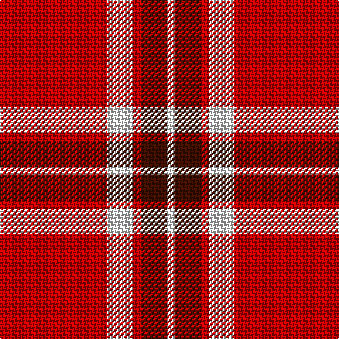

In pattern [RWRBW](/stripes/rwrbw/).

This was sourced from weddslist.  It is a [5 stripe tartan](/stripes/stripes5/).

Original link http://www.weddslist.com/cgi-bin/tartans/pg.pl?source=sts

## Thread count
R/76 LN18 R6 DR18 LN/6

## Palette
Each colour and the base-6 reference it is a variant of.

| Colour | Shade | Base |
|---|---|---|
| DR | <code style="background-color:#401000;">#401000</code> `oklch(25.3% 0.079 39.9)` <small>#401000</small> | B <code style="background-color:#2A418A;">#2A418A</code> |
| LN | <code style="background-color:#E0E0E0;">#E0E0E0</code> `oklch(90.7% 0.000 89.9)` <small>#E0E0E0</small> | W <code style="background-color:#F7F7F7;">#F7F7F7</code> |
| R | <code style="background-color:#C00000;">#C00000</code> `oklch(50.7% 0.208 29.2)` <small>#C00000</small> | R <code style="background-color:#CC0000;">#CC0000</code> |

# Sample pattern

## Nearest tartans

The nearest existing variants by ΔTartan distance, with this tartan at the top so the swatches line up against it.

ΔTartan

Tartan

Sett

—

<a href="/ttd/edit/#slug=r38w9r3dr9w3~x2">Loch Morar</a> <a class="nn-out" href="/setts/s5/r38w9r3dr9w3~x2/" title="open its dictionary page">↗</a>

0.15

<a href="/ttd/edit/#slug=r38w9r3do9w3~x2">Loch Morar Trade Tartan Tartan Number: 1701. Earliest known date: pre 2003 Nothing See products available Copyright © Blair Urquhart, Comrie, 2015</a> <a class="nn-out" href="/setts/s5/r38w9r3do9w3~x2/" title="open its dictionary page">↗</a>

1.09

<a href="/ttd/edit/#slug=ly3k2r10k1~x4">Masai Shuka 26 (Artefact)</a> <a class="nn-out" href="/setts/s4/ly3k2r10k1~x4/" title="open its dictionary page">↗</a>

1.12

<a href="/ttd/edit/#slug=r13lb3r1dg3lb1~x6">Glen Shiel (Fashion)</a> <a class="nn-out" href="/setts/s5/r13lb3r1dg3lb1~x6/" title="open its dictionary page">↗</a>

1.19

<a href="/ttd/edit/#slug=r48k12o7k5w3~x2">Turner (Personal)</a> <a class="nn-out" href="/setts/s5/r48k12o7k5w3~x2/" title="open its dictionary page">↗</a>

1.24

<a href="/ttd/edit/#slug=r125k26lb20lo16">McPeek (Fashion)</a> <a class="nn-out" href="/setts/s4/r125k26lb20lo16/" title="open its dictionary page">↗</a>

1.28

<a href="/ttd/edit/#slug=r38w9r3k9w3~x2">Loch Morar</a> <a class="nn-out" href="/setts/s5/r38w9r3k9w3~x2/" title="open its dictionary page">↗</a>

1.30

<a href="/ttd/edit/#slug=r8w4r50k12r4k15g5~x2">Instakilt, Red (Fashion)</a> <a class="nn-out" href="/setts/s7/r8w4r50k12r4k15g5~x2/" title="open its dictionary page">↗</a>

1.31

<a href="/ttd/edit/#slug=r4dg5r2k6r18k2r4~x2">MacQuarrie #7</a> <a class="nn-out" href="/setts/s7/r4dg5r2k6r18k2r4~x2/" title="open its dictionary page">↗</a>

1.39

<a href="/ttd/edit/#slug=r41k19r7k9w3~x2">MacGregor, Black (Personal)</a> <a class="nn-out" href="/setts/s5/r41k19r7k9w3~x2/" title="open its dictionary page">↗</a>

1.43

<a href="/ttd/edit/#slug=r4k8r12k1ly1~x2">MacKeane</a> <a class="nn-out" href="/setts/s5/r4k8r12k1ly1~x2/" title="open its dictionary page">↗</a>

## Neighbour map

Every grey dot is one of 14299 variants placed by the first two principal components of the ΔTartan feature space (44% of its variance). Red is this tartan; blue dots are its nearest — click one to open its page.

<svg viewBox="0 0 640 380" role="img" style="max-width:100%;height:auto;border:1px solid #e0e0e0;border-radius:4px;display:block" xmlns="http://www.w3.org/2000/svg"><image href="/nn/cloud.v1.png" width="640" height="380"/><a href="/setts/s5/r38w9r3do9w3~x2/"><circle cx="414.5" cy="182.1" r="4" fill="#3465a4"><title>Loch Morar Trade Tartan Tartan Number: 1701. Earliest known date: pre 2003 Nothing See products available Copyright © Blair Urquhart, Comrie, 2015</title></circle></a><a href="/setts/s4/ly3k2r10k1~x4/"><circle cx="367.3" cy="212.0" r="4" fill="#3465a4"><title>Masai Shuka 26 (Artefact)</title></circle></a><a href="/setts/s5/r13lb3r1dg3lb1~x6/"><circle cx="418.3" cy="192.4" r="4" fill="#3465a4"><title>Glen Shiel (Fashion)</title></circle></a><a href="/setts/s5/r48k12o7k5w3~x2/"><circle cx="395.1" cy="161.0" r="4" fill="#3465a4"><title>Turner (Personal)</title></circle></a><a href="/setts/s4/r125k26lb20lo16/"><circle cx="376.6" cy="200.7" r="4" fill="#3465a4"><title>McPeek (Fashion)</title></circle></a><a href="/setts/s5/r38w9r3k9w3~x2/"><circle cx="390.4" cy="182.7" r="4" fill="#3465a4"><title>Loch Morar</title></circle></a><a href="/setts/s7/r8w4r50k12r4k15g5~x2/"><circle cx="366.4" cy="150.1" r="4" fill="#3465a4"><title>Instakilt, Red (Fashion)</title></circle></a><a href="/setts/s7/r4dg5r2k6r18k2r4~x2/"><circle cx="408.1" cy="203.4" r="4" fill="#3465a4"><title>MacQuarrie #7</title></circle></a><a href="/setts/s5/r41k19r7k9w3~x2/"><circle cx="382.7" cy="201.8" r="4" fill="#3465a4"><title>MacGregor, Black (Personal)</title></circle></a><a href="/setts/s5/r4k8r12k1ly1~x2/"><circle cx="384.8" cy="212.9" r="4" fill="#3465a4"><title>MacKeane</title></circle></a><circle cx="412.6" cy="182.4" r="5" fill="#c00000"/></svg>

ID: /setts/s5/r38w9r3dr9w3~x2/
